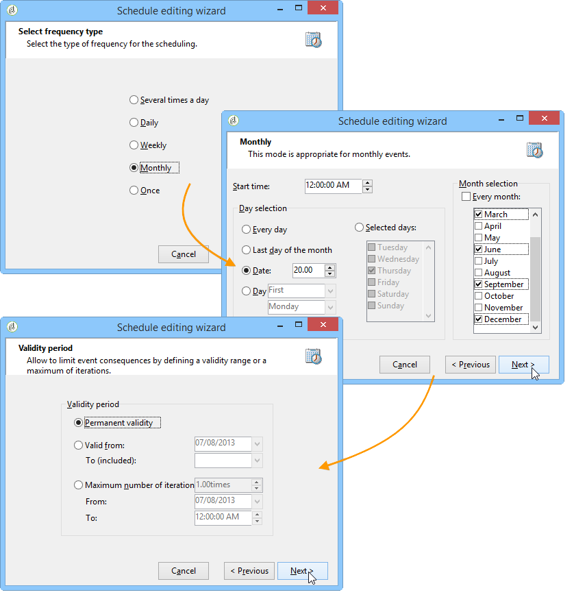

# Consulta incremental{#incremental-query}

Um query incremental permite selecionar periodicamente um target com base em um critério, enquanto exclui as pessoas já alvos desse critério.

O público que já foi alvo é armazenado na memória pela instância de workflow e por atividade, ou seja, dois workflows iniciados do mesmo template não compartilham o mesmo log. Por outro lado, duas tarefas baseadas no mesmo query incremental para a mesma instância de workflow usarão o mesmo log.

A query é definida da mesma forma que queries padrão (consulte [Criação de query](../../workflow/using/query.md#creating-a-query)), mas sua execução é agendada.

>[!CAUTION]
>
>Se o resultado de um query incremental for igual a **0** durante uma de suas execuções, o workflow será pausado até a próxima execução programada do query. As transições e as atividades que seguem o query incremental não são, portanto, processadas antes da execução a seguir.

Para fazer isso:

1. Na guia **[!UICONTROL Scheduling &amp; History]**, selecione a opção **[!UICONTROL Schedule execution]**. A tarefa permanece ativa após sua criação e só será acionada nos horários especificados pelo agendamento para execução do query. No entanto, se a opção estiver desabilitada, o query será executado imediatamente, **de uma só vez**.
1. Clique no botão **[!UICONTROL Change]**.

   Na janela **[!UICONTROL Schedule editing wizard]**, você pode configurar o tipo de frequência, a recorrência do evento e o período de validade do evento.

   

1. Clique em **[!UICONTROL Finish]** para salvar o cronograma.

   

1. A seção inferior da guia **[!UICONTROL Scheduling &amp; History]** permite selecionar o número de dias a serem considerados no histórico.

   

   * **[!UICONTROL History in days]**

      Os recipients já alvos podem ser registrados em um número máximo de dias a partir do dia de envio do target. Se esse valor for zero, os recipients nunca serão removidos do log.

   * **[!UICONTROL Keep history when starting]**

      Essa opção não permite limpar o log quando a atividade estiver habilitada.

   * **[!UICONTROL SQL table name]**

      Esse parâmetro permite que você sobrecarregue a tabela SQL padrão contendo os dados do histórico.

## Exemplo de um query incremental: atualização trimestral da lista {#example-of-an-incremental-query--quarterly-list-update}

No exemplo a seguir, um query incremental é usado para atualizar automaticamente uma lista de recipients. Esses recipients são alvos como parte das campanhas de marketing sazonais.

Como essas campanhas são iniciadas no início de cada temporada para oferecer atividades esportivas relevantes, essas listas são atualizadas a cada trimestre. No entanto, um recipient só deve ser alvo dessa campanha uma vez a cada 9 meses. Isso permite espaçar a frequência de elegibilidade do recipient e oferecer atividades para diferentes estações ao longo dos anos.

1. Adicione um query incremental, bem como uma atividade de atualização da lista em um novo workflow.
1. Configure a guia **[!UICONTROL Incremental query]** da atividade, conforme especificado em [Criação de query](../../workflow/using/query.md#creating-a-query).
1. Selecione a guia **[!UICONTROL Scheduling &amp; History]** e especifique um histórico de 270 dias. Um recipient que já foi alvo não será novamente por um período de 270 dias ou aproximadamente 9 meses.

   Clique no botão **[!UICONTROL Change...]**.

1. Para garantir que a lista seja atualizada antes do início de cada estação, selecione **[!UICONTROL Monthly]**.
1. Na próxima tela, selecione março, junho, setembro e dezembro. Escolha o dia 20 do mês e escolha o horário que deseja iniciar o workflow.
1. Em seguida, selecione o período de validade do query. Por exemplo, se você quiser que essa atividade fique ativa permanentemente, selecione **[!UICONTROL Permanent validity]**.

   

1. Após a aprovação do query incremental, configure a atividade de atualização da lista como explicado em [List update](../../workflow/using/list-update.md).

O workflow será iniciado automaticamente e imediatamente antes do início de cada estação. A lista será atualizada com os novos recipients qualificados para receber as ofertas.

## Parâmetros de output {#output-parameters}

* tableName
* schema
* recCount

Esse conjunto de três valores identifica o público alvo do query. **[!UICONTROL tableName]** é o nome da tabela que registra os identificadores de target, **[!UICONTROL schema]** é o schema do público (normalmente nms:recipient) e **[!UICONTROL recCount]** é o número de elementos na tabela.
