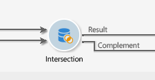

# Interseção{#intersection}

Uma atividade do tipo **intersecção** cria um target a partir da intersecção dos targets recebidos.

Uma intersecção permite extrair somente o público que é comum a todos os resultados da atividade de entrada. O target é criado com todos os resultados recebidos: todas as atividades anteriores devem então ser concluídas antes que a intersecção possa ser executada. Para configurar essa atividade, você precisa inserir um rótulo para ela, bem como as opções referentes ao resultado.

Para obter mais informações sobre como configurar e usar a atividade de interseção, consulte [Extraindo dados conjuntos (Interseção)](../../workflow/using/targeting-data.md#extracting-joint-data--intersection-).

Check the **[!UICONTROL Generate complement]** option if you wish to process the remaining population. O complemento conterá a união dos resultados de todas as atividades de entrada menos a intersecção. Uma transição de saída adicional será adicionada à atividade, da seguinte maneira:

## Exemplo de intersecção {#intersection-example}

No exemplo a seguir, o objetivo da intersecção é calcular os recipients comuns aos três queries simples para criar uma lista.

1. After three simple queries, insert an **[!UICONTROL Intersection]** -type activity.

   Neste exemplo, os queries direcionam os recipients homens, que moram em Paris e com idade entre 18 e 30 anos, respectivamente.

1. Configure a intersecção. To do this, select the **[!UICONTROL Keys only]** reconciliation method since the populations resulting from the queries contain consistent data.
1. Se você tiver fornecido dados adicionais para os queries, poderá optar por manter apenas aqueles compartilhados por recipients marcando a caixa relevante.
1. If you wish to use the rest of the data (in regard to the queries but not their intersection), check the **[!UICONTROL Generate complement]** box.
1. Adicione uma atividade de atualização da lista após o resultado da intersecção. Você também pode adicionar uma atualização da lista ao complemento que deseja usar.
1. Execute o workflow Aqui, dois recipients se aplicam a todos os três queries fornecidos ao mesmo tempo. O complemento é composto de cinco recipients que se aplicam apenas a um ou dois queries.

   O resultado da intersecção é enviado para a atualização da primeira lista. Se você optou usar o complemento, ele também será enviado para a segunda atualização da lista.

   

## Parâmetros de entrada {#input-parameters}

* tableName
* schema

Cada evento de entrada deve especificar um target definido por esses parâmetros.

## Parâmetros de output {#output-parameters}

* tableName
* schema
* recCount

Esse conjunto de três valores identifica o target resultante da intersecção. **[!UICONTROL tableName]** é o nome da tabela que registra os identificadores de metas, **[!UICONTROL schema]** é o esquema da população (geralmente **[!UICONTROL nms:recipient]**) e **[!UICONTROL recCount]** é o número de elementos na tabela.
