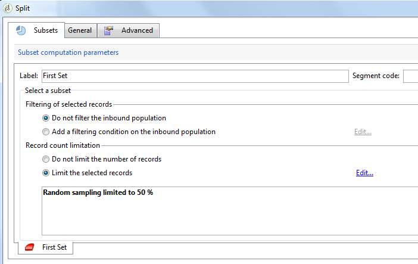
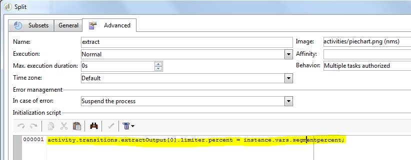

# Modelos e scripts JavaScript{#javascript-scripts-and-templates}

Os scripts permitem o cálculo de valores, a troca de dados entre tarefas diferentes em andamento e a execução de operações específicas usando chamadas SOAP.

Os scripts são universais em um diagrama de workflow:

* todas as atividades têm scripts de inicialização. Um script de inicialização é executado quando a atividade é ativada e pode ser usado para inicializar variáveis e modificar as propriedades.
* A atividade &#39;código JavaScript&#39; é simplesmente usada para executar um script.
* A atividade de &#39;Teste&#39; avalia expressões JavaScript para ativar a transição apropriada.
* A maioria dos campos de texto são modelos JavaScript: Expressões JavaScript podem ser incluídas entre &lt;%= e %>. Estes campos oferecem um botão que abre uma lista suspensa para ajudá-lo a inserir expressões.

   

## Objetos expostos {#objects-exposed}

Os JavaScripts executado no contexto de um workflow acessa uma série de objetos globais adicionais.

* **instância**: Representa o fluxo de trabalho que está sendo executado. O esquema deste objeto é **xtk:workflow**.
* **tarefa**: Representa as tarefas que estão sendo executadas. O esquema deste objeto é **xtk:workflowTask**.
* **event**: Representa os eventos que ativaram a tarefa que está sendo executada. O esquema deste objeto é **xtk:workflowEvent**. Este objeto não é inicializado para atividades tipo **AND-join** que foram ativadas a partir de várias transições.
* **eventos**: Representa a lista de eventos que ativaram a tarefa atual. O esquema deste objeto é **xtk:workflowEvent**. Essa tabela normalmente contém um elemento, mas pode conter vários para atividades tipo **AND-join** ativadas com base em várias transições.
* **atividade**: Representa o modelo da tarefa que está sendo executada. O esquema desse objeto depende do tipo de atividade. Esse objeto pode ser modificado pelo script de inicialização, em outros scripts, modificações têm efeitos indeterninárveis.

As propriedades disponíveis para esses objetos podem ser visualizadas em uma lista suspensa clicando no botão à direita da barra de ferramentas do script.

>[!CAUTION]
>
>As propriedades desses objetos são somente para leitura, exceto para as sub-propriedades da propriedade vars.
>  
>A maioria dessas propriedades é atualizada somente após executar uma tarefa primária ou quando a instância ficar passiva. Os valores que são lidos não correspondem necessariamente ao status atual, mas ao status anterior.

**Exemplo**

Neste exemplo, e nos exemplos a seguir, crie um workflow que inclua uma atividade de **código JavaScript** e uma atividade **final** como exibido no diagrama a seguir.


Clique duas vezes na atividade de **código JavaScript** e insira o seguinte script:

```
logInfo("Label: " + instance.label)
logInfo("Start date: " + task.creationDate)
```

The **[!UICONTROL logInfo(message)]** function inserts a message into the log.

Click **[!UICONTROL OK]** to close the creation wizard, then start the workflow using the action buttons situated at the top right of the list of workflows. No final da execução, consulte o log. Você verá duas mensagens correspondentes ao script: uma exibe a identificação do workflow, a outra exibe a data em que o script foi ativado.

## Variáveis {#variables}

The variables are the free properties of the **[!UICONTROL instance]**, **[!UICONTROL task]** and **[!UICONTROL event]** objects. The JavaScript types authorized for these variables are **[!UICONTROL string]**, **[!UICONTROL number]** and **[!UICONTROL Date]**.

### Variáveis de instância {#instance-variables}

The instance variables (**[!UICONTROL instance.vars.xxx]**) are comparable to global variables. Eles são compartilhados por todas as atividades.

### Variáveis de tarefa {#task-variables}

The task variables (**[!UICONTROL task.vars.xxx]**) are comparable to local variables. São utilizadas somente pela tarefa atual. Essas variáveis são utilizadas por atividades persistentes para manter os dados e, às vezes, são utilizadas para trocar dados entre os diferentes scripts de uma mesma atividade.

### Variáveis do evento {#event-variables}

The event variables (**[!UICONTROL vars.xxx]**) enable the exchange of data between the elementary tasks of a workflow process. Essas variáveis são passadas pela tarefa que ativou a tarefa em andamento. É possível modificá-las e definir novas. Então, elas são passadas para as atividades seguintes.

No caso de atividades de tipo **AND-join**, as variáveis são mescladas, mas se uma mesma variável é definida duas vezes, há um conflito e o valor permanece indeterminado.

Essas são as variáveis usadas com mais frequência e devem ser usadas em detrimento de variáveis de instância.

Certas variáveis de evento são modificadas ou lidas pelas várias atividades. Estas são todas as variáveis do tipo string. For example, an export sets the **[!UICONTROL vars.filename]** variable with the full name of the file that has just been exported. All these read or modified variables are documented in [About activities](../../workflow/using/about-activities.md), in the sections **Input parameters** and **Output parameters** of the activities.

### Exemplos {#example}

**Exemplo 1**

Neste exemplo, uma variável de instância é usada para calcular dinamicamente a porcentagem dividida a ser aplicada em uma população.

1. Crie um fluxo de trabalho e adicione uma atividade Iniciar.

1. Adicione e configure uma atividade de código JavaScript para definir uma variável de instância.

   Por exemplo: `instance.vars.segmentpercent = 10;`

   

1. Adicione uma atividade de Consulta e destinatários de destino de acordo com suas necessidades.

1. Adicione uma atividade Dividida e configure-a para executar uma amostragem aleatória da população recebida. A porcentagem de amostragem pode ser qualquer escolha sua. Neste exemplo, está definido para 50%.

   É essa porcentagem que é atualizada dinamicamente graças à variável de instância definida anteriormente.

   

1. Na seção Script de inicialização da guia Avançado da atividade Dividir, defina uma condição JS. A condição JS seleciona a porcentagem de amostragem aleatória da primeira transição que sai da atividade Dividir e a atualiza para um valor definido pela variável de instância criada anteriormente.

   ```activity.transitions.extractOutput[0].limiter.percent = instance.vars.segmentpercent;```

   

1. Certifique-se de que o complemento seja gerado em uma transição separada da atividade Dividir e adicione as atividades Finais após cada transição de saída.

1. Salve e execute o workflow. A amostragem dinâmica é aplicada de acordo com a variável de instância.

   

**Exemplo 2**

1. Pegue o workflow do exemplo anterior e substitua o script da atividade **JavaScript Code** pelo seguinte script:

    ```
    instance.vars.foo = "bar1"
    vars.foo = "bar2"
    task.vars.foo = "bar3"
    ```

1. Adicione o script a seguir ao script de inicialização da atividade **End**:

    ```
    logInfo("instance.vars.foo = " + instance.vars.foo)
    logInfo("vars.foo = " + vars.foo)
    logInfo("task.vars.foo = " + task.vars.foo)
    ```

1. Inicie o workflow e examine o log.

    ```
    Workflow finished
    task.vars.foo = undefined
    vars.foo = bar2
    instance.vars.foo = bar1
    Starting workflow (operator 'admin')
    ```

Este exemplo mostra que a atividade após o **JavaScript Code** acessa as variáveis de instância e as variáveis de evento, mas as variáveis de tarefa não estão acessíveis a partir do exterior (&#39;undefined&#39;).

### Chamada de uma variável de instância em uma query {#calling-an-instance-variable-in-a-query}

Depois de especificar uma variável de instância em uma atividade, é possível reutilizá-la em uma query de workflow.

Assim, para chamar uma variável **instance.vars.xxx = &quot;yyy&quot;** em um filtro, digite **$(instance/vars/xxx)**.

Por exemplo:

1. Create an instance variable that defines a delivery&#39;s internal name via the **[!UICONTROL JavaScript code]**: **instance.vars.deliveryIN = &quot;DM42&quot;**.

   

1. Criar uma query cujo direcionamento e dimensões de filtro são os recipients. Nas condições, especifique que deseja localizar todos os recipients que receberam a delivery especificada pela variável .

   Como lembrete, essas informações são armazenadas nos logs de delivery.

   To reference the instance variable in the **[!UICONTROL Value]** column, enter **$(instance/vars/@deliveryIN)**.

   O workflow retornará os recipients da delivery DM42.

   

## Funções avançadas {#advanced-functions}

Além das funções JavaScript padrão, as funções especiais estão disponíveis para manipular arquivos, ler ou modificar dados no banco de dados ou adicionar mensagens ao log.

### Journal {#journal}

**[!UICONTROL logInfo(message)]** foi detalhado nos exemplos acima. Essa função adiciona uma mensagem de informação ao diário.

**[!UICONTROL logError(message)]** adiciona uma mensagem de erro ao registro. O script interrompe a execução e o workflow muda para o status de erro (por padrão, a instância será pausada).

## Script de inicialização {#initialization-script}

Sob determinadas condições, é possível modificar uma propriedade de uma atividade no momento da execução.

A maioria das propriedades de atividades pode ser calculada dinamicamente, usando um template JavaScript ou porque as propriedades do workflow permitem explicitamente que o valor seja calculado por um script.

No entanto, para outras propriedades, é necessário usar o script de inicialização. Este script é avaliado antes que a tarefa seja executada. The **[!UICONTROL activity]** variable references the activity corresponding to the task. As propriedades dessa atividade podem ser modificadas e afetarão somente essa tarefa.
