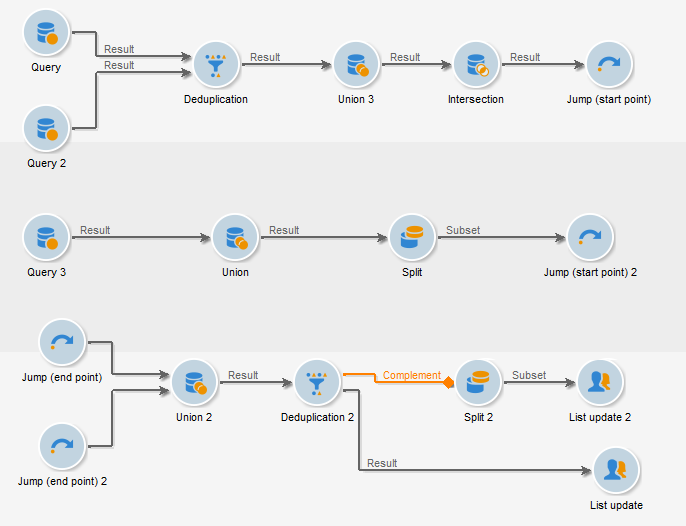

# Jump (ponto inicial e ponto final){#jump-start-point-and-end-point}

Os objetos gráficos do tipo **[!UICONTROL Jump]** são usados para melhorar a leitura de um diagrama complexo, especialmente que contenha transições cruzadas.

Jumps são transições sem setas.

Elas vão de uma atividade para outra, como no exemplo a seguir:

Para cada transição de tipo &quot;ponto inicial&quot;, uma transição de tipo &quot;ponto final&quot; deve ser posicionada.

É possível inserir vários pontos iniciais e pontos finais no mesmo workflow. Eles são identificados por um número que deve ser inserido nos parâmetros:

Para melhorar a legibilidade do diagrama, é possível alterar a imagem associada aos saltos para exibir o número relacionado. Consulte [Gerenciamento de imagens de atividades](../../workflow/using/managing-activity-images.md).
