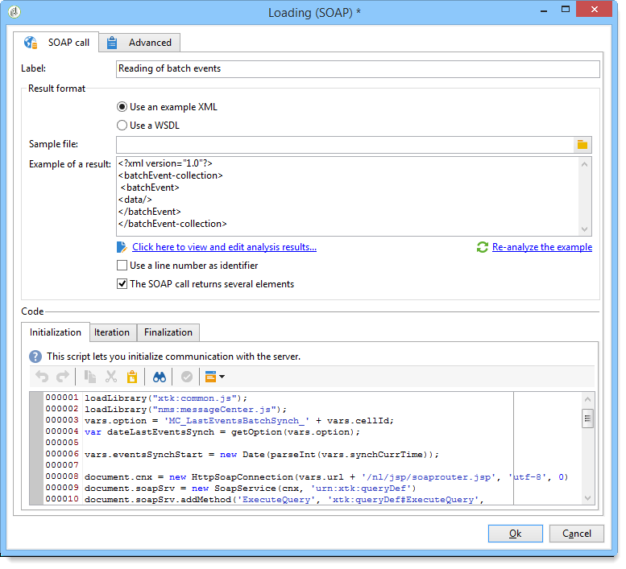
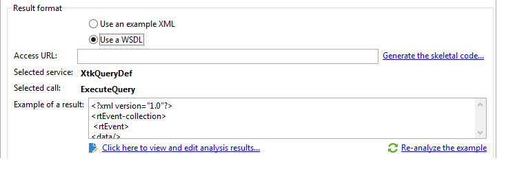

# Carregamento (SOAP){#loading-soap}

>[!CAUTION]
>
>A atividade de **Carregamento (SOAP)** só estará disponível se você tiver o módulo **FDA (Federated Data Access)** instalado. Verifique o contrato de licença.

A atividade de **Carregamento (SOAP)** é usada além da atividade de **carregamento de dados (RDBMS)** quando não é possível coletar dados diretamente pelo FDA em um banco de dados externo.

A operação é como descrita a seguir:

1. Escolha usar um exemplo XML ou WSDL.

   O exemplo a seguir é de um fluxo de trabalho técnico do módulo do Centro de Mensagens.

   

1. Para um exemplo XML, selecione um arquivo de exemplo. O arquivo é analisado para estabelecer um exemplo de resultado.

   Para um WSDL, insira a URL de acesso correspondente, e então gere o código estrutural. O serviço e a chamada selecionados são atualizados e exibidos automaticamente.

   

1. Selecione **[!UICONTROL Click here to view and edit analysis results]** para especificar cada coluna identificada.

   

   Se desejar atualizar o exemplo, selecione **[!UICONTROL Re-analyze the example]**.

   Você também pode personalizar o formato dos dados da coluna por meio do link **[!UICONTROL Advanced parameters]**. Para obter mais informações sobre a formatação de dados importados, consulte esta [seção](../../platform/using/executing-import-jobs.md).

1. Você pode usar o número de linha como um identificador e/ou especificar que a chamada SOAP retorna vários elementos.
1. Insira os seguintes scripts de guia de acordo com sua função:

   * **[!UICONTROL Initialization]**: estabelece uma conexão SOAP.
   * **[!UICONTROL Iteration]**: executa a chamada para o serviço SOAP. O retorno dessa função deve ser um objeto XML compatível com a descrição do exemplo ou do WSDL.

     O código dessa guia será chamado em um loop pelo Adobe Campaign até que um objeto XML nulo seja retornado.

   * **[!UICONTROL Finalization]**: fecha a conexão e/ou libera outros recursos criados durante o processamento.
