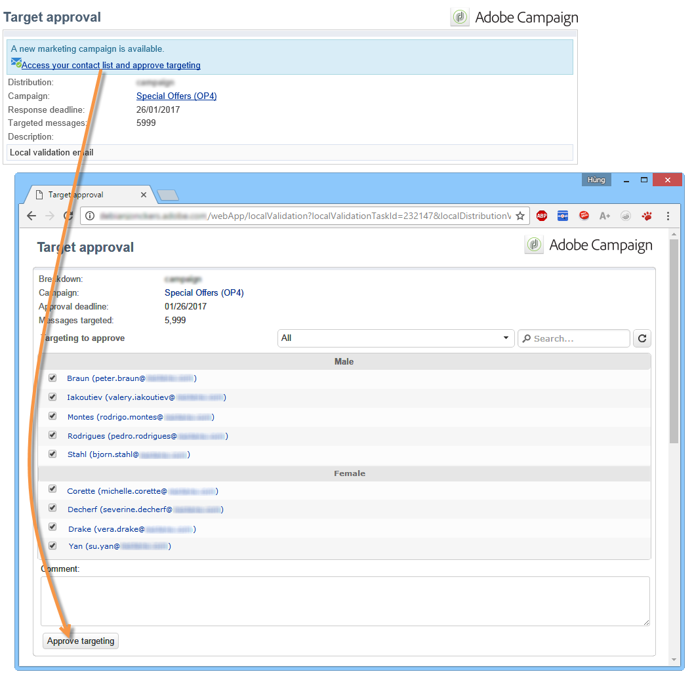

# Aprovação local{#local-approval}

When integrated into a targeting workflow, the **[!UICONTROL Local approval]** activity lets you set up a recipient approval process before the delivery is sent.

>[!CAUTION]
>
>Para usar essa atividade, você precisa ter adquirido o módulo Marketing distribuído, que é uma opção do Campaign. Verifique o contrato de licença.

Para obter um exemplo da **[!UICONTROL Local approval]** atividade com um modelo de distribuição, consulte [Uso da atividade](../../workflow/using/using-the-local-approval-activity.md)de aprovação local.

Start by entering a label for the activity and the **[!UICONTROL Action to execute]** field:

* Select the **[!UICONTROL Target approval notification]** option to send a notification email to local supervisors before the delivery, asking them to approve the recipients assigned to them.

   

* **Query incremental**: permite executar um query e planejar sua execução. Consulte a seção Consulta  incremental.

   

## Notificação de aprovação de target {#target-approval-notification}

In this case, the **[!UICONTROL Local approval]** activity is placed between upstream targeting and the delivery:

Os campos a serem inseridos no caso de uma notificação para aprovação de target são:

* **[!UICONTROL Distribution context]**: selecione a **[!UICONTROL Specified in the transition]** opção se estiver usando uma atividade **[!UICONTROL Split]** de tipo para limitar a população direcionada. Nesse caso, o template de distribuição é inserido na atividade de Split. If you are not limiting the targeted population, select the **[!UICONTROL Explicit]** option here and enter the distribution template in the **[!UICONTROL Data distribution]** field.

   Para obter mais informações sobre como criar um modelo de distribuição de dados, consulte [Limitação do número de registros de subconjunto por distribuição](../../workflow/using/split.md#limiting-the-number-of-subset-records-per-data-distribution)de dados.

* **[!UICONTROL Approval management]**

   * Selecione o template de delivery e o assunto que será usado para a notificação por email. Um template padrão está disponível: **[!UICONTROL Local approval notification]**. Você também pode adicionar uma descrição que aparecerá acima das listas de recipients nas notificações de aprovação e de feedback.
   * Specify the **[!UICONTROL Approval type]** that corresponds to the approval deadline (date or deadline from the start of the approval). Nesta data, o workflow começa novamente e os recipients que não foram aprovados não serão considerados no target. Depois que as notificações forem enviadas, a atividade será colocada em fila para que os supervisores locais possam aprovar seus contatos.

      >[!NOTE]
      >
      >Por padrão, quando o processo de aprovação é iniciado, a atividade fica pendente por três dias.

      Você também pode adicionar um ou mais lembretes para informar aos supervisores locais que o prazo final está se aproximando. To do this, click the **[!UICONTROL Add a reminder]** link.

* **[!UICONTROL Complementary set]**: a **[!UICONTROL Generate complement]** opção permite gerar um segundo conjunto que inclui todos os alvos não aprovados.

   >[!NOTE]
   >
   >Essa opção está desabilitada por padrão.

## Relatório de feedback de delivery {#delivery-feedback-report}

In this case, the **[!UICONTROL Local approval]** activity is placed after the delivery:

No caso de um relatório de feedback de delivery, os seguintes campos devem ser inseridos:

* Select the **[!UICONTROL Specified in the transition]** option if the delivery was entered during a previous activity. Select **[!UICONTROL Explicit]** to specify the delivery in the local approval activity.
* Selecione o template de delivery e o objeto do email de notificação. Há um template padrão: **[!UICONTROL Local approval notification]**.

## Example: Approving a workflow delivery {#example--approving-a-workflow-delivery}

Este exemplo mostra como configurar um processo de aprovação para um delivery de workflow. For more information about creating delivery workflows, refer to the [Example: delivery workflow](../../workflow/using/delivery.md#example--delivery-workflow) section.

Um operador pode aprovar um delivery de duas formas: usando a página da Web vinculada na mensagem de email ou através do console.

* Aprovação da Web

   O email enviado para operadores do grupo Administrador permite aprovar o target do delivery. A mensagem usa o texto definido e a expressão JavaScript é substituída pelo valor calculado (neste caso, &#39;574&#39;)

   Para aprovar o delivery, clique no link relevante e entre no console do Adobe Campaign.

   

   Make a choice and click the **[!UICONTROL Submit]** button.

   

* Aprovação através do console

   In the tree structure, the **[!UICONTROL Administration > Production > Objects created automatically > Approvals pending]** node contains the list of tasks to be approved by the operator currently connected. A lista deve exibir uma linha. Clique duas vezes na linha para responder. A janela a seguir é exibida:

Selecione **Sim** e clique em **[!UICONTROL Approve]**. Uma mensagem informará que a resposta foi registrada.

Volte para a tela de fluxo de trabalho: Após dez segundos, o diagrama é exibido da seguinte maneira:

The workflow has executed the **[!UICONTROL Delivery control]** task, which in this case means starting the delivery previously created. O workflow foi concluído sem erros.
