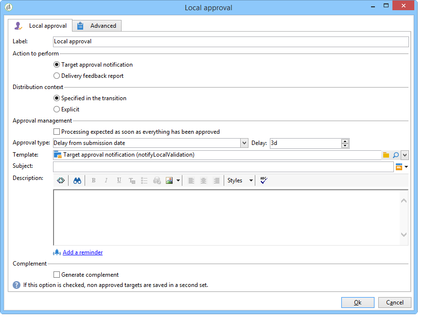
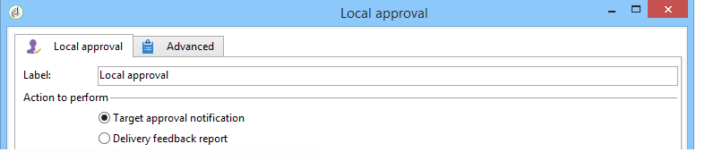
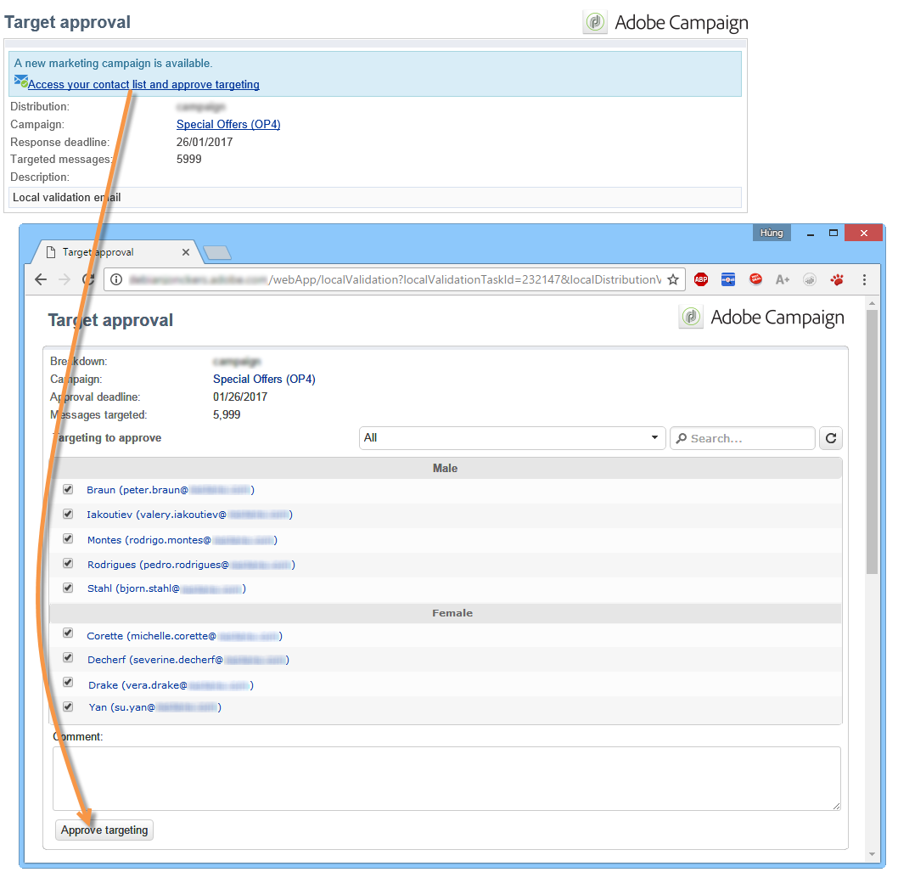
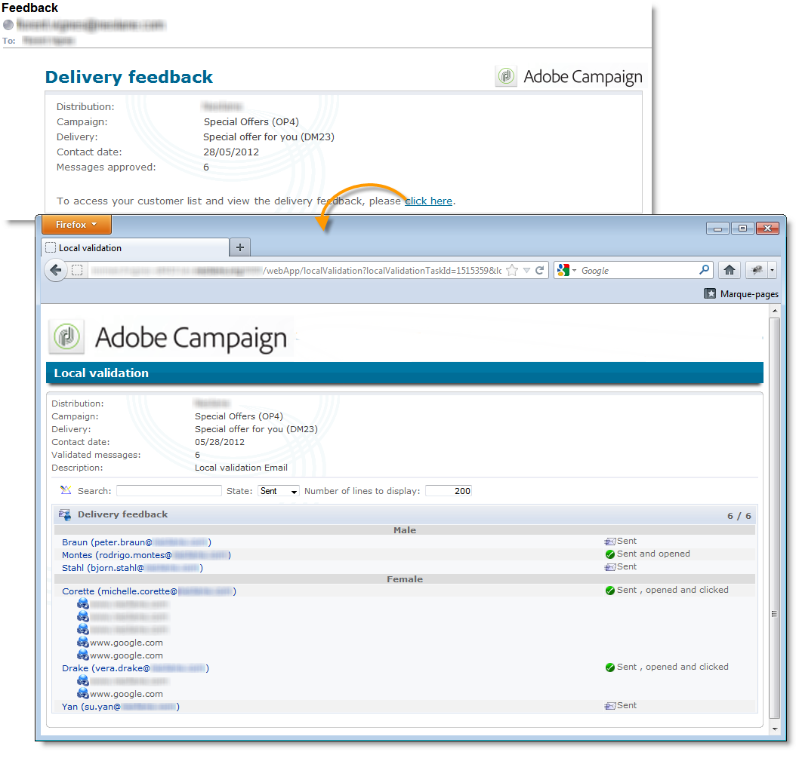
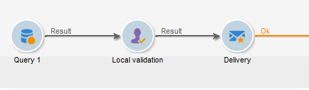
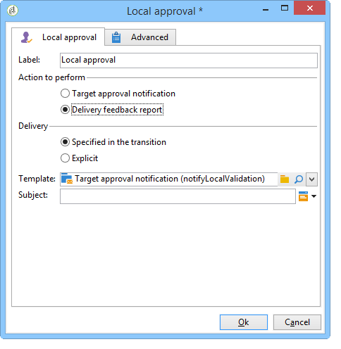
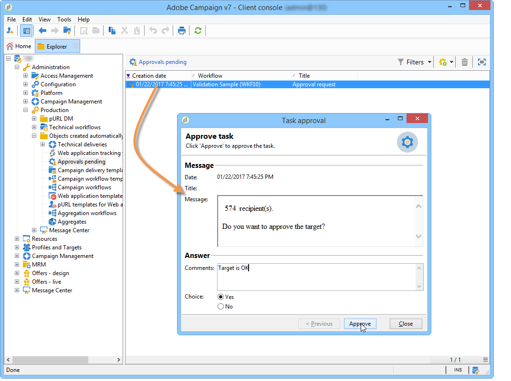
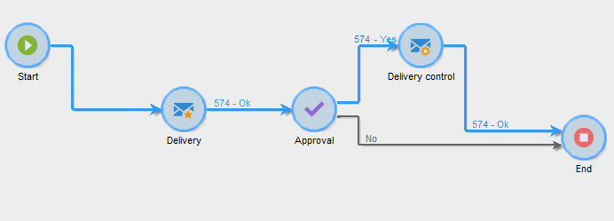

# Aprovação local{#local-approval}

Quando integrado em um fluxo de trabalho de segmentação, a atividade **[!UICONTROL Local approval]** permite configurar um processo de aprovação de destinatário antes do envio da entrega.

>[!CAUTION]
>
>Para usar essa atividade, você precisa ter adquirido o módulo Marketing distribuído, que é uma opção do Campaign. Verifique o contrato de licença.

Para obter um exemplo da atividade **[!UICONTROL Local approval]** com um modelo de distribuição, consulte [Uso da atividade de aprovação local](using-the-local-approval-activity.md).

Comece inserindo um rótulo para a atividade e o campo **[!UICONTROL Action to execute]**:

* Selecione a opção **[!UICONTROL Target approval notification]** para enviar um email de notificação para supervisores locais antes da entrega, pedindo sua aprovação dos destinatários atribuídos a eles.

  

* **Consulta incremental**: permite executar um query e planejar sua execução. Consulte a seção [Consulta incremental](incremental-query.md).

  

## Notificação de aprovação de target {#target-approval-notification}

Nesse caso, a atividade **[!UICONTROL Local approval]** é colocada entre o direcionamento e a entrega upstream:

Os campos a serem inseridos no caso de uma notificação para aprovação de target são:

* **[!UICONTROL Distribution context]**: selecione a opção **[!UICONTROL Specified in the transition]** se estiver usando uma atividade do tipo **[!UICONTROL Split]** para limitar a população de destino. Nesse caso, o modelo de distribuição é inserido na atividade de Split. Se você não estiver limitando a população de destino, selecione a opção **[!UICONTROL Explicit]** aqui e insira o modelo de distribuição no campo **[!UICONTROL Data distribution]**.

  Para obter mais informações sobre como criar um modelo de distribuição de dados, consulte [Limitação do número de registros de subconjunto por distribuição de dados](split.md#limiting-the-number-of-subset-records-per-data-distribution).

* **[!UICONTROL Approval management]**

   * Selecione o modelo de entrega e o assunto que será usado para a notificação por email. Um modelo padrão está disponível: **[!UICONTROL Local approval notification]**. Você também pode adicionar uma descrição que aparecerá acima das listas de destinatários nas notificações de aprovação e de feedback.
   * Especifique o **[!UICONTROL Approval type]** que corresponda ao prazo final de aprovação (data ou prazo final do início da aprovação). Nesta data, o fluxo de trabalho começa novamente e os destinatários que não foram aprovados não serão considerados na segmentação. Depois que as notificações forem enviadas, a atividade será colocada em fila para que os supervisores locais possam aprovar seus contatos.

     >[!NOTE]
     >
     >Por padrão, quando o processo de aprovação é iniciado, a atividade fica pendente por três dias.

     Você também pode adicionar um ou mais lembretes para informar aos supervisores locais que o prazo final está se aproximando. Para fazer isso, clique em **[!UICONTROL Add a reminder]**.

* **[!UICONTROL Complementary set]**: a opção **[!UICONTROL Generate complement]** permite gerar um segundo conjunto que inclui todos os targets não aprovados.

  >[!NOTE]
  >
  >Essa opção está desabilitada por padrão.

## Relatório de feedback de entrega {#delivery-feedback-report}

Nesse caso, a atividade **[!UICONTROL Local approval]** é disponibilizada após a entrega:

No caso de um relatório de feedback de entrega, os seguintes campos devem ser inseridos:

* Selecione a opção **[!UICONTROL Specified in the transition]** se a entrega foi inserida durante uma atividade anterior. Selecione **[!UICONTROL Explicit]** para especificar a entrega na atividade de aprovação local.
* Selecione o modelo de entrega e o objeto do email de notificação. Há um modelo padrão: **[!UICONTROL Local approval notification]**.

## Exemplo: aprovação de uma entrega de fluxo de trabalho {#example--approving-a-workflow-delivery}

Este exemplo mostra como configurar um processo de aprovação para uma entrega de fluxo de trabalho. Para obter mais informações sobre como criar fluxos de trabalho de entrega, consulte a seção [Exemplo: fluxo de trabalho de entrega](delivery.md#example--delivery-workflow).

Um operador pode aprovar uma entrega de duas formas: usando a página da Web vinculada na mensagem de email ou através do console.

* Aprovação da Web

  O email enviado para operadores do grupo Administrador permite aprovar o target da entrega. A mensagem usa o texto definido e a expressão JavaScript é substituída pelo valor calculado (neste caso, &#39;574&#39;)

  Para aprovar a entrega, clique no link relevante e entre no console do Adobe Campaign.

  

  Escolha e clique no botão **[!UICONTROL Submit]**.

  

* Aprovação através do console

  Na estrutura de árvore, o nó **[!UICONTROL Administration > Production > Objects created automatically > Approvals pending]** contém a lista de tarefas a serem aprovadas pelo operador conectado atualmente. A lista deve exibir uma linha. Clique duas vezes na linha para responder. A janela a seguir é exibida:

Selecione **Yes** e depois clique em **[!UICONTROL Approve]**. Uma mensagem informará que a resposta foi registrada.

Volte para a tela fluxo de trabalho. Após aproximadamente dez segundos, o diagrama é exibido da seguinte maneira:

O fluxo de trabalho executou a tarefa **[!UICONTROL Delivery control]**, que nesse caso significa iniciar a entrega criada anteriormente. O fluxo de trabalho foi concluído sem erros.
