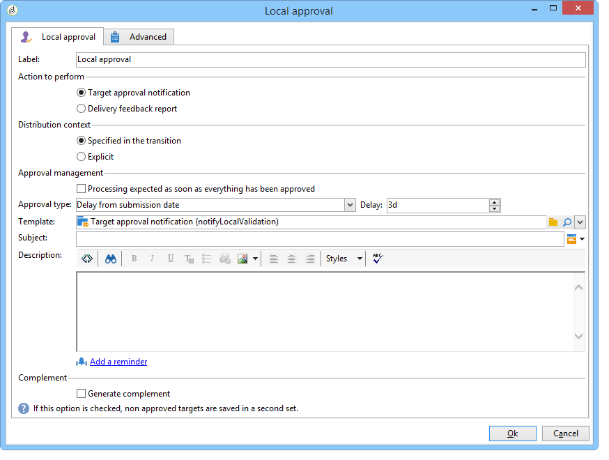

# Aprovação local{#local-approval}

Quando integrado em um workflow para construção do target, a atividade **[!UICONTROL Local approval]** permite configurar um processo de aprovação de recipient antes do envio do delivery.

>[!CAUTION]
>
>Para usar essa atividade, você precisa ter adquirido o módulo Marketing distribuído, que é uma opção do Campaign. Verifique o contrato de licença.

Para obter um exemplo da atividade **[!UICONTROL Local approval]** com um template de distribuição, consulte [Uso da atividade de aprovação local](../../workflow/using/using-the-local-approval-activity.md).

Start by entering a label for the activity and the **[!UICONTROL Action to execute]** field:

* Selecione a opção **[!UICONTROL Target approval notification]** para enviar um email de notificação para supervisores locais antes do delivery, pedindo sua aprovação dos recipients atribuídos a eles.

   

* **Query incremental**: permite executar um query e planejar sua execução. Consulte a seção [Query incremental](../../workflow/using/incremental-query.md).

   

## Notificação de aprovação de target {#target-approval-notification}

Nesse caso, a atividade **[!UICONTROL Local approval]** é colocada entre o target e o delivery upstream:

Os campos a serem inseridos no caso de uma notificação para aprovação de target são:

* **[!UICONTROL Distribution context]**: selecione a **[!UICONTROL Specified in the transition]** opção se estiver usando uma atividade de **[!UICONTROL Split]** tipo para limitar a população direcionada. Nesse caso, o template de distribuição é inserido na atividade de Split. Se você não estiver limitando o público-alvo, selecione a opção **[!UICONTROL Explicit]** aqui e insira o template de distribuição no campo **[!UICONTROL Data distribution]**.

   Para obter mais informações sobre como criar um template de distribuição de dados, consulte [Limitação do número de registros de subconjunto por distribuição de dados](../../workflow/using/split.md#limiting-the-number-of-subset-records-per-data-distribution).

* **[!UICONTROL Approval management]**

   * Selecione o template de delivery e o assunto que será usado para a notificação por email. Um template padrão está disponível: **[!UICONTROL Local approval notification]**. Você também pode adicionar uma descrição que aparecerá acima das listas de recipients nas notificações de aprovação e de feedback.
   * Especifique o **[!UICONTROL Approval type]** que corresponda ao prazo final de aprovação (data ou prazo final do início da aprovação). Nesta data, o workflow começa novamente e os recipients que não foram aprovados não serão considerados no target. Depois que as notificações forem enviadas, a atividade será colocada em fila para que os supervisores locais possam aprovar seus contatos.

      >[!NOTE]
      >
      >Por padrão, quando o processo de aprovação é iniciado, a atividade fica pendente por três dias.

      Você também pode adicionar um ou mais lembretes para informar aos supervisores locais que o prazo final está se aproximando. Para fazer isso, clique em **[!UICONTROL Add a reminder]**.

* **[!UICONTROL Complementary set]**: a **[!UICONTROL Generate complement]** opção permite gerar um segundo conjunto que inclui todos os públicos alvos não aprovados.

   >[!NOTE]
   >
   >Essa opção está desabilitada por padrão.

## Relatório de feedback de delivery {#delivery-feedback-report}

Nesse caso, a atividade **[!UICONTROL Local approval]** é disponibilizada após o delivery:

No caso de um relatório de feedback de delivery, os seguintes campos devem ser inseridos:

* Select the **[!UICONTROL Specified in the transition]** option if the delivery was entered during a previous activity. Selecione **[!UICONTROL Explicit]** para especificar o delivery na atividade de aprovação local.
* Selecione o template de delivery e o objeto do email de notificação. Há um template padrão: **[!UICONTROL Local approval notification]**.

## Exemplo: Aprovação de um delivery de workflow {#example--approving-a-workflow-delivery}

Este exemplo mostra como configurar um processo de aprovação para um delivery de workflow. Para obter mais informações sobre como criar workflows de delivery, consulte a seção [Exemplo: workflow de delivery](../../workflow/using/delivery.md#example--delivery-workflow).

Um operador pode aprovar um delivery de duas formas: usando a página da Web vinculada na mensagem de email ou através do console.

* Aprovação da Web

   O email enviado para operadores do grupo Administrador permite aprovar o target do delivery. A mensagem usa o texto definido e a expressão JavaScript é substituída pelo valor calculado (neste caso, &#39;574&#39;)

   Para aprovar o delivery, clique no link relevante e entre no console do Adobe Campaign.

   

   Escolha e clique no botão **[!UICONTROL Submit]**.

   

* Aprovação através do console

   In the tree structure, the **[!UICONTROL Administration > Production > Objects created automatically > Approvals pending]** node contains the list of tasks to be approved by the operator currently connected. A lista deve exibir uma linha. Clique duas vezes na linha para responder. A janela a seguir é exibida:

Selecione **Yes** e depois clique em **[!UICONTROL Approve]**. Uma mensagem informará que a resposta foi registrada.

Volte para a tela workflow. Após aproximadamente dez segundos, o diagrama é exibido da seguinte maneira:

O workflow executou a tarefa **[!UICONTROL Delivery control]**, que nesse caso significa iniciar o delivery criado anteriormente. O workflow foi concluído sem erros.
