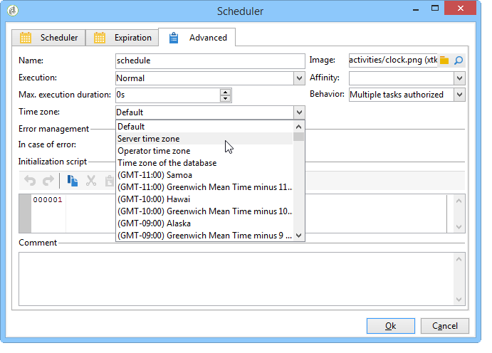

# Gerenciar fusos horários{#managing-time-zones}

O Adobe Campaign permite a gestão do intervalo entre vários países relacionados à mesma instância. A configuração aplicada é aplicada durante a criação da instância.

Para obter mais informações sobre a configuração de fusos horários do Adobe Campaign, consulte [section](../../installation/using/time-zone-management.md).

Em um workflow, é possível adaptar os agendamentos de execução de atividades e vincular um fuso horário específico a uma atividade ou ao workflow inteiro. Essa configuração é útil ao importar o arquivo ou dentro da estrutura de agendamento de delivery.

## Agendamento de execução {#execution-scheduling}

You can schedule the execution of tasks using the scheduler (refer to [Scheduler](../../workflow/using/scheduler.md)). Também é possível usar as opções de agendamento disponíveis nas atividades que oferecem essa funcionalidade. Essas atividades oferecem uma **[!UICONTROL Schedule]** guia: **[!UICONTROL File collector]**, **[!UICONTROL File transfer]**, **[!UICONTROL Web download]**, **[!UICONTROL Email reception]** &amp; **[!UICONTROL SMS]**, etc.

Para todas as tarefas agendadas, ou seja, todas as atividades com opções de agendamento, é possível selecionar o fuso horário a ser aplicado. The time zone is selected via the **[!UICONTROL Advanced]** tab of the concerned activity:

Os valores possíveis são:

* Fuso horário do servidor

   Usa o fuso horário do servidor de aplicativos Adobe Campaign.

* Fuso horário do usuário

   Usa o fuso horário do operador do Adobe Campaign que executa o workflow.

* Fuso horário do banco de dados

   Usa o fuso horário do servidor de banco de dados usado.

* Fusos horários específicos

   Usa o fuso horário selecionado.

If the **[!UICONTROL By default]** value is selected, the time zone of the workflow is applied, or, otherwise, that of the application server.

## Vínculo de um fuso horário a uma atividade {#linking-a-time-zone-to-an-activity}

The **[!UICONTROL Advanced]** tab of the workflow activities lets you select its time zone. Embora a maior parte do tempo, o fuso horário dos workflows seja suficiente, pode ser necessário sobrescrever ele agora e novamente em uma atividade específica, como importação de dados, para vincular datas aos seus fusos horários corretos.
