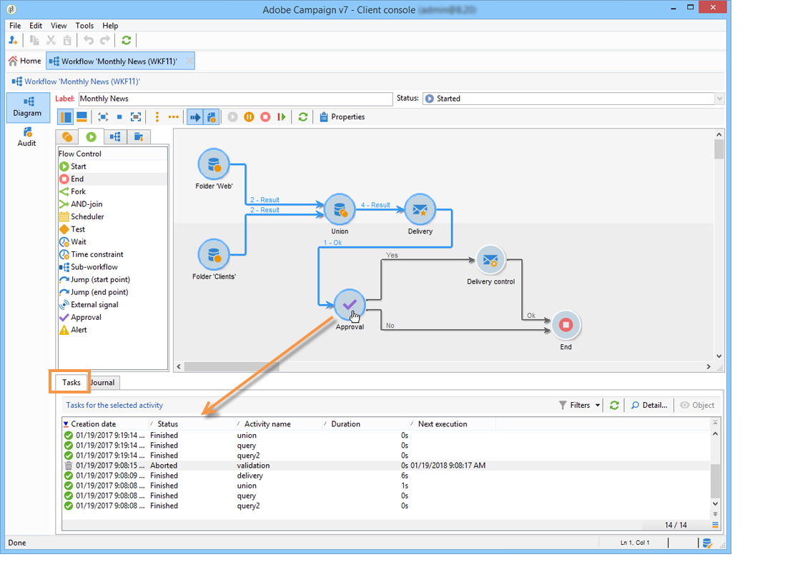

# Monitoramento da execução do workflow {#monitoring-workflow-execution}

Esta seção apresenta informações sobre como monitorar a execução de seus fluxos de trabalho.

Um caso de uso sobre como criar um fluxo de trabalho que permite monitorar o status de um conjunto de fluxos de trabalho que estão &quot;pausados&quot;, &quot;parados&quot; ou &quot;com erros&quot; também está disponível [nesta seção](../../workflow/using/supervising-workflows.md#supervising-workflows).

Além disso, os administradores da instância podem usar a trilha **de** auditoria para verificar as atividades e as últimas modificações feitas nos fluxos de trabalho, o estado dos fluxos de trabalho. Para obter mais informações, consulte a [seção dedicada](../../production/using/audit-trail.md).

Outras maneiras de monitorar os diferentes processos do Campaign são apresentadas [nesta página](https://helpx.adobe.com/campaign/kb/acc-maintenance.html).

## Exibição do progresso {#displaying-progress}

Você pode monitorar a execução ao exibir o progresso usando o ícone apropriado na barra de ferramentas.

The **[!UICONTROL Display progress information]** icon lets you display the status and the activity result in the execution screen.


Quando essa opção é selecionada, as atividades executadas são exibidas em azul, as atividades pendentes piscam, os avisos são exibidos em laranja e os erros em vermelho. Essa opção também exibe o resultado das atividades na transição de saída, seguido do rótulo do resultado conforme definido nas propriedades da atividade e da duração da tarefa se ela exceder um segundo


## Exibição de logs {#displaying-logs}

O log contém o histórico ou a trilha de auditoria do workflow. Ele registra todas as ações do usuário, todas as operações executadas e erros encontrados. É possível:

* Select the **[!UICONTROL Tracking]** tab in the detail. Esta lista contém todas as mensagens de workflow.

   

* Filtrar as mensagens de log por atividade. Para fazer isso, clique **[!UICONTROL Display the tasks and the log]** na barra de ferramentas acima do diagrama para exibir as guias **[!UICONTROL Log]** e **[!UICONTROL Tasks]** abaixo do diagrama. Selecionar uma atividade para exibir todas as mensagens relacionadas. Esta lista contém todas as mensagens quando nenhuma atividade é selecionada.

   

   >[!NOTE]
   >
   >Clicar no plano de fundo do diagrama para anular a seleção de todos os elementos.

* Visualizar apenas as mensagens vinculadas a uma determinada tarefa. To do this, select the **[!UICONTROL Tasks]** tab, and then select an activity in the diagram in order to restrict the list. Clique duas vezes em uma tarefa para exibir as informações. A última guia na janela contém o log.

   

   The **[!UICONTROL Details...]** button lets you display all additional information on activity execution. Por exemplo, você pode exibir o operador de validação e quando aplicável, o comentário inserido durante a aprovação, como no exemplo a seguir:

   

>[!NOTE]
>
>O log não é removido quando um workflow é reiniciado. Todas as mensagens são mantidas. Se desejar descartar as mensagens de uma execução anterior, você deve limpar o histórico.

O log exibe a lista cronológica de mensagens de execução relacionadas às atividades do workflow para construção do target.

* Log de uma campanha de target

   Once a targeting campaign has been executed, click the **[!UICONTROL Tracking]** tab to view the execution trace.

   

   Todas as mensagens da campanha são exibidas: campanhas realizadas, assim como avisos ou erros.

* Log de uma atividade

   Você também pode exibir o log de execução e os detalhes de cada atividade. Há duas maneiras de fazer isso:

   1. Selecione a atividade direcionada e clique no **[!UICONTROL Display the tasks and the log]** ícone.

      

      A seção inferior do diagrama mostra duas guias: Registro e tarefas.

      As atividades selecionadas no diagrama atuam como filtros na lista de logs e tarefas.

      

   1. Right-click the targeted activity and select **[!UICONTROL Display logs]**.

      

      O log é exibido em uma janela separada.

## Remoção dos logs {#purging-the-logs}

O histórico do workflow não é removido automaticamente: todas as mensagens são mantidas por padrão. History can be purged via the **[!UICONTROL File > Actions]** menu or by clicking the **[!UICONTROL Actions]** button located in the toolbar above the list. Select **[!UICONTROL Purge history]**. As opções disponíveis no **[!UICONTROL Actions]** menu são detalhadas na seção da barra de ferramentas [](../../workflow/using/executing-a-workflow.md#actions-toolbar) Ações.


## Schema de workflow e tabela de trabalho {#worktables-and-workflow-schema}

O workflow transmite tabelas de trabalho que podem ser manipuladas por determinadas atividades. O Adobe Campaign permite, por meio de atividades de Gestão de Dados, modificar, renomear e enriquecer as colunas das tabelas de trabalho do workflow, por exemplo, para alinhar com a nomenclatura dependendo das necessidades do cliente, para coletar informações adicionais sobre o cobeneficiários de um contrato etc.

Também é possível criar vínculos entre várias dimensões de trabalho e definir alterações de dimensão. Por exemplo, para cada contrato registrado no banco de dados, direcione o titular principal e use dados de cotitular nas informações adicionais.

As tabelas de trabalho do workflow é excluído automaticamente quando o workflow fica passivo. If you wish to keep a work table, save it in a list via the **[!UICONTROL List update]** activity (refer to [List update](../../workflow/using/list-update.md)).

## Gestão de erros {#managing-errors}

Quando ocorre um erro, o workflow é pausado e a atividade está sendo executada quando a ocorrência do erro pisca em vermelho. In the workflow overview (**[!UICONTROL Monitoring]** universe > **[!UICONTROL Workflows]** link) you can display workflows with errors only, as shown below.


In the Adobe Campaign Explorer, the workflow list displays a **[!UICONTROL Failed]** column by default.


Quando um workflow está com erro, os operadores pertencentes ao grupo de supervisão do workflow são notificados por email, desde que seus endereços de email estejam listados em seus perfis. This group is selected in the **[!UICONTROL Supervisor(s)]** field of the workflow properties.


O conteúdo da notificação está configurado no modelo **[!UICONTROL Workflow manager notification]** padrão: Este modelo é selecionado na **[!UICONTROL Execution]** guia das propriedades do fluxo de trabalho. A notificação mostra o nome do workflow com erro e a tarefa relacionada.

Exemplo de notificação:


O link permite acessar o console do Adobe Campaign no modo da Web e trabalhar no workflow com erro após fazer logon.


Você pode configurar o workflow para que ele não pause e continue a execução em caso de erros. Para fazer isso, edite o fluxo de trabalho **[!UICONTROL Properties]** e, na **[!UICONTROL Error management]** seção, selecione a **[!UICONTROL Ignore]** opção no **[!UICONTROL In case of error]** campo. Você pode então especificar o número de erros consecutivos que podem ser ignorados antes que o processo seja pausado.

Nesse caso, a tarefa com erro é anulada. Esse modo é particularmente adequado para workflows projetados para tentar novamente a campanha mais tarde (ações periódicas).


>[!NOTE]
>
>Você pode aplicar essa configuração individualmente para cada atividade. Para fazer isso, edite as propriedades da atividade e selecione o modo de gerenciamento de erros na **[!UICONTROL Advanced]** guia.

Para obter mais informações sobre a solução de problemas de execução de fluxos de trabalho, consulte a seção [](../../production/using/workflow-execution.md)dedicada.

## Processamento de erros {#processing-errors}

Concerning activities, the **[!UICONTROL Process errors]** option displays a specific transition which will be enabled if an error is generated. Nesse caso, o workflow não entra no modo de erro e a execução continua.

Os erros considerados são erros do sistema de arquivos (o arquivo não pôde ser movido, o diretório não pôde ser acessado etc.).

Essa opção não processa erros relacionados à configuração de atividade, ou seja, valores inválidos. Erros relacionados à configuração com falha não permitirão essa transição (o diretório não existe, etc.).

If a workflow is paused (manually or automatically after an error), the **[!UICONTROL Start]** button restarts the workflow execution where it was stopped. A atividade incorreta (ou atividade pausada) será executada novamente. As atividades anteriores não são executadas novamente.

To re-execute all of the workflow activities, use the **[!UICONTROL Restart]** button.

Se você modificar atividades já executadas, as alterações não serão consideradas quando a execução do workflow for reiniciada.

Se você modificar atividades não executadas, elas serão consideradas quando a execução do workflow for reiniciada.

Se você modificar atividades em pausa, as alterações não serão consideradas corretamente quando o workflow for reiniciado.

Se possível, recomendamos reiniciar completamente o workflow após realizar as modificações.

## Supervisão de instância {#instance-supervision}

The **[!UICONTROL Instance supervision]** page lets you view the Adobe Campaign server activity and display the list of workflows and deliveries with errors.

To access this page, go to the **[!UICONTROL Monitoring]** universe and click the **[!UICONTROL General view]** link.


To display all the workflows, click the **[!UICONTROL Workflows]** link. Use a lista suspensa para exibir os workflows na plataforma com base em seu estado.


Clique no link em um workflow com erros para abri-lo e visualizar seu log.


## Evitando várias execuções simultâneas {#preventing-simultaneous-multiple-executions}

Um único workflow pode ter várias execuções ativas ao mesmo tempo. Isso deve ser evitado em alguns casos.

Por exemplo, você pode ter um scheduler acionando a execução do workflow a cada hora, mas, às vezes, a execução do workflow inteiro demora mais de uma hora. Talvez você queira ignorar a execução se o workflow já estiver em execução.

Se você tiver uma atividade de sinal no início do workflow, talvez queira ignorar o sinal se o workflow estiver em execução.

O princípio geral é o seguinte:


A solução é usar uma variável de instância. As variáveis de instância são compartilhadas por todas as execuções paralelas dos workflows.

Um exemplo de workflow de teste simples:


The **[!UICONTROL Scheduler]** is triggering an event every minute. The following **[!UICONTROL Test]** activity is going to test the **isRunning** instance variable to decide whether or not to continue the execution:


>[!NOTE]
>
>**isRunning** é um nome da variável escolhido para este exemplo. Essa não é uma variável interna.

The activity immediately following the **[!UICONTROL Test]** in the **yes** branch must set the instance variable in its **Initialization script**:

```
instance.vars.isRunning = true
```

A última atividade na ramificação **sim** deve reverter a variável para falso em seu **script de Inicialização**:

```
instance.vars.isRunning = false
```

Observe que:

* Você pode verificar o valor atual da variável da instância por meio da guia **Variáveis** nas **Propriedades** do workflow.
* As variáveis de instância são redefinidas quando você reinicia um workflow.
* Em JavaScript, um valor indefinido é falso em um teste, permitindo testar a variável da instância mesmo antes de ter inicializado.
* Você pode monitorar as atividades que não são processadas devido a este mecanismo ao adicionar uma instrução de log ao script de inicialização do final &quot;nenhum&quot;.

   ```
   logInfo("Workflow already running, parallel execution not allowed.");
   ```

Nesta seção apresenta-se um caso de utilização: [Coordenação de atualizações](../../workflow/using/coordinating-data-updates.md)de dados.

## Manutenção do banco de dados {#database-maintenance}

Os workflows usam muitas tabelas de trabalho que consomem espaço e acabam reduzindo o desempenho da plataforma inteira se não houver manutenção. Para saber mais sobre a manutenção de banco de dados, consulte esta [seção](../../production/using/tables-to-maintain.md).

O workflow de **limpeza do banco de dados** pode ser acessado por meio do nó **Administração > Produção > Workflows técnicos**, permite excluir dados obsoletos para evitar o crescimento exponencial do banco de dados. O workflow é acionado automaticamente sem a intervenção do usuário. Consulte esta [seção](../../production/using/database-cleanup-workflow.md).

Você também pode criar workflows técnicos específicos para limpar o consumo de espaço desnecessário de dados. Consulte esta [seção](../../production/using/application-objects.md) e esta [página](#purging-the-logs).

## Manuseio de workflows pausados {#handling-of-paused-workflows}

Por padrão, se um workflow estiver pausado, suas tabelas de trabalho nunca serão apagadas. A partir do build 8880, os workflows pausados por muito tempo são interrompidos automaticamente e suas tabelas de trabalho são removidas. Esse comportamento é acionado da seguinte maneira:

* Os workflows pausados por mais de 7 dias aparecem como um aviso no painel de monitoramento (e na API de monitoramento) e uma notificação é enviada ao grupo supervisor.
* The same happens every week, when the **[!UICONTROL cleanupPausedWorkflows]** technical workflow is triggered. Para obter mais informações sobre workflow, consulte [esta seção](../../workflow/using/delivery.md).
* Após 4 notificações (ou seja, um mês no estado pausado por padrão), o workflow é interrompido incondicionalmente. Um log aparece no workflow após sua interrupção. The tables are purged at the next execution **[!UICONTROL cleanup]** workflow

Esses períodos podem ser configurados por meio da opção NmsServer_PausedWorkflowPeriod.

Os supervisores de workflow são notificados. O criador e o último usuário que modificou o workflow também são notificados. Os administradores não recebem as notificações.

## Filtrar fluxos de trabalho de acordo com seu status{#filtering-workflows-status}

A interface do Campaign Classic permite monitorar o status de execução de todos os fluxos de trabalho na sua instância usando **exibições** predefinidas. Para acessar essas exibições, abra o nó&#x200B;**Administração**/**Auditoria**/ Status **dos** fluxos de trabalho.

As seguintes exibições estão disponíveis:

* **Em execução**: lista todos os fluxos de trabalho em execução.
* **Pausado**: lista todos os fluxos de trabalho pausados.
* **Falha**: lista todos os fluxos de trabalho com falha.

<!--Start Pending: lists all workflows that are waiting to be started by the operationMgt process.-->


<!--The Start Pending view is available with the Marketing campaigns package only. See Installing Campaign standard packages../../installation/using/installing-campaign-standard-packages.md.-->

Por padrão, essas exibições estão acessíveis na pasta **Auditoria**. No entanto, você pode recriá-los no local de sua escolha na árvore de pastas. Dessa forma, eles estarão disponíveis para usuários padrão sem nenhum direito administrativo.

Para fazer isso:

1. Clique com o botão direito do mouse na pasta onde deseja adicionar a exibição.
1. Em **Adicionar nova pasta**/**Administração**, selecione a exibição que deseja adicionar.
1. Depois que a pasta for adicionada à árvore, certifique-se de configurá-la como uma exibição, para que ela exiba todos os fluxos de trabalho, qualquer que seja a pasta de origem.Para obter mais informações sobre como configurar exibições, consulte [esta seção](../../platform/using/access-management.md#adding-folders-and-creating-views).

Além dessas exibições, você pode configurar pastas de filtros que permitirão filtrar a lista de fluxos de trabalho de acordo com o status de execução. Para fazer isso:

1. Acesse uma pasta do tipo fluxo de trabalho e selecione o **[!UICONTROL Filters]** / **[!UICONTROL Advanced filter]** menu.
1. Configure o filtro para que o **[!UICONTROL @status]** campo do fluxo de trabalho seja igual ao estado de sua escolha.
1. Salve e nomeie o filtro. Estará então disponível diretamente na lista de filtros.


Para obter mais informações, consulte estas seções:

* [Criação de filtros avançados](../../platform/using/creating-filters.md#creating-an-advanced-filter)
* [Salvar filtros](../../platform/using/creating-filters.md#saving-a-filter)

<!-- need to check if pending status filter will be implemented or not in january release, note, Additionally to these views, a prefedefined filter is available in workflow-type folders. It allows you to display in the list workflows that are waiting to be started by the operationMgt process only.This filter is available with the Marketing campaigns package only. See Installing Campaign standard packages../../installation/using/installing-campaign-standard-packages.md.-->

