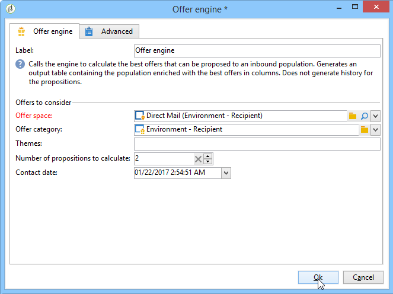

# Mecanismo de oferta{#offer-engine}

A atividade **[!UICONTROL Offer engine]** permite definir uma chamada para o mecanismo de oferta antes de uma entrega.

Essa atividade funciona de acordo com o mesmo princípio que a atividade de enriquecimento com uma chamada de mecanismo, enriquecendo os dados da população de entrada com uma oferta calculada pelo mecanismo, antes de uma entrega.

Após configurar sua consulta (consulte esta [seção](query.md)):

1. Adicione e abra uma atividade de **[!UICONTROL Offer engine]**.
1. Preencha os vários campos disponíveis para especificar a chamada para oferecer parâmetros de mecanismo (espaço de oferta, categoria ou tema(s), data de contato, número de ofertas a serem mantidas). O mecanismo calculará automaticamente as ofertas para adicionar de acordo com esses parâmetros.

   >[!CAUTION]
   >
   >Se usar essa atividade, somente as propostas de oferta usadas na entrega serão armazenadas.

   

1. Em seguida, configure uma atividade de entrega que corresponda ao canal escolhido. Consulte [Entregas entre canais](cross-channel-deliveries.md).
