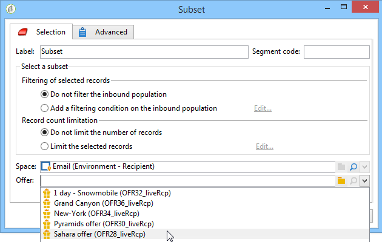

# Ofertas por célula{#offers-by-cell}

A atividade **[!UICONTROL Offers by cell]** permite distribuir a população de entrada (de uma consulta, por exemplo) em vários segmentos e especificar uma oferta a ser apresentada para cada um desses segmentos.

Essa atividade só pode ser usada com **Interaction**. Para obter mais informações, consulte esta [seção](../../interaction/using/about-outbound-channels.md).

Para fazer isso:

1. Adicione a atividade **[!UICONTROL Offers by cell]** após especificar a população do target e, em seguida, a abra.
1. Na guia **[!UICONTROL General]**, selecione o espaço de ofertas no qual deseja apresentar as ofertas.
1. Na guia **[!UICONTROL Cells]**, especifique os diferentes subconjuntos usando o botão **[!UICONTROL Add]**:

   * Especifique a população de subconjunto usando o filtro disponível e as regras de limitação.
   * Em seguida, selecione a oferta que deseja apresentar ao subconjunto. As ofertas disponíveis são aquelas qualificadas no espaço de oferta que foi selecionado na etapa anterior.

      

1. Em seguida, configure uma atividade de delivery que corresponda ao canal escolhido. Consulte [Deliveries entre canais](cross-channel-deliveries.md).
