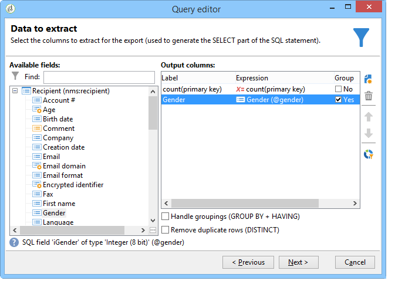
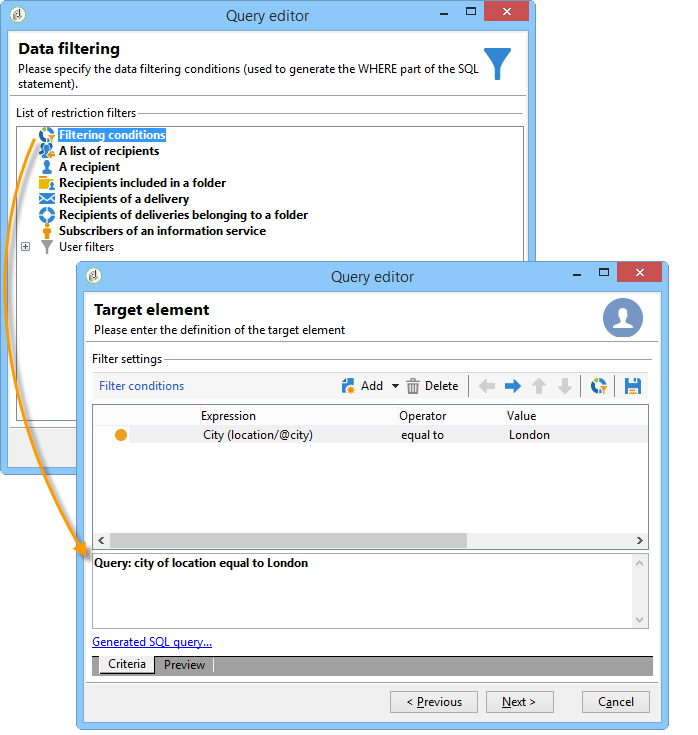

# Execução de computação agregada {#performing-aggregate-computing}

Neste exemplo, devemos contar o número de destinatários que vivem em Londres, de acordo com o gênero.

* Qual tabela precisa ser selecionada?

  A tabela de destinatários (**nms:recipient**)

* Quais campos devem ser selecionados na coluna de saída?

  Primary key (with count) e Gender

* Quais condições são usadas para filtrar as informações?

  Com base nos destinatários que vivem em Londres.

Para criar este exemplo, aplique as seguintes etapas:

1. Em **[!UICONTROL Data to extract]**, defina uma contagem para a chave primária (como mostrado no exemplo anterior). Adicione o campo **[!UICONTROL Gender]** na coluna de saída. Marque a opção **[!UICONTROL Group]** na coluna **[!UICONTROL Gender]**. Dessa forma, os destinatários serão agrupados por gênero.

   

1. Na janela **[!UICONTROL Sorting]**, clique em **[!UICONTROL Next]**: nenhuma classificação é necessária aqui.
1. Configure o filtro de dados. Aqui, é possível restringir a seleção aos contatos que vivem em Londres.

   

   >[!NOTE]
   >
   >Os valores diferenciam maiúsculas de minúsculas. Se o valor &quot;Londres&quot; é inserido na condição sem uma letra maiúscula e a lista de destinatários contiver a palavra &quot;Londres&quot; com uma letra maiúscula, então a consulta falha.

1. Na janela **[!UICONTROL Data formatting]**, clique em **[!UICONTROL Next]**: nenhuma formatação é necessária para este exemplo.
1. Na janela de pré-visualização, clique em **[!UICONTROL Launch data preview]**.

   Há três valores separados para cada tipo por gênero: **2** para feminino, **1** para masculino e **0** quando o sexo é desconhecido. Neste exemplo, a lista contém 10 mulheres, 16 homens e 2 pessoas cujo gênero não é conhecido.

   
