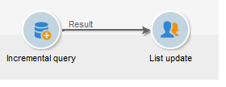
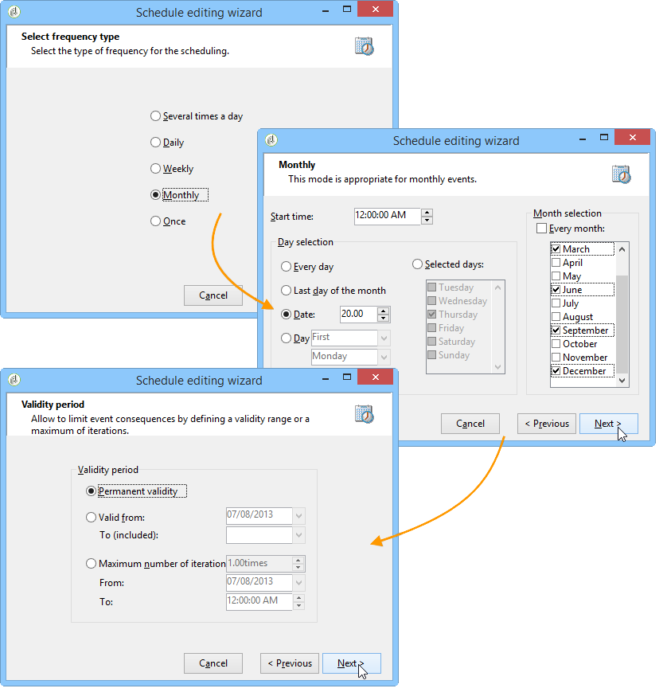

# Atualização da lista trimestral usando uma consulta incremental {#quarterly-list-update}

No exemplo a seguir, uma [consulta incremental](incremental-query.md) é usada para atualizar automaticamente uma lista de destinatários. Esses destinatários são alvos como parte das campanhas de marketing sazonais.

Como essas campanhas são iniciadas no início de cada temporada para oferecer atividades esportivas relevantes, essas listas são atualizadas a cada trimestre. No entanto, um destinatário só deve ser alvo dessa campanha uma vez a cada 9 meses. Isso permite espaçar a frequência de elegibilidade do destinatário e oferecer atividades para diferentes estações ao longo dos anos.

1. Adicione uma consulta incremental, bem como uma atividade de atualização da lista em um novo fluxo de trabalho.
1. Configure a guia **[!UICONTROL Incremental query]** da atividade, conforme especificado em [Criar uma consulta](query.md#creating-a-query).
1. Selecione a guia **[!UICONTROL Scheduling & History]** e especifique um histórico de 270 dias. Um destinatário que já foi direcionado não será direcionado novamente por um período de 270 dias ou aproximadamente 9 meses.

   Clique no botão **[!UICONTROL Change...]**

1. Para garantir que a lista seja atualizada antes do início de cada estação, selecione **[!UICONTROL Monthly]**.
1. Na próxima tela, selecione março, junho, setembro e dezembro. Escolha o dia 20 do mês e escolha o horário que deseja iniciar o fluxo de trabalho.
1. Em seguida, selecione o período de validade da consulta. Por exemplo, se você quiser que essa atividade fique ativa permanentemente, selecione **[!UICONTROL Permanent validity]**.

   

1. Após a aprovação da consulta incremental, configure a atividade de atualização da lista como explicado em [List update](list-update.md).

O fluxo de trabalho será iniciado automaticamente e imediatamente antes do início de cada estação. A lista será atualizada com os novos destinatários qualificados para receber as ofertas.
