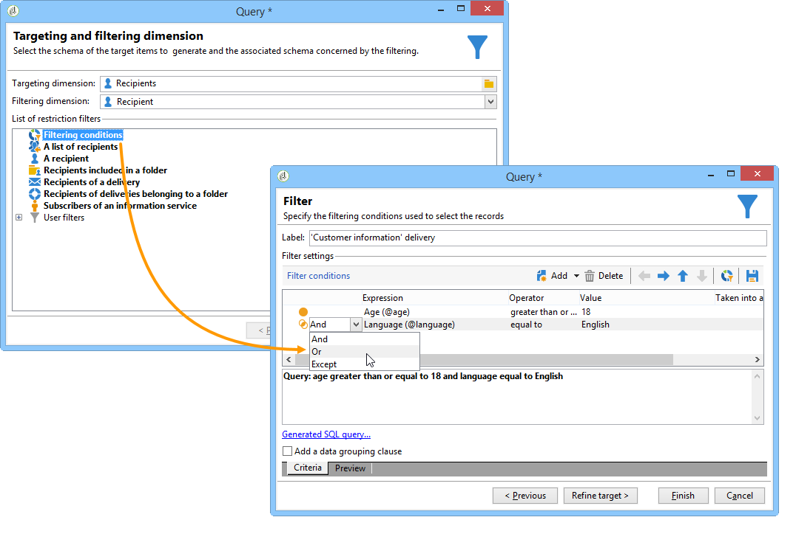

# Consulta{#query}

## Criação de query {#creating-a-query}

Um query permite selecionar um target de acordo com critérios. Você pode associar um código de segmento ao resultado do query e inserir dados adicionais nele.
Para obter mais informações sobre amostras de consulta, consulte esta [seção](../../workflow/using/querying-recipient-table.md).

>[!NOTE]
>
>Atividades de consulta não são compatíveis com campos CLOB ao usar o Oracle.

For more on using and managing additional data, refer to [Adding data](#adding-data).

The **[!UICONTROL Edit query...]** link lets you define the targeting type, the restrictions, and the selection criteria for the population in the following way:

1. Selecione a targeting dimension e a dimensão de filtro. Por padrão, o target é selecionado dos recipients. A lista de filtros de restrição é igual àquelas usadas para o target de delivery.

   O targeting dimension coincide com o tipo de elemento que iremos trabalhar, por exemplo, o público alvo da operação.

   A dimensão do filtro permite coletar esses elementos, por exemplo, informações relacionadas à pessoa alvo (contratos, liquidações completas e finais etc.).

   Para obter mais informações, consulte [Definição de metas e dimensões](../../workflow/using/building-a-workflow.md#targeting-and-filtering-dimensions)de filtragem.

   

   A query can be based on data from the inbound transition, if necessary, by selecting **[!UICONTROL Temporary schema]** when choosing targeting and filtering dimensions.

   

1. Defina os públicos usando o assistente. Os campos a serem inseridos podem variar de acordo com o tipo de target. You can preview the targeted population with your current criteria using the **[!UICONTROL Preview]** tab.

   Para obter mais informações sobre como criar e usar filtros ou queries, consulte esta [seção](../../platform/using/filtering-options.md).

   

1. If you have selected **[!UICONTROL Filtering conditions]** at step 1 or using the **[!UICONTROL Filters]** > **[!UICONTROL Advanced filter...]** option, then you will have to manually add filtering criteria later on.

   Você também pode adicionar condições de agrupamento de dados marcando a caixa correspondente. Para fazer isso, a dimensão de filtro deve ser diferente do targeting dimension do query. Para obter mais informações sobre agrupamento, consulte esta [seção](../../workflow/using/querying-using-grouping-management.md).

   Você também pode adicionar mais critérios usando o Construtor de Expressões e combinando com as opções lógicas AND, OR e EXCEPT. You can then preview the **[!UICONTROL Corresponding SQL query...]** for your criteria combination. Para obter mais informações, consulte [esta seção](../../platform/using/defining-filter-conditions.md#building-expressions).

   Salve seu filtro se quiser reutilizá-lo posteriormente.

   

## Adição de dados {#adding-data}

As colunas adicionais permitem coletar informações adicionais sobre o público alvo, como, por exemplo, números de contrato, assinaturas de boletins informativos ou origem. Esses dados podem ser armazenados no banco de dados do Adobe Campaign ou em um banco de dados externo.

The **[!UICONTROL Add data...]** link lets you select the additional data to collect.

Comece selecionando o tipo de dado a ser adicionado:

* Selecione **[!UICONTROL Data linked to the filtering dimension]** para selecionar os dados no banco de dados do Adobe Campaign.
* Select **[!UICONTROL External data]** to add data from an external database. Essa opção só estará disponível se você tiver adquirido a opção **Federated Data Access** . Para obter mais informações, consulte [Acesso a um banco de dados externo (FDA)](../../workflow/using/accessing-an-external-database--fda-.md).
* Select the **[!UICONTROL An offer proposition]** option to add a set of columns which let you store the best proposition generated by the offer engine. Essa opção só estará disponível se você tiver adquirido o módulo **Interaction** .

Se nenhum módulo opcional estiver instalado na plataforma, esse estágio não será exibido. Você será direcionado ao próximo estágio.

Para adicionar dados do banco de dados do Adobe Campaign:

1. Selecione o tipo de dado que deseja adicionar. Isso pode ser dados pertencentes à dimensão de filtro ou dados armazenados em tabelas vinculadas.

   

1. Se os dados pertencerem à dimensão de filtro do query, basta selecioná-lo na lista de campos disponíveis para exibi-lo nas colunas de output.

   

   Você pode adicionar:

   * Um campo calculado com base nos dados obtidos do público alvo ou em um agregado (número de compras pendentes no último mês, quantidade média de um recibo, etc.). Para obter um exemplo, acesse [Selecionar dados](../../workflow/using/targeting-data.md#selecting-data).
   * A new field, created using the **[!UICONTROL Add]** button to the right of the list of output columns.

      Você também pode adicionar uma coleção de informações, por exemplo, uma lista de contratos, os últimos 5 deliveries, etc. As coleções coincidem com os campos que podem ter múltiplos valores para o mesmo perfil (relação 1-N). Para obter mais informações, consulte [Edição de dados](../../workflow/using/targeting-data.md#editing-additional-data)adicionais.

Para adicionar uma coleção de informações vinculadas a um público alvo:

1. Na primeira etapa do assistente, selecione a **[!UICONTROL Data linked to the filtering dimension]** opção:
1. Select the table which contains the information you want to collect and click **[!UICONTROL Next]**.

   

1. If necessary, specify the number of elements of the collection that you want to keep by selecting one of the values in the **[!UICONTROL Data collected]** field. Por padrão, todas as linhas da coleção são recuperadas, então filtradas de acordo com as condições especificadas na etapa a seguir.

   * If a single element of the collection coincides with the filtering conditions for this collection, select **[!UICONTROL Single row]** in the **[!UICONTROL Data collected]** field.

      >[!IMPORTANT]
      >
      >Esse modo otimiza o query SQL gerada graças a uma junção direta dos elementos de coleção.
      >
      >Se a condição inicial não for respeitada, o resultado pode ser falho (linhas ausentes ou sobrepostas).

   * If you choose to recover several lines (**[!UICONTROL Limit the line count]**) you can specify the number of lines to collect.
   * Se as colunas coletadas contiverem agregados, por exemplo, o número de falhas declaradas, o dispêndio médio em um site, etc. você pode usar o **[!UICONTROL Aggregates]** valor.
   

1. Especifique a subseleção da coleção. Por exemplo: compras somente dos últimos 15 dias.

   

1. If you have selected the **[!UICONTROL Limit the line count]** option, define the order in which the collected data is to be filtered. Quando o número de linhas coletadas for maior que o número de linhas especificado a ser mantido, a ordem de filtragem permite que você especifique quais linhas manter.

## Example: Targeting on simple recipient attributes {#example--targeting-on-simple-recipient-attributes}

No exemplo a seguir, o query busca identificar homens que moram na França com idades entre 18 e 30. Este query será usado em um workflow que visa fazer uma oferta exclusiva, por exemplo.

>[!NOTE]
>
>Os exemplos de query são apresentados [nesta seção](../../workflow/using/querying-recipient-table.md).

1. Name your query then select the **[!UICONTROL Edit query...]** link.
1. Select **[!UICONTROL Filtering conditions]** in the list of types of filter available.
1. Insira os diferentes critérios para o target proposto. Os critérios são combinados usando a opção AND. Para ser incluído na seleção, os recipients terão de cumprir as quatro condições seguintes:

   * Recipients cujo título é &quot;Sr.&quot; (também é possível encontrar pelo campo **Sexo** e selecionar **Masculino** como valor).
   * Recipients abaixo de 30 anos.
   * Recipients acima de 18 anos.
   * Recipients que vivem na França.
   

   Você pode exibir o SQL correspondente com sua combinação de critérios:

   

1. Você pode verificar se os seus critérios estão corretos visualizando os recipients que correspondam ao seu query na guia relevante:

   

1. Save your filters so that you can use them again at a later date by clicking **[!UICONTROL Finish]** > **[!UICONTROL OK]**.
1. Continue editando seu workflow adicionando outras atividades a ele. Depois de iniciado e após o término da etapa de query anterior, o número de recipients encontrados será exibido. You can display further details using the mouse pop-up menu (right click the transition > **[!UICONTROL Display the target...]**).

   

## Parâmetros de output {#output-parameters}

* tableName
* schema
* recCount

Esse conjunto de três valores identifica o público alvo do query. **[!UICONTROL tableName]** é o nome da tabela que registra os identificadores de metas, **[!UICONTROL schema]** é o esquema da população (normalmente nms:customer) e **[!UICONTROL recCount]** é o número de elementos na tabela.

Este valor é o schema da tabela de trabalho. This parameter is valid for all transitions with **[!UICONTROL tableName]** and **[!UICONTROL schema]**.

## Otimizando suas consultas {#optimizing-queries}

A seção abaixo fornece as práticas recomendadas para otimizar as consultas executadas no Adobe Campaign, a fim de limitar a carga de trabalho no banco de dados e melhorar a experiência do usuário.

### Ingressos e índices {#joins-and-indexes}

* Consultas eficientes dependem de índices.
* Use um índice para todas as entradas.
* A definição de links no esquema determinará as condições de junção. A tabela vinculada deve ter um índice exclusivo na chave primária e a junção deve estar nesse campo.
* Realize junções definindo chaves em campos numéricos em vez de campos de sequência.
* Evite realizar junções externas. Sempre que possível, use o registro Zero ID para obter a funcionalidade de junção externa.
* Use o tipo de dados correto para joins.

   Certifique-se de que a `where` cláusula tenha o mesmo tipo do campo.

   Um erro comum é: `iBlacklist='3'` onde `iBlacklist` é um campo numérico e `3` significa um valor de texto.

   Verifique se você sabe qual será o plano de execução da sua consulta. Evite varreduras completas de tabelas, especialmente para consultas em tempo real ou consultas quase em tempo real em execução a cada minuto.

Para obter mais informações, consulte[as práticas](https://helpx.adobe.com/campaign/kb/acc-data-model-best-practices.html) recomendadas do modelo de dados e as seções de mapeamento  do banco de dados.

### Funções {#functions}

* Cuidado com funções como `Lower(...)`. Quando a função Lower é usada, o Index não é usado.
* Verifique cuidadosamente as consultas usando a instrução &quot;like&quot; ou as instruções &quot;superior&quot; ou &quot;inferior&quot;. Aplique &quot;Superior&quot; na entrada do usuário, não no campo do banco de dados.

   For more on functions, refer to [this section](../../platform/using/defining-filter-conditions.md#list-of-functions).

### Filtrar dimensões {#filtering-dimensions}

Use a dimensão de filtragem da consulta em vez de usar o operador &quot;existe, como&quot;.

Em consultas, as condições &quot;existe como&quot; em filtros não são eficientes. Eles são o equivalente de uma subconsulta no SQL:

`select iRecipientId from nmsRecipient where iRecipientId IN (select iRecipientId from nmsBroadLog where (...))`

A prática recomendada é usar a dimensão de filtragem da consulta:

O equivalente da dimensão de filtragem no SQL é a junção interna:

`select iRecipientId from nmsRecipient INNER JOIN nmsBroadLog ON (...)`

For more on filtering dimensions, refer to [this section](../../workflow/using/building-a-workflow.md#targeting-and-filtering-dimensions).

### Arquitetura {#architecture}

* Crie uma plataforma de desenvolvimento com volumes, parâmetros e arquitetura semelhantes à plataforma de produção.
* Use os mesmos valores para os ambientes de desenvolvimento e produção. Na medida do possível, use o mesmo:

   * Sistema operacional,
   * Versão,
   * Dados,
   * Aplicação,
   * Volumes.
   >[!NOTE]
   >
   >Um recurso que funciona em um ambiente de desenvolvimento pode não funcionar em um ambiente de produção onde os dados possam ser diferentes. Tente identificar as principais diferenças para antecipar os riscos e preparar soluções.

* Faça configurações que correspondam aos volumes de destino. Grandes volumes exigem configurações específicas. Uma configuração que funcionou para 100.000 destinatários pode não funcionar para 10.000.000 destinatários.

   Considere como o sistema será dimensionado quando ele for acionado. Só porque algo funciona em pequena escala não significa que seja adequado com maiores volumes. Os ensaios devem ser efetuados com volumes semelhantes aos da produção. Você também deve avaliar o efeito das alterações nos volumes (número de chamadas, tamanho do banco de dados) nas horas de pico, dias de pico e ao longo da vida útil do projeto.
