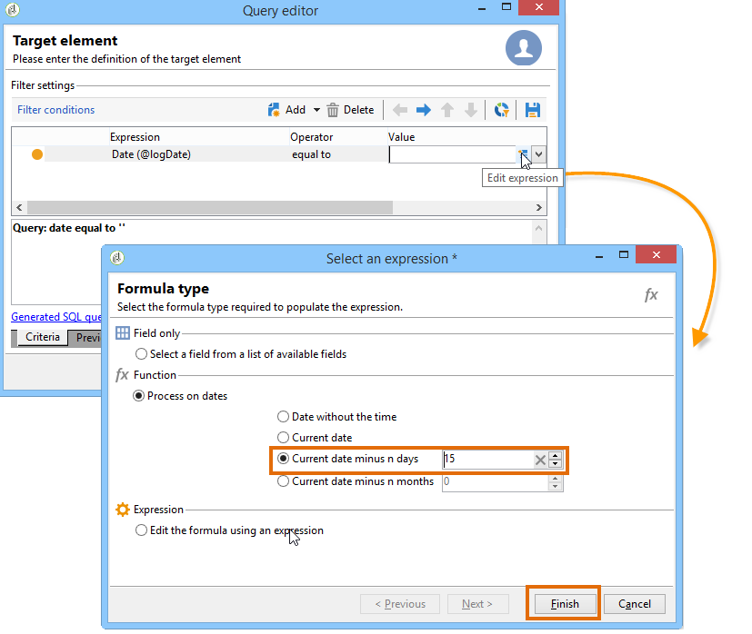
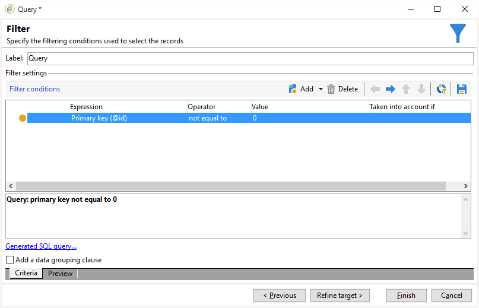

# Consulta de informações de delivery {#querying-delivery-information}

## Número de cliques de uma delivery específica {#number-of-clicks-for-a-specific-delivery}

Neste exemplo, estamos procurando coletar o número de cliques de uma delivery específica. Esses cliques são registrados graças aos logs de acompanhamento de recipients coletados por um determinado período. O recipient é identificado por meio de seu endereço de e-mail. This query uses the **[!UICONTROL Recipient tracking logs]** table.

* Qual tabela precisa ser selecionada?

   The recipient log tracking table (**[!UICONTROL nms:trackingLogRcp]**)

* Campos a serem selecionados para colunas de saída?

   Primary key (with count) e Email.

* Quais critérios serão usados para filtrar as informações?

   Um período específico e um elemento do rótulo da delivery.

Para executar esse exemplo, aplique as seguintes etapas:

1. Abra o **[!UICONTROL Generic query editor]** e selecione o **[!UICONTROL Recipient tracking logs]** schema.

   

1. In the **[!UICONTROL Data to extract]** window, we want to create an aggregate to collect information. To do this, add the primary key (located above the main **[!UICONTROL Recipient tracking logs]** element): Tracking log count is carried out on this **[!UICONTROL Primary key]** field. The edited expression will be **[!UICONTROL x=count(primary key)]**. Ele vincula a soma de vários logs de rastreamento a um único endereço de e-mail.

   Para fazer isso:

   * Click the **[!UICONTROL Add]** icon to the right of the **[!UICONTROL Output columns]** field. In the **[!UICONTROL Formula type]** window, select the **[!UICONTROL Edit the formula using an expression]** option and click **[!UICONTROL Next]**. Na janela **[!UICONTROL Field to select]**, clique em **[!UICONTROL Advanced selection]**.

      

   * Na janela **[!UICONTROL Formula type]**, execute um processo na função agregada. Esse processo será uma contagem de chaves primária.

      Selecione **[!UICONTROL Process on an aggregate function]** na **[!UICONTROL Aggregate]** seção e clique em **[!UICONTROL Count]**.

      

      Clique em **[!UICONTROL Next]**.

   * Select the **[!UICONTROL Primary key (@id)]** field. The **[!UICONTROL count (primary key)]** output column is configured.

      

1. Selecione o outro campo a ser exibido na coluna de saída. In the **[!UICONTROL Available fields]** column, open the **[!UICONTROL Recipient]** node and choose **[!UICONTROL Email]**. Marque a caixa **[!UICONTROL Group]** com **[!UICONTROL Yes]** para agrupar os logs de rastreamento por endereço de email. Este grupo vincula cada log ao respectivo recipient.

   

1. Configure a classificação de coluna para que os recipients mais ativos (com os maior número de logs de rastreamento) sejam exibidos primeiro. Verifique **[!UICONTROL Yes]** a **[!UICONTROL Descending sort]** coluna.

   

1. É preciso então, filtrar os logs que interessam, ou seja, aqueles que estão abaixo de 2 semanas e abordam deliveries relacionadas às vendas.

   Para fazer isso:

   * Configure o filtro de dados. Para fazer isso, selecione **[!UICONTROL Filter conditions]** e clique em **[!UICONTROL Next]**.

      

   * Recuperar logs de rastreamento em um determinado período de uma delivery específica. São necessárias três condições de filtro: duas condições de data para definir o período de pesquisa entre 2 semanas antes da data atual e o dia antes da data atual; e outra condição para restringir a pesquisa a uma delivery específica.

      Na janela **[!UICONTROL Target element]**, configure a data a partir da qual os logs de rastreamento serão considerados. Clique em **[!UICONTROL Add]**. Uma linha de condição é exibida. Edit the **[!UICONTROL Expression]** column by clicking the **[!UICONTROL Edit expression]** function. In the **[!UICONTROL Field to select]** window, choose **[!UICONTROL Date (@logDate)]**.

      

      Selecione o **[!UICONTROL greater than]** operador. Na **[!UICONTROL Value]** coluna, clique em **[!UICONTROL Edit expression]** e, na **[!UICONTROL Formula type]** janela, selecione **[!UICONTROL Process on dates]**. Por fim, em **[!UICONTROL Current date minus n days]**, digite &quot;15&quot;.

      Clique em **[!UICONTROL Finish]**.

      

   * Para selecionar a data de término da pesquisa de log de rastreamento, crie uma segunda condição clicando em **[!UICONTROL Add]**. Na **[!UICONTROL Expression]** coluna, escolha **[!UICONTROL Date (@logDate)]** novamente.

      Selecione o **[!UICONTROL less than]** operador. In the **[!UICONTROL Value]** column, click **[!UICONTROL Edit expression]**. For date processing, go to the **[!UICONTROL Formula type]** window, enter &quot;1&quot; in **[!UICONTROL Current date minus n days]**.

      Clique em **[!UICONTROL Finish]**.

      

      Agora, devemos configurar a terceira condição do filtro, ou seja, o rótulo de delivery que nossa query aborda.

   * Clique na função **[!UICONTROL Add]** para criar outra condição de filtro. In the **[!UICONTROL Expression]** column, click **[!UICONTROL Edit expression]**. Na **[!UICONTROL Field to select]** janela, escolha **[!UICONTROL Label]** no **[!UICONTROL Delivery]** nó.

      Clique em **[!UICONTROL Finish]**.

      

      Procure uma delivery contendo a palavra &quot;sales&quot;. Se você não lembrar o rótulo exato, é possível escolher o operador **[!UICONTROL contains]** e digitar &quot;vendas&quot; na coluna **[!UICONTROL Value]**.

      

1. Click **[!UICONTROL Next]** until you get to the **[!UICONTROL Data preview]** window: no formatting is necessary here.
1. In the **[!UICONTROL Data preview]** window, click **[!UICONTROL Start the preview of the data]** to see the number of tracking logs for each delivery recipient.

   O resultado é exibido em ordem decrescente.

   

   O número mais alto de logs para um usuário é de 6 para esta delivery. 5 usuários diferentes abriram o e-mail de delivery ou clicaram em um dos links no e-mail.

## Recipientes que não abriram nenhuma delivery {#recipients-who-did-not-open-any-delivery}

Neste exemplo, devemos filtrar recipients que não abriram um e-mail nos últimos 7 dias.

Para criar este exemplo, aplique as seguintes etapas:

1. Arraste e solte uma atividade **[!UICONTROL Query]** em um workflow e abra a atividade.
1. Click **[!UICONTROL Edit query]** and set the target and filtering dimensions to **[!UICONTROL Recipients]**.

   

1. Selecione **[!UICONTROL Filtering conditions]** e clique em **[!UICONTROL Next]**.
1. Clique no botão **[!UICONTROL Add]** e selecione **[!UICONTROL Tracking logs]**.
1. Defina o **[!UICONTROL Operator]** da **[!UICONTROL Tracking logs]** expressão como **[!UICONTROL Do not exist such as]**.

   

1. Adicione outra expressão. Select **[!UICONTROL Type]** in the **[!UICONTROL URL]** category.
1. Then, set its **[!UICONTROL Operator]** to **[!UICONTROL equal to]** and its **[!UICONTROL Value]** to **[!UICONTROL Open]**.

   

1. Adicione outra expressão e selecione **[!UICONTROL Date]**. **[!UICONTROL Operator]** deve ser definido como **[!UICONTROL on or after]**.

   

1. To set the value last 7 days, click the **[!UICONTROL Edit expression]** button in the **[!UICONTROL Value]** field.
1. In the **[!UICONTROL Function]** category, select **[!UICONTROL Current date minus n days]** and add the number of days you want to target. Aqui, devemos selecionar os últimos 7 dias.

   

A transição de saída contém recipients que não abriram um e-mail nos últimos 7 dias.

Se, caso contrário, quiser filtrar os recipients que abriram pelo menos um e-mail a sua query deverá ser com mostrado a seguir. Please note that, in this case, the **[!UICONTROL Filtering dimension]** shoud be set to **[!UICONTROL Tracking logs (Recipients)]**.

## Recipientes que abriram uma delivery {#recipients-who-have-opened-a-delivery}

O exemplo a seguir mostra como selecionar perfis que abriram uma delivery nas últimas 2 semanas:

1. Para direcionar perfis que tenham aberto um delivery, é necessário usar os logs de rastreamento. são armazenados em uma tabela vinculada: comece selecionando essa tabela na lista suspensa do campo **[!UICONTROL Filtering dimension]**, como mostrado abaixo:

   

1. Com relação às condições do filtro, clique no ícone **[!UICONTROL Edit expression]** dos critérios mostrados na estrutura de subárvore dos logs de rastreamento. Select the **[!UICONTROL Date]** field.

   

   Click **[!UICONTROL Finish]** to confirm selection.

   Para recuperar somente os logs de rastreamento que tenham menos de duas semanas, selecione o operador **[!UICONTROL Greater than]**.

   

   Em seguida, clique no ícone **[!UICONTROL Edit expression]** na coluna **[!UICONTROL Value]** para definir a fórmula de cálculo a ser aplicada. Select the **[!UICONTROL Current date minus n days]** formula and enter 15 in the related field.

   

   Clique em **[!UICONTROL Finish]** na janela da fórmula. Na janela do filtro, clique na guia **[!UICONTROL Preview]** para verificar os critérios de direcionamento.

   

## Filtro de comportamento dos recipients seguindo uma delivery {#filtering-recipients--behavior-folllowing-a-delivery}

Em um workflow, as caixas **[!UICONTROL Query]** e **[!UICONTROL Split]** permitem selecionar um comportamento após um delivery. This selection is carried out via the **[!UICONTROL Delivery recipient]** filter.

* Objetivo do exemplo

   Em um workflow de delivery, há várias maneiras de dar seguimento a uma primeira comunicação por e-mail. Esse tipo de operação envolve o uso da caixa **[!UICONTROL Split]**.

* Contexto

   Uma delivery &quot;Oferta esportiva de verão&quot; é enviada. Quatro dias após a delivery, duas outras deliverys são enviadas. Uma delas é &quot;oferta de artigos de esportes aquáticos&quot;, o outro é uma continuidade da primeira delivery &quot;oferta esportiva de verão&quot;.

   A delivery &quot;oferta de artigos de esportes aquáticos&quot; é enviada aos recipients que clicaram no link &quot;esportes aquáticos&quot; na primeira delivery. Estes cliques mostram que o recipient está interessado no tópico. Faz sentido orientá-los para ofertas semelhantes. No entanto, os recipients que não clicaram na &quot;oferta de esportes de verão&quot; devem receber o mesmo conteúdo novamente.

As etapas a seguir mostram como configurar a caixa **[!UICONTROL Split]** ao integrar dois comportamentos diferentes:

1. Insira a caixa **[!UICONTROL Split]** no workflow. Esta caixa separa os recipients da primeira delivery em duas deliverys subsequentes. A separação ocorre com base nas condições de filtragem vinculadas ao comportamento do recipient durante a primeira delivery.

   

1. Open the **[!UICONTROL Split]** box. Na guia **[!UICONTROL General]**, digite um rótulo: **Split based on behavior** por exemplo.

   

1. Na guia **[!UICONTROL Subsets]**, defina a primeira ramificação. Por exemplo, insira o rótulo **Clicked** para esta ramificação.
1. Selecione a opção **[!UICONTROL Add a filtering condition on the incoming population]**. Clique em **[!UICONTROL Edit]**.
1. In the **[!UICONTROL Targeting and filtering dimension]** window, double-click the **[!UICONTROL Recipients of a delivery]** filter.

   

1. In the **[!UICONTROL Target element]** window, select the behavior you want to apply to this branch: **[!UICONTROL Recipients having clicked (email)]**.

   Below, select the **[!UICONTROL Delivery specified by the transition]** option. Essa funcionalidade recupera automaticamente as pessoas selecionadas durante a primeira delivery.

   Esta é a delivery &quot;oferta de artigos de esportes aquáticos&quot;.

   

1. Defina a segunda ramificação. Esta ramificação incluirá o e-mail de acompanhamento com o mesmo conteúdo da primeira delivery. Go to the **[!UICONTROL Subsets]** tab and click **[!UICONTROL Add]** to create it.

   

1. Outra sub-guia é exibida. Nomeie de &quot;**Não clicou**&quot;.
1. Clique em **[!UICONTROL Add a filtering condition for the incoming population]**. Em seguida, clique em **[!UICONTROL Edit...]**.

   

1. Clique em **[!UICONTROL Delivery recipients]** na janela **[!UICONTROL Targeting and filtering dimension]**.
1. In the **[!UICONTROL Target element]** window, select the **[!UICONTROL Recipients who did not click (email)]** behavior. Select the **[!UICONTROL Delivery specified by the transition]** option as shown for the last branch.

   A caixa **[!UICONTROL Split]** está totalmente configurada.

   

Abaixo está a lista dos vários componentes configurados por padrão:

* **[!UICONTROL All recipients]**
* **[!UICONTROL Recipients of successfully sent messages,]**
* **[!UICONTROL Recipients who opened or clicked (email),]**
* **[!UICONTROL Recipients who clicked (email),]**
* **[!UICONTROL Recipients of a failed message,]**
* **[!UICONTROL Recipients who didn't open or click (email),]**
* **[!UICONTROL Recipients who didn't click (email).]**

   
