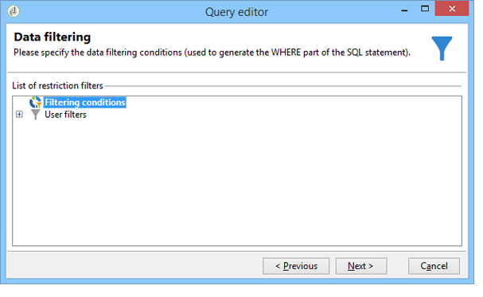

# Consulta de informações de delivery {#querying-delivery-information}

## Número de cliques de uma delivery específica {#number-of-clicks-for-a-specific-delivery}

Neste exemplo, estamos procurando coletar o número de cliques de uma delivery específica. Esses cliques são registrados graças aos logs de acompanhamento de recipients coletados por um determinado período. O recipient é identificado por meio de seu endereço de e-mail. Essa consulta usa a **[!UICONTROL Recipient tracking logs]** tabela.

* Qual tabela precisa ser selecionada?

   A tabela de rastreamento de log do destinatário (**[!UICONTROL nms:trackingLogRcp]**)

* Campos a serem selecionados para colunas de saída?

   Primary key (with count) e Email.

* Quais critérios serão usados para filtrar as informações?

   Um período específico e um elemento do rótulo da delivery.

Para executar esse exemplo, aplique as seguintes etapas:

1. Abra o **[!UICONTROL Generic query editor]** e selecione o **[!UICONTROL Recipient tracking logs]** esquema.

   

1. In the **[!UICONTROL Data to extract]** window, we want to create an aggregate to collect information. Para fazer isso, adicione a chave primária (localizada acima do **[!UICONTROL Recipient tracking logs]** elemento principal): A contagem de log de rastreamento é realizada neste **[!UICONTROL Primary key]** campo. A expressão editada será **[!UICONTROL x=count(primary key)]**. Ele vincula a soma de vários logs de rastreamento a um único endereço de e-mail.

   Para fazer isso:

   * Clique no **[!UICONTROL Add]** ícone à direita do **[!UICONTROL Output columns]** campo. Na **[!UICONTROL Formula type]** janela, selecione a **[!UICONTROL Edit the formula using an expression]** opção e clique em **[!UICONTROL Next]**. Na **[!UICONTROL Field to select]** janela, clique em **[!UICONTROL Advanced selection]**.

      

   * In the **[!UICONTROL Formula type]** window, run a process on the aggregate function. Esse processo será uma contagem de chaves primária.

      Selecione **[!UICONTROL Process on an aggregate function]** na **[!UICONTROL Aggregate]** seção e clique em **[!UICONTROL Count]**.

      

      Clique em **[!UICONTROL Next]**.

   * Selecione o **[!UICONTROL Primary key (@id)]** campo. A coluna de **[!UICONTROL count (primary key)]** saída está configurada.

      

1. Selecione o outro campo a ser exibido na coluna de saída. Na **[!UICONTROL Available fields]** coluna, abra o **[!UICONTROL Recipient]** nó e escolha **[!UICONTROL Email]**. Check the **[!UICONTROL Group]** box to **[!UICONTROL Yes]** to group the tracking logs by email address: this group links each log to its recipient.

   

1. Configure a classificação de coluna para que os recipients mais ativos (com os maior número de logs de rastreamento) sejam exibidos primeiro. Verifique **[!UICONTROL Yes]** a **[!UICONTROL Descending sort]** coluna.

   

1. É preciso então, filtrar os logs que interessam, ou seja, aqueles que estão abaixo de 2 semanas e abordam deliveries relacionadas às vendas.

   Para fazer isso:

   * Configure o filtro de dados. Para fazer isso, selecione **[!UICONTROL Filter conditions]** e clique em **[!UICONTROL Next]**.

      

   * Recuperar logs de rastreamento em um determinado período de uma delivery específica. São necessárias três condições de filtro: duas condições de data para definir o período de pesquisa entre 2 semanas antes da data atual e o dia antes da data atual; e outra condição para restringir a pesquisa a uma delivery específica.

      In the **[!UICONTROL Target element]** window, configure the date starting from which tracking logs will be taken into account. Clique em **[!UICONTROL Add]**. Uma linha de condição é exibida. Edite a **[!UICONTROL Expression]** coluna clicando na **[!UICONTROL Edit expression]** função. Na **[!UICONTROL Field to select]** janela, escolha **[!UICONTROL Date (@logDate)]**.

      

      Selecione o **[!UICONTROL greater than]** operador. Na **[!UICONTROL Value]** coluna, clique em **[!UICONTROL Edit expression]** e, na **[!UICONTROL Formula type]** janela, selecione **[!UICONTROL Process on dates]**. Por fim, em **[!UICONTROL Current date minus n days]**, digite &quot;15&quot;.

      Clique em **[!UICONTROL Finish]**.

      

   * To select the tracking log search end date, create a second condition by clicking **[!UICONTROL Add]**. Na **[!UICONTROL Expression]** coluna, escolha **[!UICONTROL Date (@logDate)]** novamente.

      Selecione o **[!UICONTROL less than]** operador. Na **[!UICONTROL Value]** coluna, clique em **[!UICONTROL Edit expression]**. Para o processamento de datas, vá para a **[!UICONTROL Formula type]** janela, digite &quot;1&quot; em **[!UICONTROL Current date minus n days]**.

      Clique em **[!UICONTROL Finish]**.

      

      Agora, devemos configurar a terceira condição do filtro, ou seja, o rótulo de delivery que nossa query aborda.

   * Click the **[!UICONTROL Add]** function to create another filtering condition. Na **[!UICONTROL Expression]** coluna, clique em **[!UICONTROL Edit expression]**. Na **[!UICONTROL Field to select]** janela, escolha **[!UICONTROL Label]** no **[!UICONTROL Delivery]** nó.

      Clique em **[!UICONTROL Finish]**.

      

      Procure uma delivery contendo a palavra &quot;sales&quot;. Since you don&#39;t remember its exact label, you can choose the **[!UICONTROL contains]** operator and enter &quot;sales&quot; in the **[!UICONTROL Value]** column.

      

1. Click **[!UICONTROL Next]** until you get to the **[!UICONTROL Data preview]** window: no formatting is necessary here.
1. Na **[!UICONTROL Data preview]** janela, clique **[!UICONTROL Start the preview of the data]** para ver o número de logs de rastreamento para cada destinatário da entrega.

   O resultado é exibido em ordem decrescente.

   

   O número mais alto de logs para um usuário é de 6 para esta delivery. 5 usuários diferentes abriram o e-mail de delivery ou clicaram em um dos links no e-mail.

## Recipientes que não abriram nenhuma delivery {#recipients-who-did-not-open-any-delivery}

Neste exemplo, devemos filtrar recipients que não abriram um e-mail nos últimos 7 dias.

Para criar este exemplo, aplique as seguintes etapas:

1. Drag and drop a **[!UICONTROL Query]** activity in a workflow and open the activity.
1. Click **[!UICONTROL Edit query]** and set the target and filtering dimensions to **[!UICONTROL Recipients]**.

   

1. Selecione **[!UICONTROL Filtering conditions]** e clique em **[!UICONTROL Next]**.
1. Clique no **[!UICONTROL Add]** botão e selecione **[!UICONTROL Tracking logs]**.
1. Defina o **[!UICONTROL Operator]** da **[!UICONTROL Tracking logs]** expressão como **[!UICONTROL Do not exist such as]**.

   

1. Adicione outra expressão. Selecione **[!UICONTROL Type]** na **[!UICONTROL URL]** categoria.
1. Em seguida, defina seu **[!UICONTROL Operator]** como **[!UICONTROL equal to]** e seu **[!UICONTROL Value]** como **[!UICONTROL Open]**.

   

1. Add another expression and select **[!UICONTROL Date]**. **[!UICONTROL Operator]** deve ser definido como **[!UICONTROL on or after]**.

   

1. To set the value last 7 days, click the **[!UICONTROL Edit expression]** button in the **[!UICONTROL Value]** field.
1. In the **[!UICONTROL Function]** category, select **[!UICONTROL Current date minus n days]** and add the number of days you want to target. Aqui, devemos selecionar os últimos 7 dias.

   

A transição de saída contém recipients que não abriram um e-mail nos últimos 7 dias.

Se, caso contrário, quiser filtrar os recipients que abriram pelo menos um e-mail a sua query deverá ser com mostrado a seguir. Please note that, in this case, the **[!UICONTROL Filtering dimension]** shoud be set to **[!UICONTROL Tracking logs (Recipients)]**.

## Recipientes que abriram uma delivery {#recipients-who-have-opened-a-delivery}

O exemplo a seguir mostra como selecionar perfis que abriram uma delivery nas últimas 2 semanas:

1. Para direcionar perfis que tenham aberto uma entrega, é necessário usar os registros de rastreamento. são armazenados em uma tabela vinculada: comece selecionando essa tabela na lista suspensa do **[!UICONTROL Filtering dimension]** campo, como mostrado abaixo:

   

1. Concerning filtering conditions, click the **[!UICONTROL Edit expression]** icon of the criteria shown in the sub-tree structure of the tracking logs. Selecione o **[!UICONTROL Date]** campo.

   

   Clique para confirmar **[!UICONTROL Finish]** a seleção.

   In order to recover only the tracking logs less than two weeks old, select the **[!UICONTROL Greater than]** operator.

   

   Then click the **[!UICONTROL Edit expression]** icon in the **[!UICONTROL Value]** column to define the calculation formula to be applied. Select the **[!UICONTROL Current date minus n days]** formula and enter 15 in the related field.

   

   Click the **[!UICONTROL Finish]** button of the formula window. In the filtering window, click the **[!UICONTROL Preview]** tab to check targeting criteria.

   

## Filtro de comportamento dos recipients seguindo uma delivery {#filtering-recipients--behavior-folllowing-a-delivery}

In a workflow, the **[!UICONTROL Query]** and **[!UICONTROL Split]** boxes let you select a behavior following a previous delivery. This selection is carried out via the **[!UICONTROL Delivery recipient]** filter.

* Objetivo do exemplo

   Em um workflow de delivery, há várias maneiras de dar seguimento a uma primeira comunicação por e-mail. This type of operation involves using the **[!UICONTROL Split]** box.

* Contexto

   Uma delivery &quot;Oferta esportiva de verão&quot; é enviada. Quatro dias após a delivery, duas outras deliverys são enviadas. Uma delas é &quot;oferta de artigos de esportes aquáticos&quot;, o outro é uma continuidade da primeira delivery &quot;oferta esportiva de verão&quot;.

   A delivery &quot;oferta de artigos de esportes aquáticos&quot; é enviada aos recipients que clicaram no link &quot;esportes aquáticos&quot; na primeira delivery. Estes cliques mostram que o recipient está interessado no tópico. Faz sentido orientá-los para ofertas semelhantes. No entanto, os recipients que não clicaram na &quot;oferta de esportes de verão&quot; devem receber o mesmo conteúdo novamente.

The following steps show you how to configure the **[!UICONTROL Split]** box by integrating two different behaviors:

1. Insert the **[!UICONTROL Split]** box into the workflow. Esta caixa separa os recipients da primeira delivery em duas deliverys subsequentes. A separação ocorre com base nas condições de filtragem vinculadas ao comportamento do recipient durante a primeira delivery.

   

1. Abra a **[!UICONTROL Split]** caixa. Na **[!UICONTROL General]** guia, digite um rótulo: **Dividir com base no comportamento** por exemplo.

   

1. In the **[!UICONTROL Subsets]** tab, define the first split branch. Por exemplo, insira o rótulo **Clicked** para esta ramificação.
1. Selecione a **[!UICONTROL Add a filtering condition on the incoming population]** opção. Clique em **[!UICONTROL Edit]**.
1. Na **[!UICONTROL Targeting and filtering dimension]** janela, clique duas vezes no **[!UICONTROL Recipients of a delivery]** filtro.

   

1. In the **[!UICONTROL Target element]** window, select the behavior you want to apply to this branch: **[!UICONTROL Recipients having clicked (email)]**.

   Abaixo, selecione a **[!UICONTROL Delivery specified by the transition]** opção. Essa funcionalidade recupera automaticamente as pessoas selecionadas durante a primeira delivery.

   Esta é a delivery &quot;oferta de artigos de esportes aquáticos&quot;.

   

1. Defina a segunda ramificação. Esta ramificação incluirá o e-mail de acompanhamento com o mesmo conteúdo da primeira delivery. Vá para a **[!UICONTROL Subsets]** guia e clique **[!UICONTROL Add]** para criá-la.

   

1. Outra sub-guia é exibida. Nomeie de &quot;**Não clicou**&quot;.
1. Clique em **[!UICONTROL Add a filtering condition for the incoming population]**. Em seguida, clique em **[!UICONTROL Edit...]**.

   

1. Clique **[!UICONTROL Delivery recipients]** na **[!UICONTROL Targeting and filtering dimension]** janela.
1. Na **[!UICONTROL Target element]** janela, selecione o **[!UICONTROL Recipients who did not click (email)]** comportamento. Selecione a **[!UICONTROL Delivery specified by the transition]** opção como mostrado para a última ramificação.

   The **[!UICONTROL Split]** box is now fully configured.

   

Abaixo está a lista dos vários componentes configurados por padrão:

* **[!UICONTROL All recipients]**
* **[!UICONTROL Recipients of successfully sent messages,]**
* **[!UICONTROL Recipients who opened or clicked (email),]**
* **[!UICONTROL Recipients who clicked (email),]**
* **[!UICONTROL Recipients of a failed message,]**
* **[!UICONTROL Recipients who didn't open or click (email),]**
* **[!UICONTROL Recipients who didn't click (email).]**

   
