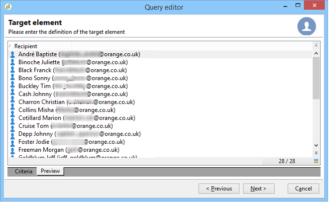
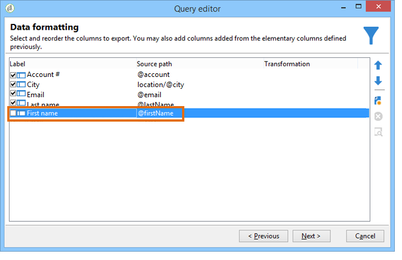

# Consulta à tabela de recipients {#querying-recipient-table}

Neste exemplo, queremos recuperar os nomes e e-mails dos recipients cujos domínios de e-mail são &quot;orange.co.uk&quot; e que não estão em Londres.

* Qual tabela devemos selecionar?

   A tabela de recipient (nms:recipient)

* Campos a serem selecionados como colunas de saída

   E-mail, nome, cidade e número da conta

* Quais são as condições do filtro dos recipients?

   domínio de e-mail e cidade

* É configurada uma classificação?

   Yes, based on **[!UICONTROL Account number]** and **[!UICONTROL Last name]**

Para criar este exemplo, aplique as seguintes etapas:

1. Click **[!UICONTROL Tools > Generic query editor...]** and choose the **Recipients** (**nms:recipient**) table. Em seguida, clique em **[!UICONTROL Next]**.
1. Escolha: **[!UICONTROL Last name]**, **[!UICONTROL First name]**, **[!UICONTROL Email]**, **[!UICONTROL City]** e **[!UICONTROL Account number]**. These fields are added to **[!UICONTROL Output columns]**. Em seguida, clique em **[!UICONTROL Next]**.

   

1. Classifique as colunas para exibi-las na ordem correta. Aqui, devemos classificar números de conta em ordem decrescente e nomes em ordem alfabética. Em seguida, clique em **[!UICONTROL Next]**.

   

1. In the **[!UICONTROL Data filtering]** window, refine your search: choose **[!UICONTROL Filtering conditions]** and click **[!UICONTROL Next]**.
1. The **[!UICONTROL Target element]** window lets you enter the filter settings.

   Defina a seguinte condição de filtro: recipients com um domínio de e-mail igual a &quot;orange.co.uk&quot;. Para fazer isso, escolha **Email domain (@email)** na coluna **[!UICONTROL Expression]**, escolha **equal to** na coluna **[!UICONTROL Operator]** e digite &quot;orange.co.uk&quot; na coluna **[!UICONTROL Value]**.

   

1. Se necessário, clique no botão **[!UICONTROL Distribution of values]** para visualizar uma distribuição baseada no domínio de email de prospectos. Uma porcentagem está disponível para cada domínio de e-mail no banco de dados. Domínios diferentes de &quot;orange.co.uk&quot; são exibidos até o filtro ser aplicado.

   Um resumo da consulta é exibido na parte inferior da janela: **Email domain equal to &#39;orange.co.uk&#39;**.

1. Clique em **[!UICONTROL Preview]** para obter visualização do resultado da consulta: somente os domínios de email &quot;orange.co.uk&quot; são exibidos.

   

1. Agora, vamos alterar a query para localizar os contatos que não moram em Londres.

   Select **[!UICONTROL City (location/@city)]** in the **[!UICONTROL Expression]** column, **[!UICONTROL different from]** as an operator and enter **[!UICONTROL London]** in the **[!UICONTROL Value]** column.

   

1. This will take you to the **[!UICONTROL Data formatting]** window. Verifique a ordem da coluna. Mova a coluna &quot;City&quot; logo ao lado da coluna &quot;Account number&quot;.

   Desmarque a coluna &quot;First name&quot; para removê-la da lista.

   

1. Na janela **[!UICONTROL Data preview]**, clique em **[!UICONTROL Start the preview of the data]**. Essa função calcula o resultado da query.

   The **[!UICONTROL Column results]** tab shows the query result in columns.

   O resultado mostra todos os recipients com um domínio de e-mail &quot;orange.co.uk&quot; que não vivem em Londres. A coluna &quot;First name&quot; não é mostrada porque foi desmarcada durante o estágio anterior. Os números de conta são classificados em ordem decrescente.

   

   The **[!UICONTROL XML result]** tab shows the result in XML format.

   

   The **[!UICONTROL Generated QSL queries]** tab shows the query result in SQL format.

   
