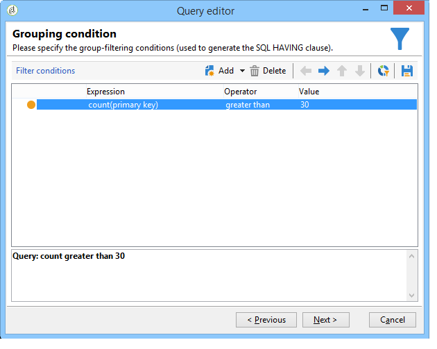
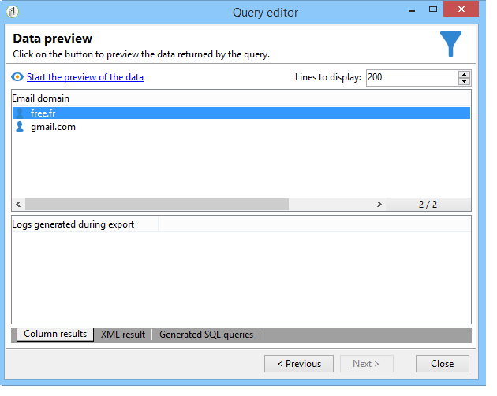

# Consultar usando gerenciamento de agrupamento {#querying-using-grouping-management}

Neste exemplo, devemos executar uma consulta para localizar todos os domínios de e-mail selecionados mais de 30 vezes durante as entregas anteriores.

* Qual tabela precisa ser selecionada?

  A tabela de destinatários (nms:recipient)

* Campos a serem selecionados nas colunas de saída?

  Email domain e primary key (with count).

* Agrupamento de dados?

  Com base no domínio de e-mail com uma contagem de chaves primárias acima de 30. Esta operação é executada com a opção **[!UICONTROL Group by + Having]**. O **[!UICONTROL Group by + Having]** permite agrupar dados (&quot;agrupar por&quot;) e criar uma seleção do que foi agrupado (&quot;ter&quot;).

Para criar este exemplo, aplique as seguintes etapas:

1. Abra o **[!UICONTROL Generic query editor]** e escolha a tabela “Destinatários” (**nms:recipient**).

   

1. Na janela **[!UICONTROL Data to extract]**, selecione os campos **[!UICONTROL Email domain]** e **[!UICONTROL Primary key]**. Execute uma contagem no campo **[!UICONTROL Primary key]**.

   Para obter mais informações sobre a contagem da chave primária, consulte [esta seção](../../platform/using/adobe-campaign-workspace.md#about-queries-in-campaign).

1. Marque a caixa **[!UICONTROL Handle groupings (GROUP BY + HAVING)]**.

   

1. Na janela **[!UICONTROL Sorting]**, classifique os domínios de email em ordem decrescente. Para fazer isso, marque **[!UICONTROL Yes]** na coluna **[!UICONTROL Descending sort]**. Clique em **[!UICONTROL Next]**.

   

1. Em **[!UICONTROL Data filtering]**, selecione **[!UICONTROL Filtering conditions]**. Vá para a janela **[!UICONTROL Target elements]** e clique em **[!UICONTROL Next]**.
1. Na janela **[!UICONTROL Data grouping]**, selecione o **[!UICONTROL Email domain]** clicando em **[!UICONTROL Add]**.

   Esta janela de agrupamento de dados será exibida somente se a caixa **[!UICONTROL Handle groupings (GROUP BY + HAVING])** tiver sido marcada.

   

1. Na janela **[!UICONTROL Grouping condition]**, indique uma contagem de chaves primárias maior que 30, pois desejamos que apenas domínios de e-mail alcançados mais de 30 vezes sejam retornados como resultados.

   Esta janela aparece quando a caixa **[!UICONTROL Manage groupings (GROUP BY + HAVING)]** foi marcada: é aqui que o resultado do agrupamento é filtrado (HAVING).

   

1. Na janela **[!UICONTROL Data formatting]**, clique em **[!UICONTROL Next]**: nenhuma formatação é necessária aqui.
1. Na janela de visualização de dados, clique em **[!UICONTROL Launch data preview]**: aqui, três domínios de e-mail diferentes alcançados mais de 30 vezes são retornados.

   
