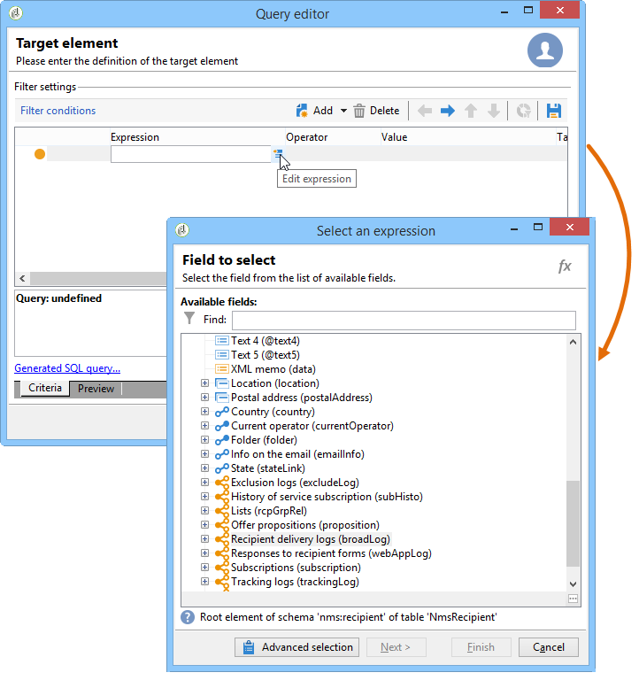

# Consulta usando uma relação muitos-para-muitos {#querying-using-a-many-to-many-relationship}

Neste exemplo, queremos recuperar recipients não foram contatados durante os últimos 7 dias. Esta query aborda todas as deliveries.

Este exemplo também mostra como configurar um filtro relacionado à escolha de um elemento de coleção (ou nó laranja). Elementos de coleção estão disponíveis na **[!UICONTROL Field to select]** janela.

* Qual tabela precisa ser selecionada?

   A tabela de recipient (**nms:recipient**)

* Campos a serem selecionados para a coluna de saída

   Primary key, Last name, First name e Email.

* Com base em quais critérios as informações são filtradas?

   Com base nos registros de delivery de recipients, 7 dias antes de hoje.

Siga as etapas abaixo:

1. Open the Generic query editor and select the Recipient table **[!UICONTROL (nms:recipient)]**.
1. Na **[!UICONTROL Data to extract]** janela, selecione **[!UICONTROL Primary key]**, **[!UICONTROL First name]**, **[!UICONTROL Last name]** e **[!UICONTROL Email]**.

   

1. Na janela de classificação, classifique os nomes em ordem alfabética.

   

1. Na **[!UICONTROL Data filtering]** janela, selecione **[!UICONTROL Filtering conditions]**.
1. In the **[!UICONTROL Target element]** window, the filtering condition for extracting profiles with no tracking log for the last 7 days involves two steps. O elemento precisa selecionar um link muitos-para-muitos.

   * Comece selecionando o elemento **[!UICONTROL Recipient delivery logs (broadlog)]** de coleta (nó laranja) para a primeira **[!UICONTROL Value]** coluna.

      

      Escolha o **[!UICONTROL do not exist as]** operador. Não há necessidade de selecionar um segundo valor nesta linha.

   * O conteúdo da segunda condição do filtro depende da primeira. Here, the **[!UICONTROL Event date]** field is offered directly in the **[!UICONTROL Recipient delivery logs]** table since there is a link to this table.

      

      Selecione **[!UICONTROL Event date]** com o **[!UICONTROL greater than or equal to]** operador. Selecione o **[!UICONTROL DaysAgo (7)]** valor. Para fazer isso, clique **[!UICONTROL Edit expression]** no **[!UICONTROL Value]** campo. Na **[!UICONTROL Formula type]** janela, selecione **[!UICONTROL Process on dates]** e **[!UICONTROL Current date minus n days]**, dando &quot;7&quot; como um valor.

      

      A condição de filtro é configurada.

      

1. In the **[!UICONTROL Data formatting]** window, switch the last names to upper-case. Clique na **[!UICONTROL Last name]** linha na **[!UICONTROL Transformation]** coluna e selecione **[!UICONTROL Switch to upper case]** no menu suspenso.

   

1. Use the **[!UICONTROL Add a calculated field]** function to insert a column into the data preview window.

   Neste exemplo, adicione um campo calculado com o nome e o sobrenome dos recipients em uma única coluna. Clique na **[!UICONTROL Add a calculated field]** função. Na **[!UICONTROL Export calculated field definition]** janela, digite um rótulo e um nome interno e escolha o **[!UICONTROL JavaScript Expression]** tipo. Em seguida, insira a seguinte expressão:

   ```
   var rep = source._firstName+" - "+source._lastName
   return rep
   ```

   

   Clique em **[!UICONTROL OK]**. A **[!UICONTROL Data formatting]** janela está configurada.

   Para obter mais informações sobre adição de campos calculados, consulte esta seção.

1. The result is shown in the **[!UICONTROL Data preview]** window. Os recipients que não tiverem sido contatados nos últimos 7 dias serão exibidos em ordem alfabética. Os nomes são exibidos em caixa alta e a coluna com nome e sobrenome é criada.

   
