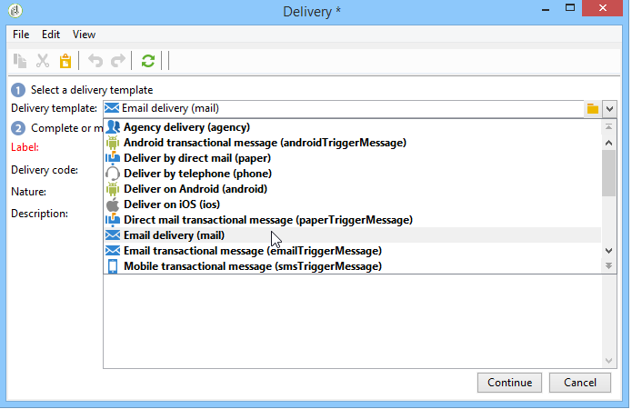
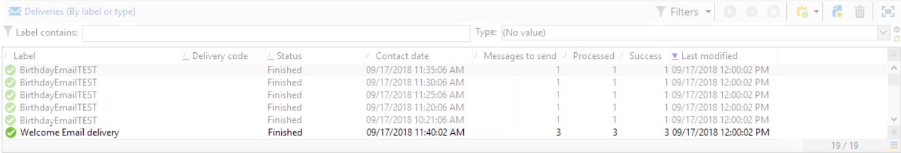

# Entrega recorrente{#recurring-delivery}

Uma atividade **[!UICONTROL Recurring delivery]** permite configurar uma ocorrência de modelo de entrega específico para uma campanha.

 [Conheça este recurso no vídeo](#recurring-delivery-video)

Essa atividade só está disponível na guia **[!UICONTROL Targeting and workflows]** localizada em uma campanha.

Para fazer isso:

1. Selecione o modelo de entrega no qual a atividade será baseada.

   

1. Configure o modelo de entrega.

O processo de configuração dessa atividade é semelhante ao da criação de um modelo de entrega em termos das opções disponíveis. Para obter mais informações, consulte esta [seção](../../delivery/using/about-templates.md).

>[!CAUTION]
>
>As entregas recorrentes não oferecem suporte à visualização de conteúdo ou ao envio de provas, incluindo elementos de personalização de [dados de público-alvo](../../workflow/using/data-life-cycle.md#target-data).

Para obter um exemplo de uso dessa atividade, consulte esta [seção](sending-a-birthday-email.md#creating-a-recurring-delivery-in-a-targeting-workflow).

## Como configurar uma entrega recorrente {#set-up-recurring-delivery}

Uma **entrega recorrente** criará uma nova instância de entrega toda vez que for executada. Por exemplo, se o fluxo de trabalho estiver programado para ser executado uma vez por semana, o resultado será 52 entregas em um ano. Também significa que o log abrangente e os logs de rastreamento serão separados por cada instância da entrega.

Se desejar impedir a execução de uma entrega recorrente, cancele completamente a campanha ou interrompa a execução do fluxo de trabalho. Parar a entrega no painel do Campaign só interromperá a ocorrência da entrega: as próximas instâncias da entrega recorrente continuarão sendo criadas em cada execução de fluxo de trabalho.

>[!NOTE]
>
>Não é possível enviar uma prova de uma atividade do tipo **[!UICONTROL Recurring delivery]**.
> 
>Para criar uma entrega diretamente por meio de um fluxo de trabalho da campanha, use as atividades específicas predefinidas do canal (por exemplo **[!UICONTROL Recurring delivery]**).

## Tutorial em vídeo {#recurring-delivery-video}

Este vídeo explica como configurar uma entrega recorrente e uma atividade de scheduler.

>[!VIDEO](https://video.tv.adobe.com/v/25040?quality=12)

Vídeos extras sobre procedimentos do Campaign Classic estão disponíveis [aqui](https://experienceleague.adobe.com/docs/campaign-classic-learn/tutorials/overview.html?lang=pt-BR).
