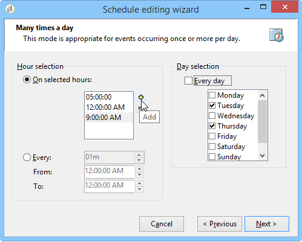
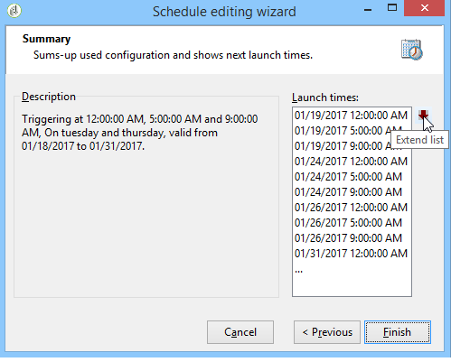

# Scheduler {#scheduler}

O **Scheduler** é uma tarefa persistente que ativa a transição nos momentos especificados por seu cronograma.

A atividade **[!UICONTROL Scheduler]** deve ser considerada como um início agendado. As regras de posicionamento de atividades no gráfico são iguais para a atividade **[!UICONTROL Start]**. Esta atividade não deve ter uma transição de entrada.

## Práticas recomendadas {#best-practices}

* É recomendável não agendar um fluxo de trabalho para execução por mais de 15 minutos, pois pode atrapalhar o desempenho geral do sistema e criar bloqueios no banco de dados.

* Nunca use mais de uma atividade **[!UICONTROL Scheduler]** por ramificação em um fluxo de trabalho. Consulte [Uso de atividades](workflow-best-practices.md#using-activities).

* O uso de uma atividade do programador pode levar a várias execuções ao mesmo tempo de um fluxo de trabalho em andamento. Por exemplo, você pode ter um scheduler acionando a execução do fluxo de trabalho a cada hora, mas, às vezes, a execução do fluxo de trabalho inteiro demora mais de uma hora.

  Talvez você queira ignorar a execução se o fluxo de trabalho já estiver em execução. Para obter mais informações sobre como evitar execuções simultâneas de um fluxo de trabalho, consulte [esta página](monitoring-workflow-execution.md#preventing-simultaneous-multiple-executions).

* Observe que a transição pode ser ativada várias horas depois caso o fluxo de trabalho esteja executando uma tarefa de longo prazo, como uma importação, ou se o módulo wfserver for interrompido por um momento. Nesse caso, pode ser necessário restringir a execução da tarefa ativada pelo scheduler para um determinado intervalo de tempo.

## Configuração de atividade do Scheduler {#configuring-scheduler-activity}

O scheduler define o agendamento de ativação da transição. Para configurá-lo, clique duas vezes no objeto gráfico e clique em **[!UICONTROL Change...]**

Um assistente permite definir a frequência e o período de validade da atividade. As etapas de configuração são as seguintes:

1. Selecione a frequência de ativação e clique em **[!UICONTROL Next]**.

   

1. Forneça os dias e horas de ativação. Os parâmetros desta etapa dependem da frequência selecionada na etapa anterior. Se optar iniciar a atividade várias vezes por dia, as opções de configuração serão as seguintes:

   

1. Defina o período de validade do agendamento ou especifique quantas vezes será executado.

   

1. Verifique a configuração e clique em **[!UICONTROL Finish]** para salvar.

   
