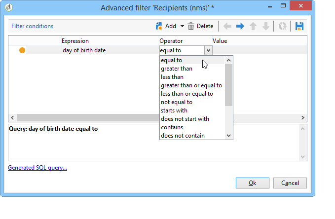
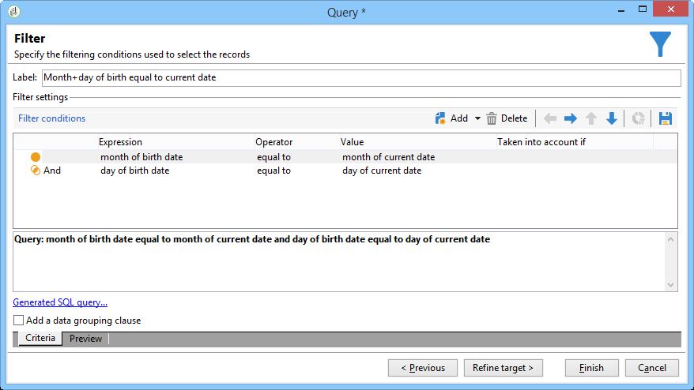

# Envio de um e-mail de aniversário{#sending-a-birthday-email}

## Introdução {#introduction}

Este caso de uso apresenta como planejar o envio de um e-mail recorrente para uma lista de recipients no dia de seus aniversários.

Para configurar esse caso de uso, criamos o seguinte workflow para construção do target:


Esse workflow (execução diária) seleciona todos os recipients que fazem aniversário na data atual.

Esse caso de uso também pode ser encontrado no formato de um vídeo. Para obter mais informações, consulte o vídeo [Creating a workflow](https://docs.campaign.adobe.com/doc/AC/en/Videos/Videos.html).

To do this, create a campaign and click the **[!UICONTROL Targeting and workflows]** tab. Para obter mais informações, consulte [Criação do destino principal em uma seção de fluxo de trabalho](../../campaign/using/marketing-campaign-deliveries.md#building-the-main-target-in-a-workflow) .

Siga estas etapas:

## Scheduling the sending {#configuring-the-scheduler}

1. First, add a **Scheduler** to trigger sending the delivery every day. No exemplo abaixo, o delivery é criado todos os dias às 6 da manhã.

   


## Identificação de recipients que fazem aniversário {#identifying-recipients-whose-birthday-it-is}

After configuring the **[!UICONTROL Scheduler]** activity so that the workflow starts every day, identify all of the recipients whose date of birth equals the current date.

Para fazer isso, siga as etapas abaixo:

1. Drag and drop a **[!UICONTROL Query]** activity into the workflow and double-click it.
1. Click the **Edit query** link and select **[!UICONTROL Filtering conditions]**.

   

1. Click the first cell of the **[!UICONTROL Expression]** column and click **[!UICONTROL Edit expression]** to open the expression editor.

   

1. Clique **[!UICONTROL Advanced selection]** para selecionar o modo de filtragem.

   

1. Selecione **[!UICONTROL Edit the formula using an expression]** e clique em **[!UICONTROL Next]** para exibir o editor de expressões.
1. Na lista de funções, clique duas vezes **[!UICONTROL Day]**, que pode ser acessado pelo **[!UICONTROL Date]** nó. Essa função retorna o número que representa o dia correspondente à data passada como parâmetro.

   

1. In the list of available fields, double-click **[!UICONTROL Birth date]**. A seção superior do editor exibe a seguinte fórmula:

   ```
   Day(@birthDate)
   ```

   Click **[!UICONTROL Finish]** to confirm.

1. In the query editor, in the first cell of the **[!UICONTROL Operator]** column, select **[!UICONTROL equal to]**.

   

1. Next, click the first cell of the second column (**[!UICONTROL Value]**), and click **[!UICONTROL Edit expression]** to open the expression editor.
1. Na lista de funções, clique duas vezes **[!UICONTROL Day]**, que pode ser acessado pelo **[!UICONTROL Date]** nó.
1. Double-click the **[!UICONTROL GetDate]** function to retrieve the current date.

   

   A seção superior do editor exibe a seguinte fórmula:

   ```
   Day(GetDate())
   ```

   Click **[!UICONTROL Finish]** to confirm.

1. Repita este procedimento para recuperar o mês de nascimento correspondendo ao mês atual. Para fazer isso, clique no **[!UICONTROL Add]** botão e repita as etapas de 3 a 10, substituindo **[!UICONTROL Day]** por **[!UICONTROL Month]**.

   A query completa é a seguinte:

   

Link the result of the **[!UICONTROL Query]** activity to an **[!UICONTROL Email delivery]** activity to send an email to the list of all of your recipients on their birthday.

## Incluindo recipients nascidos em 29 de fevereiro (opcional) {#including-recipients-born-on-february-29th--optional-}

Se desejar incluir todos os recipients que nasceram em 29 de fevereiro, este caso de uso apresentará como planejar o envio de um e-mail recorrente para uma lista de recipients em seus aniversários, seja um ano bissexto ou não.

As principais etapas de implementação para este caso de uso são:

* Seleção de recipients
* Seleção se é um ano bissexto ou não
* Seleção de todos os recipients nascidos em 29 de fevereiro

Para configurar esse caso de uso, criamos o seguinte workflow para construção do target:


Se o ano atual **não for um ano bissexto** e o workflow for executado em 1º de março, precisamos selecionar todos os recipients que teriam seu aniversário no dia anterior (29 de fevereiro) e adicioná-los à lista de recipients. Em qualquer outro caso, nenhuma ação adicional é necessária.

### Etapa 1: Selecionar os destinatários {#step-1--selecting-the-recipients}

After configuring the **[!UICONTROL Scheduler]** activity so that the workflow starts every day, identify all of the recipients whose anniversary is the current day.

>[!NOTE]
>
>Se o ano atual for um ano bissexto, todos os recipients nascidos no 29 de fevereiro serão incluídos automaticamente.



Selecionar destinatários cujo aniversário corresponde à data atual é apresentado na seção [Identificar destinatários cujo aniversário é](#identifying-recipients-whose-birthday-it-is) .

### Step 2: Select whether or not it is a leap year {#step-2--select-whether-or-not-it-is-a-leap-year}

The **[!UICONTROL Test]** activity allows you to check whether or not it is a leap year and whether the current date is March 1st.

If the test is verified (the year is not a leap year - there is no February 29th - and the current date is indeed March 1st), the **[!UICONTROL True]** transition is enabled and the recipients born on February 29th will be added to the March 1st delivery. Otherwise, the **[!UICONTROL False]** transition is enabled and only the recipients born on the current date will receive the delivery.

Copy and paste the code below into the **[!UICONTROL Initialization script]** section of the **[!UICONTROL Advanced]** tab.

```
function isLeapYear(iYear)
{
    if(iYear/4 == Math.floor(iYear/4))
    {
        if(iYear/100 != Math.floor(iYear/100))
        {
            // Divisible by 4 only -> Leap Year
            return 1;
        }
        else
        {
            if(iYear/400 == Math.floor(iYear/400))
            {
                // Divisible by 4, 100 and 400 -> Leap year
                return 1;
            }
        }
    }
    // all others: no leap year
    return 0;
}

// Return today's date and time
var currentTime = new Date()
// returns the month (from 0 to 11)
var month = currentTime.getMonth() + 1
// returns the day of the month (from 1 to 31)
var day = currentTime.getDate()
// returns the year (four digits)
var year = currentTime.getFullYear()

// is current year a leap year?
vars.currentIsALeapYear = isLeapYear(year);

// is current date the first of march?
if(month == 3 && day == 1) {
  // today is 1st of march
vars.firstOfMarch = 1;
}
```


Add the following condition in the **[!UICONTROL Conditional forks]** section:

```
vars.currentIsALeapYear == 0 && vars.firstOfMarch == 1
```


### Step 3: Select any recipients born on February 29th {#step-3--select-any-recipients-born-on-february-29th}

Create a **[!UICONTROL Fork]** activity and link one of the outbound transitions to a **[!UICONTROL Query]** activity.

Nesta query, selecione todos os recipients cujas datas de nascimento são 29 de fevereiro.


Combine the results with a **[!UICONTROL Union]** activity.

Link the results of the two **[!UICONTROL Test]** activity branches to an **[!UICONTROL Email delivery]** activity to send an email to the list of all of your recipients on their birthday, even to those born on February 29th during a non-leap year.

## Criação de uma entrega recorrente {#creating-a-recurring-delivery-in-a-targeting-workflow}

Adicione uma atividade de **Recurring delivery** com base no template de e-mail de aniversário que você deseja enviar.

>[!CAUTION]
>
>Para que os workflows sejam executados, os workflows técnicos relacionados ao processo de campanha devem ser iniciados. Para obter mais informações, consulte a seção [Lista de fluxos de trabalho](../../workflow/using/campaign.md) de processo de campanha.
>
>Se as etapas de aprovação estiverem habilitadas para a campanha, as remessas serão enviadas apenas quando essas etapas tiverem sido confirmadas. Para obter mais informações, consulte a seção [Escolhendo os processos a serem aprovados](../../campaign/using/marketing-campaign-approval.md#choosing-the-processes-to-be-approved) .


