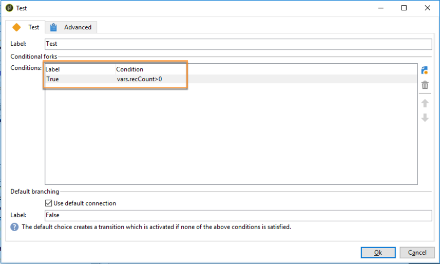

# Envio de alertas personalizados para operadores{#sending-personalized-alerts-to-operators}

Neste exemplo, queremos enviar um alerta para um operador que conterá os nomes dos perfis que abriram um boletim informativo, mas não clicaram no link que ele continha.

The profiles&#39; first and last name fields are linked to the **[!UICONTROL Recipients]** targeting dimension, whereas the **[!UICONTROL Alert]** activity is linked to the **[!UICONTROL Operator]** targeting dimension. Como resultado, não há nenhum campo disponível entre as duas dimensões de target para executar uma reconciliação e recuperar os campos de nome e sobrenome e exibi-los na atividade Alert.

O processo é criar um workflow como abaixo:

1. Use a **[!UICONTROL Query]** activity to target data.
1. Add a **[!UICONTROL JavaScript code]** activity into the workflow to save the population form the query to the instance variable.
1. Use a **[!UICONTROL Test]** activity to check the population count.
1. Use an **[!UICONTROL Alert]** activity to send an alert to an operator, depending on the **[!UICONTROL Test]** activity result.


## Salvar a população na variável de instância {#saving-the-population-to-the-instance-variable}

Add the code below into the **[!UICONTROL JavaScript code]** activity.

```
var query = xtk.queryDef.create(  
    <queryDef schema="temp:query" operation="select">  
      <select>  
       <node expr="[target/recipient.@firstName]"/>  
       <node expr="[target/recipient.@lastName]"/>  
      </select>  
     </queryDef>  
  );  
  var items = query.ExecuteQuery();
```

Verifique se o código Javascript corresponde às suas informações de workflow:

* The **[!UICONTROL queryDef schema]** tag should corresponds to the name of the targeting dimension used in the query activity.
* The **[!UICONTROL node expr]** tag should correspond to the name of the fields you want to retrieve.


Para recuperar essas informações, siga as etapas abaixo:

1. Right-click the outbound transition from the **[!UICONTROL Query]** ativity, then select **[!UICONTROL Display the target]**.

   

1. Right-click the list, then select **[!UICONTROL Configure list]**.

   

1. A targeting dimension e nomes de campos da query são exibidos na lista.

   

## Teste a contagem de população {#testing-the-population-count}

Add the code below into the **[!UICONTROL Test]** activity to check if the targeted population contains at least 1 profile.

```
var.recCount>0
```



## Como configurar um alerta {#setting-up-the-alert}

Now that the population has been added into the instance variable with the desired fields, you can add these information into the **[!UICONTROL Alert]** activity.

To do this, add into the **[!UICONTROL Source]** tab the code below:

```
<ul>
<%
var items = new XML(instance.vars.items)
for each (var item in items){
%>
<li><%= item.target.@firstName %> <%= item.target.@lastName %></li>
<%
} %></ul>
```

>[!NOTE]
>
>The **[!UICONTROL <%= item.target.recipient.@fieldName %>]** command lets you add one of the fields that have been saved to the instance variable through the **[!UICONTROL JavaScript code]** activity.\
>É possível adicionar quantos campos desejar, desde que tenham sido inseridos no código JavaScript.


