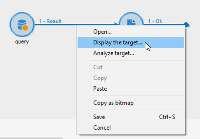
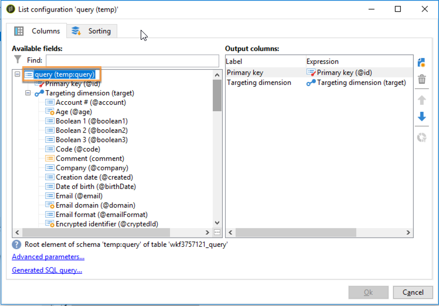

# Envio de alertas personalizados para operadores{#sending-personalized-alerts-to-operators}

Neste exemplo, queremos enviar um alerta para um operador que conterá os nomes dos perfis que abriram um boletim informativo, mas não clicaram no link que ele continha.

Os campos de nome e sobrenome dos perfis são vinculados à targeting dimension **[!UICONTROL Recipients]**, enquanto a atividade **[!UICONTROL Alert]** é vinculada à targeting dimension **[!UICONTROL Operator]**. Como resultado, não há nenhum campo disponível entre as duas dimensões de target para executar uma reconciliação e recuperar os campos de nome e sobrenome e exibi-los na atividade Alert.

O processo é criar um workflow como abaixo:

1. Use uma atividade **[!UICONTROL Query]** para direcionar dados.
1. Adicione uma atividade **[!UICONTROL JavaScript code]** no workflow para salvar o formulário de preenchimento da consulta à variável de instância.
1. Utilize uma atividade **[!UICONTROL Test]** para verificar a contagem de população.
1. Use uma atividade **[!UICONTROL Alert]** para enviar um alerta para um operador, dependendo do resultado da atividade **[!UICONTROL Test]**.


## Salvar a população na variável de instância {#saving-the-population-to-the-instance-variable}

Adicione o código abaixo na atividade **[!UICONTROL JavaScript code]**.

```
var query = xtk.queryDef.create(  
    <queryDef schema="temp:query" operation="select">  
      <select>  
       <node expr="[target/recipient.@firstName]"/>  
       <node expr="[target/recipient.@lastName]"/>  
      </select>  
     </queryDef>  
  );  
  var items = query.ExecuteQuery();
```

Verifique se o código Javascript corresponde às suas informações de workflow:

* A tag **[!UICONTROL queryDef schema]** deve corresponder ao nome da targeting dimension usada na atividade de consulta.
* A tag **[!UICONTROL node expr]** deve corresponder ao nome dos campos que você deseja recuperar.


Para recuperar essas informações, siga as etapas abaixo:

1. Clique com o botão direito do mouse na transição de saída da atividade **[!UICONTROL Query]** e selecione **[!UICONTROL Display the target]**.

   

1. Clique com o botão direito do mouse na lista e depois selecione **[!UICONTROL Configure list]**.

   

1. A targeting dimension e nomes de campos da query são exibidos na lista.

   

## Teste a contagem de população {#testing-the-population-count}

Adicione o código abaixo na atividade **[!UICONTROL Test]** para verificar se a população direcionada contém pelo menos 1 perfil.

```
var.recCount>0
```


## Como configurar um alerta {#setting-up-the-alert}

Agora que a população foi adicionada na variável da instância com os campos desejados, é possível adicionar essas informações na atividade **[!UICONTROL Alert]**.

Para fazer isso, adicione o código abaixo na guia **[!UICONTROL Source]**:

```
<ul>
<%
var items = new XML(instance.vars.items)
for each (var item in items){
%>
<li><%= item.target.@firstName %> <%= item.target.@lastName %></li>
<%
} %></ul>
```

>[!NOTE]
>
>O comando **[!UICONTROL <%= item.target.recipient.@fieldName %>]** permite adicionar um dos campos que foram salvos na variável da instância por meio da atividade **[!UICONTROL JavaScript code]**.\
>É possível adicionar quantos campos desejar, desde que tenham sido inseridos no código JavaScript.


