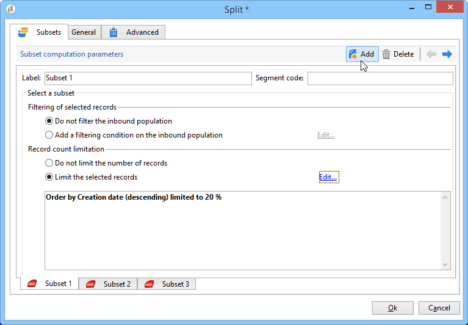
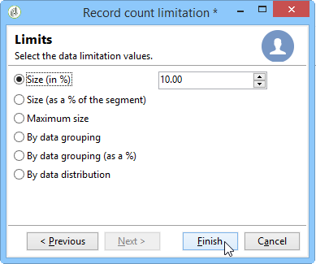

# Split{#split}

Uma atividade do tipo **Split** permite dividir um target em vários subconjuntos. O target é construído com todos os resultados recebidos: todas as atividades anteriores devem ter sido concluídas para que essa atividade seja executada.

Essa atividade não aciona uma união de públicos de entrada. If several transitions land in one split activity, we recommend inserting a **[!UICONTROL Union]** activity in front of it.

Para obter um exemplo da atividade de divisão que está sendo usada, consulte [Criar subconjuntos usando a atividade](../../workflow/using/targeting-data.md#creating-subsets-using-the-split-activity)Dividir.

Um exemplo ilustrando como usar a atividade de Split para segmentar o target em diferentes públicos usando condições de filtragem é descrito [nesta seção](../../workflow/using/cross-channel-delivery-workflow.md).

An example showing how to use an instance variable in a Split activity is available in [this section](../../workflow/using/javascript-scripts-and-templates.md).

To configure this activity, define the subset content and label in the **[!UICONTROL Subsets]** tab, then choose the target dimension in the **[!UICONTROL General]** tab.

## Criação de subconjuntos {#creating-subsets}

Para criar um subconjunto:

1. Clique no rótulo no campo correspondente e selecione o filtro a ser aplicado.
1. Para filtrar a população de entrada, selecione a **[!UICONTROL Add a filtering condition]** opção e clique no **[!UICONTROL Edit...]** link.

   Selecione o tipo de filtro a ser aplicado aos dados para incluí-lo neste conjunto.

   O processo é o mesmo de uma atividade do tipo **Query**.

   >[!CAUTION]
   >
   >É possível filtrar os dados em um máximo de dois bancos de dados externos (FDA).

1. É possível especificar o número máximo de registros para extrair a partir do target para criar o subconjunto. Para fazer isso, marque a opção **[!UICONTROL Limit the selected records]** e clique no **[!UICONTROL Edit...]** link.

   Um assistente permite escolher o modo de seleção para os registros deste subconjunto. As etapas podem ser encontradas em [Limitação do número de registros](#limiting-the-number-of-subset-records)do subconjunto.

   

1. If you wish, you can **add other subsets** using the **[!UICONTROL Add]** button.

   

   >[!CAUTION]
   >
   >If the **[!UICONTROL Enable overlapping of output populations]** option is not checked, subsets are created in the order of the tabs. Use as setas na seção superior direita desta janela para movê-las. Se o primeiro subconjunto recupera 70% da população inicial, por exemplo, o próximo subconjunto aplica seus critérios de seleção em apenas nos 30% restantes e assim por diante.

   Para cada subconjunto criado, uma transição de saída será adicionada à atividade dividida.

   

   You can choose to generate a single outbound transition (and identify sets using the segment code, for example): to do this, select the **[!UICONTROL Generate subsets in the same table]** option in the **[!UICONTROL General]** tab.

   Se estiver concluído, o código do segmento de cada subconjunto será armazenado automaticamente em uma coluna adicional. Essa coluna estará acessível nos campos de personalização no nível de delivery.

## Limite de número de registros do subconjunto {#limiting-the-number-of-subset-records}

Se não quiser usar toda a população contida em um subconjunto, é possível limitar o número de registros que ele conterá.

1. Na janela de edição de subconjunto, marque a **[!UICONTROL Limit the selected records]** opção e clique no **[!UICONTROL Edit...]** link.
1. Selecione o tipo de limite escolhido:

   * **[!UICONTROL Activate random sampling]**: essa opção obtém uma amostra aleatória dos registros. O tipo de amostragem aleatória aplicada depende do mecanismo do banco de dados.
   * **[!UICONTROL Keep only the first records after sorting]**: essa opção permite definir uma limitação com base em uma ou mais ordens de classificação. If you select the **[!UICONTROL Age]** field as a sorting criterion and 100 as the limit, only the youngest 100 recipients will be kept.
   * **[!UICONTROL Keep the first ones after sorting (criteria, random)]**: Esta opção combina as duas opções anteriores. Ele permite definir uma limitação com base em uma ou mais ordens de classificação e, então, aplicar uma seleção aleatória nos primeiros registros se alguns dos registros tiverem os mesmos valores que os critérios definidos.

      For example, if you select the **[!UICONTROL Age]** field as a sorting criteria, and you then define a limit of 100, but the 2000 youngest recipients in the database are all 18, then 100 recipients will be randomly selected out of those 2000.
   

1. Se desejar definir critérios de classificação, uma etapa adicional permite definir as colunas e a ordem de classificação.

   

1. Em seguida, escolha o método de limitação de dados.

   

   Há várias maneiras de fazer isso:

   * **[!UICONTROL Size (in %)]**: uma porcentagem de registros. Por exemplo, a configuração abaixo extrai 10% da população total.

      A porcentagem se aplica à população inicial, não ao resultado da atividade.

   * **[!UICONTROL Size (as a % of the segment)]**: uma percentagem dos registros relativos apenas aos subconjuntos e não à população inicial.
   * **[!UICONTROL Maximum size]**: um número máximo de registros.
   * **[!UICONTROL By data grouping]**: é possível definir um limite no número de registros, dependendo dos valores em um campo especificado da população de entrada. Para obter mais informações sobre esse assunto, consulte [Limitação do número de registros do subconjunto por agrupamento](#limiting-the-number-of-subset-records-by-data-grouping)de dados.
   * **[!UICONTROL By data grouping (in %)]**: é possível definir um limite no número de registros, dependendo dos valores em um campo especificado da população de entrada, usando uma porcentagem. Para obter mais informações sobre esse assunto, consulte [Limitação do número de registros do subconjunto por agrupamento](#limiting-the-number-of-subset-records-by-data-grouping)de dados.
   * **[!UICONTROL By data distribution]**: Se os campos de agrupamento tiverem valores demais ou se você quiser evitar inserir os valores novamente para cada nova atividade de divisão, o Adobe Campaign permitirá que você configure uma **[!UICONTROL By data distribution]** limitação (módulo de Marketing Distribuído opcional). Para obter mais informações, consulte [Limitação do número de registros de subconjunto por distribuição](#limiting-the-number-of-subset-records-per-data-distribution)de dados.

1. Click **[!UICONTROL Finish]** to approve the record selection criteria. A configuração selecionada é então exibida na janela do meio do editor.

## Limite de número de registros de subconjunto por agrupamento de dados {#limiting-the-number-of-subset-records-by-data-grouping}

É possível limitar o número de registros por agrupamento de dados. Esse limite pode ser executado usando um valor fixo ou uma porcentagem.

For instance, if you select the **[!UICONTROL Language]** field as a group field, you can define a list of records for each language.

1. Depois de selecionar os valores de limitação de dados, selecione **[!UICONTROL By data grouping]** ou **[!UICONTROL By data grouping (as a %)]** e clique em **[!UICONTROL Next]**.

   

1. Then select the grouping field(s) (the **[!UICONTROL Language]** field for instance) and click **[!UICONTROL Next]**.

   

1. Finalmente, especifique os limites de agrupamento de dados (usando valores fixos ou porcentagens, dependendo do método de agrupamento selecionado anteriormente). To set the same threshold for every value, for example if you wish to set the number of records for each language to 10, select the **[!UICONTROL All data groupings are the same size]** option. To set a different limit for every value, select the **[!UICONTROL Limitations by grouping value]** option. Isso permitirá escolher uma limitação diferente para inglês, francês etc.

   

1. Click **[!UICONTROL Finish]** to approve the limitation and return to editing the split activity.

## Limite de números de registros de subconjunto por distribuição de dados {#limiting-the-number-of-subset-records-per-data-distribution}

Se os campos de agrupamento contiverem um número muito grande de valores ou se quiser evitar redefinir os valores para cada nova atividade dividida, o Adobe Campaign permitirá criar uma limitação por distribuição de dados. When selecting data limitation values (for more on this subject see the [Creating subsets](#creating-subsets) section), select the **[!UICONTROL By data distribution]** option and select a template from the drop-down menu. A criação de um template de distribuição de dados é demonstrada abaixo.

Para obter um exemplo da **[!UICONTROL Local approval]** atividade com um modelo de distribuição, consulte [Uso da atividade](../../workflow/using/using-the-local-approval-activity.md)de aprovação local.

>[!CAUTION]
>
>Para usar essa função, é necessário adquirir o módulo Marketing Distribuído, que é uma opção do Campaign. Verifique o contrato de licença.

O template de distribuição de dados permite limitar o número de registros de uma lista de valores de agrupamento. Aplique as seguintes etapas para criar um template de distribuição de dados:

1. Para criar o modelo de distribuição de dados, vá para o **[!UICONTROL Resources > Campaign management > Data distribution]** nó e clique em **[!UICONTROL New]**.

   

1. The **[!UICONTROL General]** tab lets you enter the label and the execution context of the distribution (targeting dimension, distribution field).

   

   Os seguintes campos precisam ser inseridos:

   * **[!UICONTROL Label]**: rótulo do modelo de distribuição.
   * **[!UICONTROL Targeting dimension]**: informe a dimensão de definição de metas à qual a distribuição de dados será aplicada, **[!UICONTROL Recipient]** por exemplo. Esse schema deve sempre ser compatível com os dados usados no workflow para construção do target.
   * **[!UICONTROL Distribution field]**: selecione um campo pela dimensão de definição de metas. For instance, if you select the **[!UICONTROL Email domain]** field, the list of recipients will be broken down by domain.
   * **[!UICONTROL Distribution type]**: selecione a forma como o valor de limitação do destino será detalhado na **[!UICONTROL Distribution]** guia: **[!UICONTROL Percentage]** ou **[!UICONTROL Set]**.
   * **[!UICONTROL Assignment type]**: selecione o tipo de atribuição de distribuição de dados. É possível escolher entre atribuição por grupo ou operador ou atribuição por entidade local. A atribuição por entidade local é usada no **Marketing distribuído**. Para obter mais informações, consulte esta [seção](../../campaign/using/about-distributed-marketing.md).
   * **[!UICONTROL Approval storage]**: se você usar uma **[!UICONTROL Local approval]** atividade no fluxo de trabalho de definição de metas (consulte a aprovação local), informe o esquema no qual os resultados da aprovação serão armazenados. É necessário especificar um schema de armazenamento por schema de target. Se você usar o esquema de **[!UICONTROL Recipients]** definição de metas, informe o esquema **[!UICONTROL Local approval of recipients]** de armazenamento padrão.

      In case of a simple limitation by data grouping without local approval, you do not need to enter the **[!UICONTROL Approvals storage]** field.

1. Se você estiver usando uma **[!UICONTROL Local approval]** atividade (consulte Aprovação local), informe o modelo **[!UICONTROL Advanced settings]** de distribuição:

   

   Os seguintes campos precisam ser inseridos:

   * **[!UICONTROL Approve targeted messages]**: marque essa opção se desejar que todos os destinatários sejam pré-selecionados na lista de destinatários a serem aprovados. Se esta opção estiver desmarcada, nenhum recipient será pré-selecionado.

      >[!NOTE]
      >
      >Essa opção é selecionada por padrão.

      

   * **[!UICONTROL Delivery label]**: permite definir uma expressão para exibir o rótulo de entrega na notificação de retorno. A expressão padrão fornece informações sobre o rótulo padrão da distribuição (cadeia de caracteres de computação). É possível modificar essa expressão.

      

   * **[!UICONTROL Grouping field]**: esse campo permite definir o agrupamento usado para exibir destinatários nas notificações de aprovação e devolução.

      

   * **[!UICONTROL Web Interface]**: permite que você vincule um aplicativo da Web à lista de destinatários. Na notificação de aprovação e retorno, cada recipient é clicável e é vinculado ao aplicativo da Web selecionado. The **[!UICONTROL Parameters]** field (for example **[!UICONTROL recipientId]**) lets you configure the additional parameter to be used in the URL and the web application.

      

1. The **[!UICONTROL Breakdown]** tab lets you define the list of distribution values.

   

   * **[!UICONTROL Value]**: informe os valores de distribuição.
   * **[!UICONTROL Percentage / Set]**: informe o limite de registro (fixo ou porcentagem) vinculado a cada valor.

      Essa coluna é definida pelo **[!UICONTROL Distribution type]** campo dentro da **[!UICONTROL General]** guia.

   * **[!UICONTROL Label]**: insira o rótulo vinculado a cada valor.
   * **[!UICONTROL Group or operator]**: se você estiver usando uma **[!UICONTROL Local approval]** atividade (consulte Aprovação local), selecione o operador ou grupo de operadores atribuídos a cada valor de distribuição.

      In case of a simple limitation by data grouping without local approval, you do not need to enter the **[!UICONTROL Group or operator]** field.

      >[!CAUTION]
      >
      >Verifique se os operadores receberam os direitos apropriados.

   * **[!UICONTROL Local entity]**: selecione a entidade local atribuída a cada valor de distribuição. As entidades locais são usadas em **Marketing distribuído**. Para obter mais informações, consulte esta [seção](../../campaign/using/about-distributed-marketing.md).

## Filtro de parâmetros {#filtering-parameters}

Click the **[!UICONTROL General]** tab to enter the activity label. Selecione o target e o filtro de dimensões para essa divisão. Se necessário, é possível alterar essas dimensões para um determinado subconjunto.

Check the **[!UICONTROL Generate complement]** option if you wish to exploit the remaining population. O complemento é o target de entrada menos a união dos subconjuntos. Uma transição de saída adicional será adicionada à atividade, da seguinte maneira:

Para que essa opção funcione corretamente, os dados de entrada devem ter uma chave primária.

For example, if the data is read directly from an external database such as Netezza (which does not support the notion of an index) via a **[!UICONTROL Data loading (RDBMS)]** activity, the complement generated by the **[!UICONTROL Split]** activity will be incorrect.

To avoid this, you can drag and drop an **[!UICONTROL Enrichment]** activity just before the **[!UICONTROL Split]** activity. In the **[!UICONTROL Enrichment]** activity, check the **[!UICONTROL Keep all additional data from the main set]** and specify in the additional data the columns that you want to use for configuring the filters of the **[!UICONTROL Split]** activity. The data from the inbound transition of the **[!UICONTROL Split]** activity are then stored locally in a temporary table on the Adobe Campaign server and the complement can be generated correctly.

The **[!UICONTROL Enable overlapping of output populations]** option lets you manage populations belonging to several subsets:

* Quando a caixa não estiver marcada, a atividade dividida garante que um recipient não esteja presente em várias transições de saída, mesmo que ele atenda aos critérios de vários subconjuntos. Eles estarão no target da primeira guia com critérios correspondentes.
* Quando a caixa for marcada, os recipients poderão ser encontrados em vários subconjuntos se atenderem aos critérios de filtro. O Adobe Campaign recomenda usar critérios exclusivos.

## Parâmetros de entrada {#input-parameters}

* tableName
* schema

Cada evento de entrada deve especificar um target definido por esses parâmetros.

## Parâmetros de output {#output-parameters}

* tableName
* schema
* recCount

Esse conjunto de três valores identifica o target resultante da exclusão. **[!UICONTROL tableName]** é o nome da tabela que registra os identificadores de metas, **[!UICONTROL schema]** é o esquema da população (normalmente nms:customer) e **[!UICONTROL recCount]** é o número de elementos na tabela.

A transição associada ao complemento tem os mesmos parâmetros.
