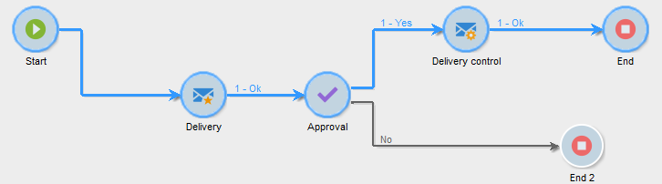

# Início e término{#start-and-end}

As atividades **[!UICONTROL Start]** e **[!UICONTROL End]** permitem marcar graficamente o início e o fim de um workflow. Essas atividades não têm impacto funcional e, portanto, são opcionais.

* **[!UICONTROL Start]**

   A execução de um workflow começa com atividades sem uma transição de entrada e atividades tipo início.

   

* **[!UICONTROL End]**

   É possível configurar a atividade **[!UICONTROL End]** para interromper todas as tarefas em andamento. Para fazer isso, clique duas vezes na atividade para exibir suas propriedades e marque a opção apropriada.

   

   Os dados na tabela de trabalho são excluídos automaticamente quando a atividade final é habilitada. Se isso não for necessário e para evitar cargas desnecessárias, é possível desabilitar a transição na última saída de atividade. Por exemplo, em uma saída de remessa, se nenhum processo estiver agendado, desmarque a opção relevante conforme mostrado abaixo:

   

