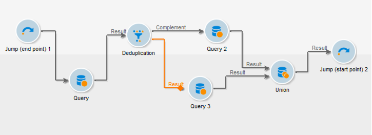
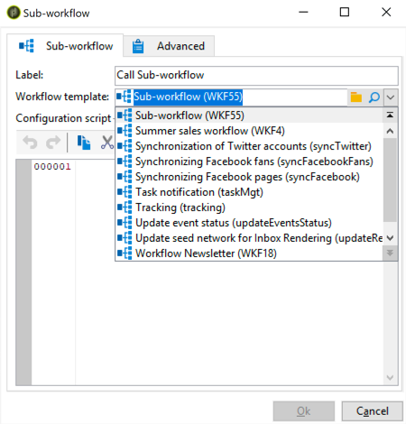
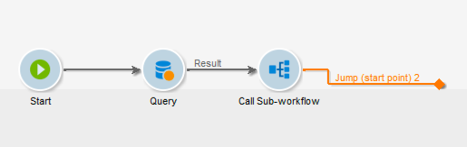
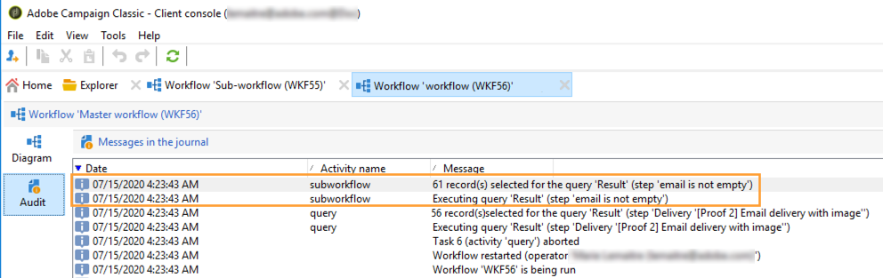

# Subfluxo de trabalho{#sub-workflow}

A atividade **[!UICONTROL Sub-workflow]** permite acionar a execução de outro fluxo de trabalho e recuperar o resultado. Essa atividade permite usar fluxos de trabalho complexos ao usar uma interface simplificada.

Você pode chamar vários subfluxos de trabalho em um único fluxo de trabalho. Os Subfluxos de trabalho são executados de forma síncrona.

No exemplo abaixo, um fluxo de trabalho chama um subfluxo de trabalho por meio de saltos. Para obter mais informações sobre objetos gráficos do tipo salto, consulte [esta seção](jump-start-point-and-end-point.md).

1. Crie um fluxo de trabalho que será usado como um subfluxo de trabalho em outro fluxo de trabalho.
1. Insira uma atividade **[!UICONTROL Jump (end point)]** com prioridade 1 no início do fluxo de trabalho. Se você tiver vários saltos do tipo &quot;ponto final&quot;, o Adobe Campaign usará o salto &quot;ponto final&quot; com o número mais baixo.
1. Insira uma atividade **[!UICONTROL Jump (start point)]** com prioridade 2 no fim do fluxo de trabalho. Se você tiver vários saltos do tipo &quot;ponto inicial&quot;, o Adobe Campaign usará o salto &quot;ponto inicial&quot; com o número mais alto.

   

   >[!NOTE]
   >
   >Se a atividade do subfluxo de trabalho fizer referência a um fluxo de trabalho com várias atividades **[!UICONTROL Jump]**, o subfluxo de trabalho será executado entre o salto tipo &quot;ponto final&quot; com o número mais baixo e o salto tipo &quot;ponto inicial&quot; com o número mais alto.
   >
   >Para que o subfluxo de trabalho seja executado corretamente, você deve ter apenas um salto tipo &quot;ponto final&quot; com o número mais baixo e apenas um salto tipo &quot;ponto inicial&quot; com o número mais alto.

1. Complete e salve este &quot;subfluxo de trabalho&quot;.
1. Crie um fluxo de trabalho principal.
1. Insira uma atividade **[!UICONTROL Sub-workflow]** e abra-a.
1. Selecione o fluxo de trabalho que deseja usar na lista suspensa **[!UICONTROL Workflow template]**.

   

1. Também é possível adicionar um script de configuração para alterar o fluxo de trabalho referenciado.
1. Clique em **[!UICONTROL Ok]**. Uma transição de saída com o rótulo da atividade **[!UICONTROL Jump (start point)]** será criada automaticamente a partir do fluxo de trabalho selecionado.

   

1. Execute o fluxo de trabalho.

Uma vez executado, o fluxo de trabalho chamado como um subfluxo de trabalho ainda estará com o status **[!UICONTROL Being edited]**, o que significa que:

* Você não pode clicar com o botão direito do mouse nas transições para exibir o target.
* A contagem de populações intermediárias não pode ser exibida.
* Os registros do subfluxo de trabalho são exibidos no fluxo de trabalho principal.

  

>[!NOTE]
>
>Se ocorrer algum erro no subfluxo de trabalho, o fluxo de trabalho principal será pausado e uma cópia do subfluxo de trabalho será criada.

## Parâmetros de entrada (opcional) {#input-parameters--optional-}

* tableName
* esquema

Cada evento de entrada deve especificar um target definido por esses parâmetros.

## Parâmetros de saída {#output-parameters}

* tableName
* esquema
* recCount

Esse conjunto de três valores identifica a população de destino da consulta. **[!UICONTROL tableName]** é o nome da tabela que registra os identificadores de público-alvo, **[!UICONTROL schema]** é o esquema da população (normalmente, nms:recipient) e **[!UICONTROL recCount]** é o número de elementos na tabela.

* targetSchema: Este valor é o schema da tabela de trabalho. Esse parâmetro é válido para todas as transições com **[!UICONTROL tableName]** e **[!UICONTROL schema]**.

