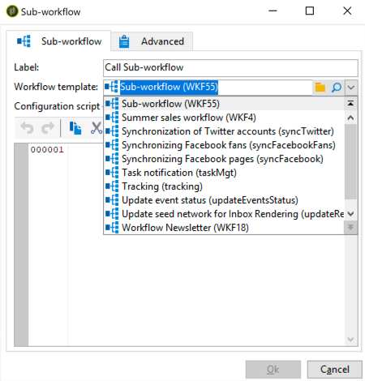

# Sub-workflow{#sub-workflow}

A atividade **[!UICONTROL Sub-workflow]** permite acionar a execução de outro workflow e recuperar o resultado. Essa atividade permite usar workflows complexos ao usar uma interface simplificada.

Você pode chamar vários sub-workflows em um único workflow. Os Sub-workflows são executados de forma síncrona.

>[!NOTE]
>
>Para que o sub-workflow seja executado corretamente, você deve ter apenas um atalho de &quot;chegada&quot; com o número mais baixo e apenas um atalho de &quot;início&quot; com o número mais alto. Por exemplo, se você tiver um atalho de &quot;início&quot; com uma prioridade 1, 2 e 3, você deverá ter apenas um atalho de &quot;início&quot; com uma prioridade 3.

1. Crie um workflow a ser usado como um sub-workflow em outro workflow.
1. Insira uma atividade **[!UICONTROL Jump (end point)]** com prioridade 1 no início do workflow. Se você tiver vários atalhos de &quot;chegada&quot;, o Adobe Campaign usará o atalho de &quot;chegada&quot; com o número mais baixo.

   Insira uma atividade **[!UICONTROL Jump (start point)]** com prioridade 2 no fim do workflow. Se você tiver vários atalhos de &quot;início&quot;, o Adobe Campaign usará o atalho &quot;inicial&quot; com o número mais alto.

   

   >[!NOTE]
   >
   >Se a atividade de sub-workflow consultar um workflow com várias atividades **[!UICONTROL Jump]**, o sub-workflow será executado entre o atalho de &quot;chegada&quot; com o número mais baixo e o atalho de &quot;início&quot; com o número mais alto.

1. Complete e salve este &quot;sub-workflow&quot;.
1. Crie um workflow principal.
1. Insira uma atividade **[!UICONTROL Sub-workflow]** e abra-a.
1. Selecione o workflow que deseja usar na lista suspensa **[!UICONTROL Workflow template]**.

   

1. Também é possível adicionar um script de configuração para alterar o workflow referenciado.
1. Clique em **[!UICONTROL Ok]**. Ele criará automaticamente uma transição de saída com o rótulo da atividade **[!UICONTROL Jump (start point)]** do workflow selecionado.

   

1. Execute o workflow.

Uma vez executado, o workflow chamado como sub-workflow ainda estará com o status **[!UICONTROL Being edited]**, o que significa:

* Você não pode clicar com o botão direito do mouse nas transições para exibir o target.
* A contagem de públicos intermediários não pode ser exibida.
* Os logs são agregados no workflow principal e são rotulados apenas como &quot;subworkflow&quot;.

De fato, este workflow é apenas um template. Um novo sub-workflow baseado nesse template é criado quando chamado pelo workflow principal.

## Parâmetros de entrada (opcional) {#input-parameters--optional-}

* tableName
* schema

Cada evento de entrada deve especificar um target definido por esses parâmetros.

## Parâmetros de output {#output-parameters}

* tableName
* schema
* recCount

Esse conjunto de três valores identifica o público alvo do query. **[!UICONTROL tableName]** é o nome da tabela que registra os identificadores de target, **[!UICONTROL schema]** é o schema do público (normalmente nms:recipient) e **[!UICONTROL recCount]** é o número de elementos na tabela.

* targetSchema

Este valor é o schema da tabela de trabalho. Esse parâmetro é válido para todas as transições com **[!UICONTROL tableName]** e **[!UICONTROL schema]**.
