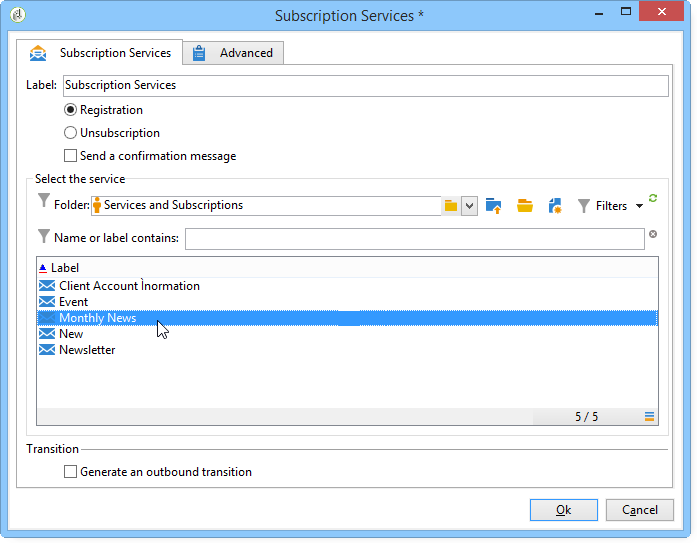

# Serviços de assinatura{#subscription-services}

Uma atividade tipo **Subscription services** permite criar ou excluir uma subscrição para um serviço de informações para a população especificada na transição.

Para configurá-la, edite a atividade e insira seu rótulo, então selecione a ação a ser executada (Subscrição ou Unsubscription) e o serviço relacionado, como no exemplo a seguir:

1. Insira o rótulo da atividade.
1. Selecione **[!UICONTROL Generate an outbound transition]** para criar uma transição no final da execução.

   Geralmente, a assinatura de um segmento em um serviço de informações marca o final do fluxo de trabalho de segmentação, por isso a opção não está ativada por padrão.

1. Clique em **[!UICONTROL Subscription]** ou em **[!UICONTROL Unsubscription]** para assinar ou cancelar a subscrição da população especificada para ou a partir do serviço de informações selecionado.
1. Selecione **[!UICONTROL Send a confirmation message]** para notificar os destinatários que a subscrição de um serviço foi realizada ou cancelada.

   O conteúdo dessa mensagem é definido no modelo de entrega associado ao serviço de assinatura. Para obter mais informações, consulte esta [seção](../../delivery/using/managing-subscriptions.md).

## Exemplo: inscrever uma lista de destinatários em um boletim informativo {#example--subscribe-a-list-of-recipients-to-a-newsletter}

Em uma única operação, o fluxo de trabalho a seguir visa fazer uma lista de destinatários qualificados para um boletim informativo, destinado a pessoas que trabalham em Paris, para que assinem.

Para fazer isso, também é necessário excluir os destinatários que já estão subscritos.

>[!CAUTION]
>
>Antes de subscrever destinatários manualmente a um serviço, verifique se esses destinatário aceitam receber comunicações.

1. Adicione as três queries a seguir:

   * Uma direcionada a destinatários com idade entre 18 e 60 anos.
   * Uma segunda direcionada a destinatários que residem em Paris.
   * Uma terceira direcionada a destinatários que não se inscreveram no boletim informativo.

1. Adicione uma atividade de interseção para cruzar os resultados diferentes.
1. Se desejar, insira um list update para manter a lista de subscritos atualizada.
1. Insira uma atividade de serviços de subscrição e clique duas vezes nesta opção para configurá-la.
1. Insira o rótulo da atividade e selecione **[!UICONTROL Subscription]**.

   Se desejar, é possível informar os destinatários sobre a subscrição do boletim informativo marcando a caixa **[!UICONTROL Send a confirmation message]**.

1. Selecione a pasta em que o boletim informativo está e em seguida, selecione o boletim informativo na lista exibida.
1. Deixe a opção **[!UICONTROL Generate outbound transition]** desmarcada para que esta atividade marque o final do fluxo de trabalho e clique em **[!UICONTROL Ok]**.

Durante a execução do fluxo de trabalho, os destinatários que correspondem a todas as três queries são adicionados à lista e subscritos ao boletim informativo.

É possível verificar se a subscrição foi bem-sucedida acessando a guia **[!UICONTROL Subscription]** dos destinatários.

## Parâmetros de entrada {#input-parameters}

* tableName
* esquema

Cada evento de entrada deve especificar um target definido por esses parâmetros.

