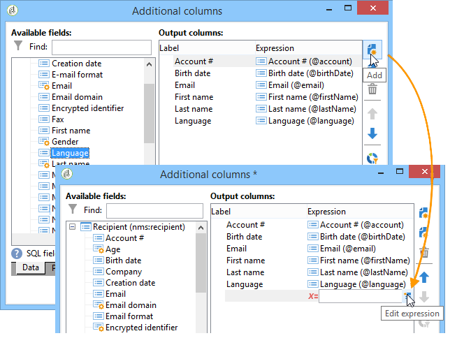

# Direcionamento de dados{#targeting-data}

## Criação de query {#creating-queries}

### Seleção de dados {#selecting-data}

A **[!UICONTROL Query]** activity lets you select basic data to build the target population. For more on this, refer to [Creating a query](../../workflow/using/query.md#creating-a-query).

You can also use the following activities to query and refine data from the database: [Incremental query](../../workflow/using/incremental-query.md), [Read list](../../workflow/using/read-list.md).

É possível coletar dados adicionais para serem encaminhados e processados durante o ciclo de vida do workflow. Para obter mais informações, consulte [Adicionar dados](../../workflow/using/query.md#adding-data) e [Editar dados](#editing-additional-data)adicionais.

### Edição de dados adicionais {#editing-additional-data}

Após adicionar os dados adicionais, você pode editá-los ou utilizá-los para refinar o target definido na atividade de query.

The **[!UICONTROL Edit additional data...]** link lets you view the added data and modify it or add to it.

Para adicionar dados às colunas de output definidas anteriormente, selecione-os na lista de campos disponíveis. To create a new output column, click the **[!UICONTROL Add]** icon, then select the field and click **[!UICONTROL Edit expression]**.

Defina um modo de cálculo para que o campo seja adicionado, como, por exemplo, uma agregação.

The **[!UICONTROL Add a sub-item]** option lets you attach computed data to the collection. Isso permite selecionar os dados adicionais da coleção ou definir cálculos agregados em elementos de coleção.

O subelementos será representado na subárvore da coleção em que são mapeados.

Collections are shown in the **[!UICONTROL Collections]** sub-tab. You can filter the collected elements by clicking the **[!UICONTROL Detail]** icon of the selected collection. O assistente de filtro permite selecionar os dados coletados e especificar as condições de filtragem a serem aplicadas aos dados na coleção.

### Refinamento do target usando dados adicionais {#refining-the-target-using-additional-data}

Os dados adicionais coletados podem habilitar a filtragem de dados no banco de dados. To do this, click the **[!UICONTROL Refine the target using additional data...]** link: this lets you over-filter on the added data.

### Uniformização de dados {#homogenizing-data}

In **[!UICONTROL Union]** or **[!UICONTROL Intersection]** type activities, you can choose to keep only shared additional data to keep the data consistent. Nesse caso, a mesa de trabalho temporária de output dessa atividade conterá apenas os dados adicionais encontrados em todos os conjuntos de entradas.

### Reconciliação com dados adicionais {#reconciliation-with-additional-data}

Durante as fases de reconciliação de dados (**[!UICONTROL Union]**, **[!UICONTROL Intersection]** etc.). atividades), você pode selecionar as colunas a serem usadas para reconciliação de dados das colunas adicionais. Para fazer isso, configure uma reconciliação em uma seleção de colunas e especifique o conjunto principal. Em seguida, selecione as colunas na coluna inferior da janela, como mostrado no exemplo a seguir:

### Criação de subconjuntos {#creating-subsets}

The **[!UICONTROL Split]** activity lets you create subsets on criteria defined via extraction queries. Para cada subconjunto, ao editar uma condição de filtro no público, você acessará a atividade de query padrão que permite definir as condições de segmentação de target.

Você pode dividir um target em vários subconjuntos usando apenas dados adicionais como condições de filtragem ou como complemento aos dados de target. Você também pode usar dados externos se tiver comprado a opção **Federated Data Access**.

Para obter mais informações, consulte [Criação de subconjuntos usando a atividade](#creating-subsets-using-the-split-activity)Dividir.

## Segmentação de dados {#segmenting-data}

### Combinação de vários targets (União) {#combining-several-targets--union-}

A atividade de união permite combinar o resultado de várias atividades em uma transição. Os conjuntos não precisam ser necessariamente homogêneos.

As seguintes opções de reconciliação de dados estão disponíveis:

* **[!UICONTROL Keys only]**

   Essa opção pode ser usada se os públicos de entrada forem homogêneos.

* **[!UICONTROL All columns in common]**

   Esta opção permite reconciliar dados baseado em todas as colunas comuns para os vários públicos do target.

   O Adobe Campaign identifica colunas com base em seu nome. Um limite de tolerância é aceito: uma coluna &#39;Email&#39; pode ser reconhecida como idêntica a uma coluna &#39;@email&#39;, por exemplo.

* **[!UICONTROL A selection of columns]**

   Selecione essa opção para definir a lista de colunas na qual a reconciliação de dados será aplicada.

   Comece selecionando o conjunto principal (aquele que contém os dados de origem) e as colunas a serem usadas na associação.

   

   >[!CAUTION]
   >
   >Durante a reconciliação de dados, não haverá a eliminação da duplicação dos públicos.

   Você pode restringir o tamanho do público a um determinado número de registros. Para fazer isso, clique na opção adequada e especifique o número de registros a serem mantidos.

   Além disso, especifique a prioridade dos públicos de entrada: a seção inferior da janela lista as transições de entrada da atividade de união e permite organizá-las com as setas azuis à direita da janela.

   Os registros serão retirados primeiro do público da primeira transição de entrada na lista, e, se o máximo não tiver sido atingido, eles serão retirados do público da segunda transição de entrada e etc.

   

### Extração de dados da junção (Intersecção) {#extracting-joint-data--intersection-}

A intersecção permite recuperar apenas as linhas compartilhadas pelos públicos de transições de entrada. Essa atividade será configurada como a atividade de união.

Além disso, é possível manter apenas uma seleção de colunas ou apenas as colunas compartilhadas pelo público de entrada.

The intersection activity is detailed in the [Intersection](../../workflow/using/intersection.md) section.

### Excluir um público (Exclusão) {#excluding-a-population--exclusion-}

A atividade de exclusão permite excluir os elementos de um target de um público alvo diferente. O targeting dimension de output dessa atividade será do conjunto principal.

Quando necessário, é possível manipular as tabelas de entrada. De fato, para excluir um target de outra dimensão, esse target deve ser devolvido ao mesmo targeting dimension como o target principal. To do this click the **[!UICONTROL Add]** button and specify the dimension change conditions.

A reconciliação de dados é realizada por meio de um identificador, alterando o eixo ou uma junção. Um exemplo está disponível em [Uso de dados de uma lista: Lista](../../workflow/using/importing-data.md#using-data-from-a-list--read-list)de leitura.

### Criação de subconjuntos usando a atividade de Split {#creating-subsets-using-the-split-activity}

The **[!UICONTROL Split]** activity is a standard activity which lets you create as many sets as necessary via one or several filtering dimensions, as well as generating either one output transition per subset or a unique transition.

Os dados adicionais transmitidos pela transição de entrada podem ser usados nos critérios de filtragem.

Para configurá-lo, primeiro é necessário selecionar os critérios:

1. In your workflow, drag and drop a **[!UICONTROL Split]** activity.
1. Na **[!UICONTROL General]** guia, selecione a opção desejada: **[!UICONTROL Use data from the target and additional data]**, **[!UICONTROL Use the additional data only]** ou **[!UICONTROL Use external data]**.
1. If the **[!UICONTROL Use data from the target and additional data]** option is selected, the targeting dimension lets you use all the data conveyed by the inbound transition.

   

   Quando subconjuntos são criados, os parâmetros de filtragem mencionados anteriormente são usados.

   Para definir condições de filtragem, escolha a **[!UICONTROL Add a filtering condition on the inbound population]** opção e clique no **[!UICONTROL Edit...]** link. Em seguida, especifique as condições de filtragem para criar esse subconjunto.

   

   An example showing how to use filtering conditions in the **[!UICONTROL Split]** activity to segment the target into different populations is described in [this section](../../workflow/using/cross-channel-delivery-workflow.md).

   The **[!UICONTROL Label]** field lets you give the newly created subset a name, which will match the outbound transition.

   Você também pode atribuir um código de segmento ao subconjunto para identificá-lo e usá-lo para o target do seu público.

   Se necessário, você pode alterar o targeting dimension e a dimensão de filtro individualmente para cada subconjunto que deseja criar. To do this, edit the subset&#39;s filtering condition and check the **[!UICONTROL Use a specific filtering dimension]** option.

   

1. If the **[!UICONTROL Use the additional data only]** option is selected, only additional data is offered for subset filtering.

   

1. If the **Federated Data Access** option is enabled, the **[!UICONTROL Use external data]** lets you process data in an external database which is already configured, or create a new connection to a database.

   

   Para obter mais informações, consulte esta [seção](../../platform/using/accessing-an-external-database.md).

Em seguida, precisamos adicionar novos subconjuntos:

1. Click the **[!UICONTROL Add]** button and define the filtering conditions.

   

1. Define the filtering dimension in the **[!UICONTROL General]** tab of the activity (see above).It applies to all subsets by default.

   

1. Se necessário, você pode alterar a dimensão de filtro para cada subconjunto individualmente. Isso permite criar um conjunto para todos os titulares de cartões Gold, um para todos os recipients que clicaram no boletim informativo mais recente e um terceiro para pessoas entre 18 e 25 anos que fizeram uma compra na loja nos últimos 30 dias, tudo usando a mesma atividade de Split. To do this, select the **[!UICONTROL Use a specific filtering dimension]** option and select the data filtering context.

   

   >[!NOTE]
   >
   >Se adquiriu a opção **Federated Data Access**, você pode criar subconjuntos com base nas informações em uma base externa. To do this, select the schema of the external table in the **[!UICONTROL Targeting dimension]** field. Para obter mais informações, consulte [Acesso a um banco de dados externo (FDA)](../../workflow/using/accessing-an-external-database--fda-.md).

Após a criação dos subconjuntos, por padrão, a atividade de split mostrará tantas transições de output quanto houver subconjuntos:

Você pode agrupar todos esses subconjuntos em uma única transição de output. Nesse caso, o link para os respectivos subconjuntos será visível no código do segmento, por exemplo. Para fazer isso, selecione a **[!UICONTROL Generate all subsets in the same table]** opção.

Por exemplo, você pode colocar uma única atividade de delivery e personalizar o conteúdo do delivery com base no código do segmento de cada conjunto de recipients:

Subsets can also be created using the **[!UICONTROL Cells]** activity. For more on this, refer to the [Cells](../../workflow/using/cells.md) section.

### Uso de dados de target {#using-targeted-data}

Depois que os dados forem identificados e preparados, eles poderão ser usados nos seguintes contextos:

* Você pode atualizar os dados no banco de dados após a manipulação de dados nos vários estágios do workflow.

   Para obter mais informações, [atualize os dados](../../workflow/using/update-data.md).

* Você também pode atualizar o conteúdo de listas existentes.

   For more on this, refer to [List update](../../workflow/using/list-update.md).

* Você pode preparar ou iniciar deliveries no workflow diretamente.

   Para obter mais informações, consulte [Entrega](../../workflow/using/delivery.md), controle [de](../../workflow/using/delivery-control.md) entrega e entrega contínua.

## Gestão de Dados {#data-management}

No Adobe Campaign, a Gestão de Dados combina um conjunto de atividades para resolver problemas complexos de target oferecendo ferramentas mais eficientes e flexíveis. Isso permite implementar uma gestão consistente de todas as comunicações com um contato usando informações relacionadas a seus contratos, assinaturas, reatividade aos deliveries, etc. A Gestão de Dados permite acompanhar o ciclo de vida dos dados durante as operações de segmentação, especificamente:

* Simplificação e otimização de processos de target, ao incluir dados que não são modelados no datamart (criando novas tabelas: extensão local para todo workflow para construção do target, dependendo da configuração).
* Manutenção e transmissão de cálculos de buffer, especialmente durante as fases de construção do target ou para administração de banco de dados.
* Acesso a bases externas (opcional): bancos de dados heterogêneos considerados durante o processo de segmentação.

Para implementar essas operações, o Adobe Campaign oferece:

* Atividades de recolha de dados: Transferência [de](../../workflow/using/file-transfer.md)arquivos, carregamento [de dados (arquivo)](../../workflow/using/data-loading--file-.md), carregamento [de dados (RDBMS)](../../workflow/using/data-loading--rdbms-.md), [Atualização de dados](../../workflow/using/update-data.md). Essa primeira etapa de coleta de dados prepara os dados para que ele seja processado em outras atividades. Vários parâmetros precisam ser monitorados para garantir que o workflow seja executado corretamente e forneça os resultados esperados. Por exemplo, ao importar os dados, a chave primária (Pkey) para esses dados deve ser única para cada registro.
* As atividades de definição de metas foram aprimoradas com as opções de Gerenciamento de dados: [Consulta](../../workflow/using/query.md), [União](../../workflow/using/union.md), [Interseção](../../workflow/using/intersection.md), [Dividir](../../workflow/using/split.md). Isso permite configurar uma união ou uma intersecção entre dados de diferentes targeting dimensions, desde que a reconciliação dos dados seja possível.
* Atividades de transformação de dados: [Enriquecimento](../../workflow/using/enrichment.md), [Alterar dimensão](../../workflow/using/change-dimension.md).

>[!CAUTION]
>
>Quando dois workflows são vinculados, a exclusão de um elemento de tabela de origem não significa que todos os dados vinculados a ele serão excluídos.
>  
>Por exemplo, excluir um recipient por meio de um workflow não resultará na exclusão de todo o histórico de delivery. No entanto, excluir um recipient diretamente na pasta &#39;Recipients&#39; resultará na exclusão de todos os dados vinculados a este recipient.

### Modificação e enriquecimento de dados {#enriching-and-modifying-data}

Além do targeting dimension, a dimensão de filtro permite especificar a natureza dos dados coletados. Consulte [Definição de metas e dimensões](../../workflow/using/building-a-workflow.md#targeting-and-filtering-dimensions)de filtragem.

Os dados identificados e coletados podem ser enriquecidos, agregados e manipulados para otimizar a construção de target. To do this, in addition to the data manipulation activities detailed in the [Segmenting data](#segmenting-data) section, use the following:

* The **[!UICONTROL Enrichment]** activity lets you momentarily add columns to a schema, as well as add information to certain elements. It is detailed in the [Enrichment](../../workflow/using/enrichment.md) section of the repository of activities.
* The **[!UICONTROL Edit schema]** activity lets you modify the structure of a schema. It is detailed in the [Edit schema](../../workflow/using/edit-schema.md) section of the repository of activities.
* The **[!UICONTROL Change dimension]** activity lets you change the targeting dimension during the target construction cycle. It is detailed in the [Change dimension](../../workflow/using/change-dimension.md) section.

