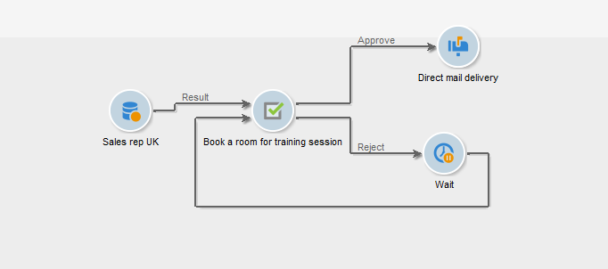
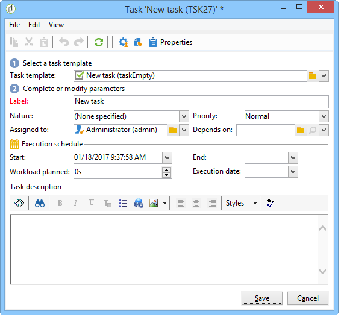

# Tarefa{#task}

>[!AVAILABILITY]
>
>`:warning:` Esse recurso só está disponível no Campaign Classic v7. [Saiba mais](../../mrm/using/creating-and-managing-tasks.md)

Em um fluxo de trabalho de campanha, a atividade **[!UICONTROL Task]** permite especificar dois cenários: o primeiro se a tarefa for concluída e um segundo se a tarefa não for concluída (se estiver marcada manualmente como incompleta ou se ela expirar).

A configuração e operação de uma tarefa são detalhadas na [documentação do Campaign Classic v7](../../mrm/using/creating-and-managing-tasks.md).

A opção **[!UICONTROL Resources]** permite definir vários operadores, bem como um agendamento de aprovação para a tarefa. Se a pessoa que aprova rejeitar, isso não leva à tarefa em si a ser rejeitada.
