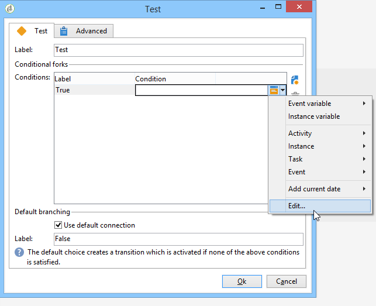

<?xml version="1.0" encoding="UTF-8"?>
<xliff xmlns="urn:oasis:names:tc:xliff:document:1.2" xmlns:okp="okapi-framework:xliff-extensions" xmlns:its="http://www.w3.org/2005/11/its" xmlns:itsxlf="http://www.w3.org/ns/its-xliff/" version="1.2" its:version="2.0">
<file original="help/workflow/using/test.md.mdnouisc" source-language="en-US" target-language="en-XX" datatype="x-text/markdown">
<body>
<trans-unit id="tu8" xml:space="preserve">
<source xml:lang="en-US">https://experienceleague.adobe.com/en/tools/campaign-api</source>
<target xml:lang="en-XX">https://experienceleague.adobe.com/pt-br/tools/campaign-api</target>
</trans-unit>
<trans-unit id="tu1" restype="x-YAML_METADATA_HEADER_VALUE" xml:space="preserve">
<source xml:lang="en-US">Test</source>
<target xml:lang="en-XX">Teste</target>
</trans-unit>
<trans-unit id="tu2" restype="x-YAML_METADATA_HEADER_VALUE" xml:space="preserve">
<source xml:lang="en-US">Learn more about the Test workflow activity</source>
<target xml:lang="en-XX">Saiba mais sobre a atividade do fluxo de trabalho de teste</target>
</trans-unit>
<trans-unit id="tu3" xml:space="preserve">
<source xml:lang="en-US">Test</source>
<target xml:lang="en-XX">Teste</target>
</trans-unit>
<trans-unit id="tu4" xml:space="preserve">
<source xml:lang="en-US">A <ph id="1" ctype="x-STRONG_EMPHASIS">**</ph>Test<ph id="2" ctype="x-STRONG_EMPHASIS">**</ph> type activity activates the first transition that satisfies the condition associated with it. If no condition is satisfied and if the <ph id="3" ctype="x-STRONG_EMPHASIS">**[!UICONTROL Use the default fork]**</ph> option is activated, the default transition will be activated.</source>
<target xml:lang="en-XX">Uma atividade de tipo <ph id="1" ctype="x-STRONG_EMPHASIS">**</ph>Teste<ph id="2" ctype="x-STRONG_EMPHASIS">**</ph> ativa a primeira transição que satisfaz a condição associada a ela. Se nenhuma condição for satisfeita e se a opção <ph id="3" ctype="x-STRONG_EMPHASIS">**[!UICONTROL Use the default fork]**</ph> for ativada, a transição padrão será ativada.</target>
</trans-unit>
<trans-unit id="tu5" xml:space="preserve">
<source xml:lang="en-US">A condition is a JavaScript expression that must be evaluated to 'true' or 'false'. To enter the expression, click the icon to the right of the name of the condition, and then select <ph id="1" ctype="x-STRONG_EMPHASIS">**[!UICONTROL Edit...]**</ph>.</source>
<target xml:lang="en-XX">Uma condição é uma expressão JavaScript que deve ser avaliada como "verdadeira" ou "falsa". Para inserir a expressão, clique no ícone à direita do nome da condição e selecione <ph id="1" ctype="x-STRONG_EMPHASIS">**[!UICONTROL Edit...]**</ph>.</target>
</trans-unit>
<trans-unit id="tu6" xml:space="preserve">
<source xml:lang="en-US"><ph id="1" ctype="x-IMAGE"></ph></source>
<target xml:lang="en-XX"><ph id="1" ctype="x-IMAGE"></ph></target>
</trans-unit>
<trans-unit id="tu7" xml:space="preserve">
<source xml:lang="en-US">For more information on all the additional JavaScript functions and SOAP methods of the applicative server accessible via workflow JavaScript, refer to <ph id="1" ctype="x-LINK">&lbrack;</ph>JSAPI documentation<ph id="2" ctype="x-LINK">[#$tu8]</ph>.</source>
<target xml:lang="en-XX">Para obter mais informações sobre todas as funções adicionais do JavaScript e métodos SOAP do servidor do aplicativo acessível via JavaScript de fluxo de trabalho, consulte a <ph id="1" ctype="x-LINK">&lbrack;</ph>documentação JSAPI<ph id="2" ctype="x-LINK">[#$tu8]</ph>.</target>
</trans-unit>
<trans-unit id="tu9" xml:space="preserve">
<source xml:lang="en-US">You can also insert variables directly from this editor. For more  information on how to work with variables, refer to <ph id="1" ctype="x-LINK">[</ph>this section<ph id="2" ctype="x-LINK">](javascript-scripts-and-templates.md#variables)</ph>.</source>
<target xml:lang="en-XX">Também é possível inserir variáveis diretamente no editor. Para obter mais informações sobre como trabalhar com variáveis, consulte <ph id="1" ctype="x-LINK">[</ph>esta seção<ph id="2" ctype="x-LINK">](javascript-scripts-and-templates.md#variables)</ph>.</target>
</trans-unit>
<trans-unit id="tu10" xml:space="preserve">
<source xml:lang="en-US">Conditions can be added, deleted, or ordered from the activity property edit window, but can also be modified from the transition.</source>
<target xml:lang="en-XX">As condições podem ser adicionadas, excluídas ou ordenadas a partir da janela de edição da propriedade de atividade, mas também podem ser modificadas a partir da transição.</target>
</trans-unit>
<trans-unit id="tu11" xml:space="preserve">
<source xml:lang="en-US">If the result of a calculation is to be reused by different conditions, it is possible to calculate it in the initialization script of the activity. The result must be stored in a variable of the task to be accessed by the condition scripts (task.vars.xxx).</source>
<target xml:lang="en-XX">Se o resultado de um cálculo for reutilizado por condições diferentes, é possível calculá-lo no script de inicialização da atividade. O resultado deve ser armazenado em uma variável da tarefa a ser acessada pelos scripts de condição (task.vars.xxx).</target>
</trans-unit>
</body>
</file>
</xliff>