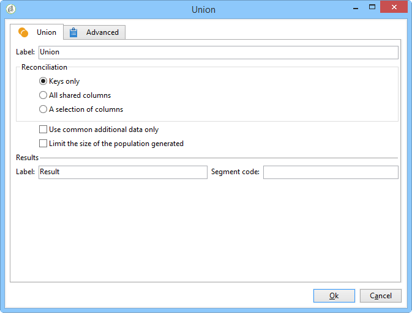

# União{#union}

Uma união agrupa o resultado de várias atividades de entrada em um único target. O target é criado com todos os resultados recebidos: todas as atividades anteriores devem então ser concluídas para que a união seja executada.

>[!NOTE]
>
>Para obter mais informações sobre como configurar e usar a atividade de união, consulte [Combinando vários targets (União)](targeting-data.md#combining-several-targets--union-).

## Exemplo de união {#union-example}

No exemplo a seguir, os resultados de dois queries foram combinados para atualizar a lista. Os dois queries têm os destinatários como alvo. Os resultados são então baseados na mesma tabela.

1. Insira uma atividade do tipo **[!UICONTROL Union]** diretamente após os dois queries e antes de uma atividade do tipo atualização da lista, e depois a abra.
1. Você pode inserir um rótulo.
1. Selecione o método de reconciliação **[!UICONTROL Keys only]**, pois, neste exemplo, a população resultante dos queries contém dados consistentes.
1. Se você tiver inserido dados adicionais para os queries, pode manter apenas os dados compartilhados.
1. Se desejar limitar o tamanho da população final, marque a caixa **[!UICONTROL Limit size of generated population]**.

   Especifique este número final inserindo o número máximo de destinatários e selecionando a consulta cuja população terá prioridade.

1. Aprove a atividade de união e configure a atividade de atualização da lista (consulte [Atualização de lista](list-update.md)).
1. Inicie o fluxo de trabalho. O número de resultados é exibido e a lista definida na atividade de atualização da lista é criada ou atualizada. Esta lista contém o conjunto de destinatários para queries ou, onde aplicável, o número definido na etapa anterior.

   

## Parâmetros de entrada {#input-parameters}

* tableName
* esquema

Cada evento de entrada deve especificar um target definido por esses parâmetros.

## Parâmetros de saída {#output-parameters}

* tableName
* esquema
* recCount

Esse conjunto de três valores identifica o target resultante da união. **[!UICONTROL tableName]** é o nome da tabela que registra os identificadores de público-alvo, **[!UICONTROL schema]** é o esquema da população (normalmente, nms:recipient) e **[!UICONTROL recCount]** é o número de elementos na tabela.
