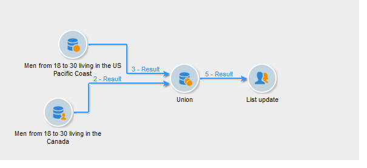

# União{#union}

Uma união agrupa o resultado de várias atividades de entrada em um único target. O target é criado com todos os resultados recebidos: todas as atividades anteriores devem então ser concluídas para que a união seja executada.

>[!NOTE]
>
>Para obter mais informações sobre como configurar e usar a atividade de união, consulte [Combinando vários targets (União)](../../workflow/using/targeting-data.md#combining-several-targets--union-).

## Exemplo de união {#union-example}

No exemplo a seguir, os resultados de dois queries foram combinados para atualizar a lista. Os dois queries têm os recipients como alvo. Os resultados são então baseados na mesma tabela.

1. Insira uma atividade do tipo **[!UICONTROL Union]** diretamente após os dois queries e antes de uma atividade do tipo atualização da lista, e depois a abra.
1. Você pode inserir um rótulo.
1. Selecione o método de reconciliação **[!UICONTROL Keys only]**, pois, neste exemplo, o público resultante dos queries contém dados consistentes.
1. Se você tiver inserido dados adicionais para os queries, pode manter apenas os dados compartilhados.
1. If you wish to limit the size of the final population, check the **[!UICONTROL Limit size of generated population]** box.

   Especifique este número final inserindo o número máximo de recipients e selecionando o query cujo público terá prioridade.

1. Aprove a atividade de união e configure a atividade de atualização da lista (consulte [Atualização de lista](../../workflow/using/list-update.md)).
1. Inicie o workflow. O número de resultados é exibido e a lista definida na atividade de atualização da lista é criada ou atualizada. Esta lista contém o conjunto de recipients para queries ou, onde aplicável, o número definido na etapa anterior.

   

## Parâmetros de entrada {#input-parameters}

* tableName
* schema

Cada evento de entrada deve especificar um target definido por esses parâmetros.

## Parâmetros de output {#output-parameters}

* tableName
* schema
* recCount

Esse conjunto de três valores identifica o target resultante da união. **[!UICONTROL tableName]** é o nome da tabela que registra os identificadores de target, **[!UICONTROL schema]** é o schema do público (normalmente nms:recipient) e **[!UICONTROL recCount]** é o número de elementos na tabela.
