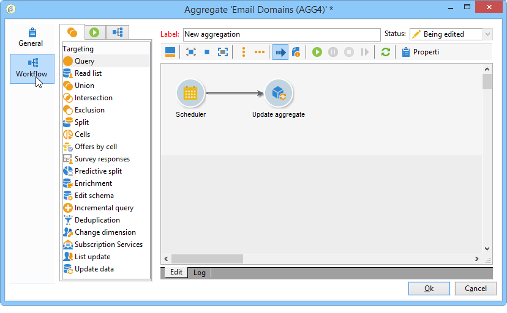

# Atualizar agregado{#update-aggregate}

Agregados são definidos em nível de cubo para fins de relatório. Uma guia **[!UICONTROL Workflow]** está disponível ao configurar uma agregação.

Para obter mais informações sobre cubos e usando agregados no Adobe Campaign, consulte a [seção](../../reporting/using/concepts-and-methodology.md#calculating-and-using-aggregates) dedicada.

A atividade **[!UICONTROL Update aggregate]** permite selecionar o modo de atualização que será aplicado: completo ou parcial.

Por padrão, uma atualização completa é realizada durante cada cálculo. Para habilitar uma atualização parcial, selecione a opção relevante e defina as condições de atualização.

**Prática recomendada**: uma atividade **[!UICONTROL Scheduler]** pode ser usada para especificar a frequência das atualizações de cálculo.

