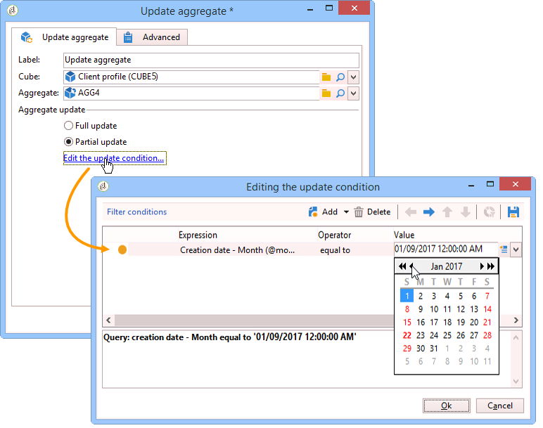

# Atualizar agregado{#update-aggregate}

Agregados são definidos em nível de cubo para fins de relatório. Uma guia **[!UICONTROL Workflow]** está disponível ao configurar uma agregação.

Agregações são úteis ao manipular grandes volumes de dados. Eles são atualizados automaticamente com base nas configurações definidas na caixa de fluxo de trabalho dedicada, para integrar os dados a serem coletados mais recentemente nos indicadores

As agregações são definidas na guia relevante de cada cubo.

A atividade **[!UICONTROL Update aggregate]** permite selecionar o modo de atualização que será aplicado: completo ou parcial.

Por padrão, uma atualização completa é realizada durante cada cálculo. Para habilitar uma atualização parcial, selecione a opção relevante e defina as condições de atualização.

**Prática recomendada**: uma atividade **[!UICONTROL Scheduler]** pode ser usada para especificar a frequência das atualizações de cálculo.

