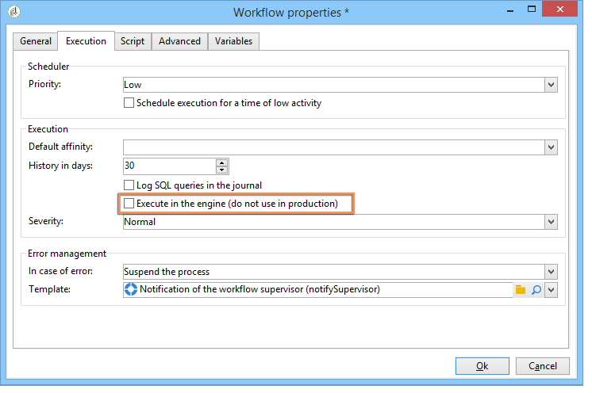

# Práticas recomendadas do fluxo de trabalho{#workflow-best-practices}

## Execução e desempenho {#execution-and-performance}

Abaixo estão listadas as diretrizes gerais sobre a otimização do desempenho da Campanha, incluindo as práticas recomendadas para aplicar aos seus fluxos de trabalho.

Diretrizes para solução de problemas relacionados à execução de fluxos de trabalho também estão disponíveis [nesta seção](../../production/using/workflow-execution.md).

### Logs {#logs}

The JavaScript method **[!UICONTROL logInfo()]** is a great solution for debugging a workflow. É útil, mas deve ser usado com cuidado, especialmente para atividades executadas com frequência: pode sobrecarregar os logs e aumentar significativamente o tamanho da tabela de log. But you might also need more than **[!UICONTROL logInfo()]**.

Duas soluções adicionais estão disponíveis para ajudar:

* **Manter o resultado de públicos provisórios entre duas execuções**

   Essa opção mantém tabelas temporárias entre duas execuções de um workflow. It is available in the workflow properties&#39; **[!UICONTROL General]** tab, and can be used for development and test purpose to monitor data and check results. Você pode usar essa opção em ambientes de desenvolvimento, mas nunca usá-la em ambientes de produção. Manter tabelas temporárias pode resultar no aumento significativo do tamanho de banco de dados e, por fim, atingir o limite de tamanho. Além disso, o backup ficará lento.

   Somente as tabelas de trabalho da última execução do workflow são mantidas. Working tables from previous executions are purged by the **[!UICONTROL cleanup]** workflow, which runs on a daily basis.

   >[!CAUTION]
   >
   >Essa opção nunca deve ser verificada em um workflow de produção. Essa opção é usada para analisar os resultados e é projetada apenas para fins de teste e, portanto, deve ser usada apenas em ambientes de desenvolvimento ou de preparo.

* **Logs de queries SQL no journal**

   Available in the **[!UICONTROL Execution]** tab of workflow properties, this option will log all SQL queries generated by the tool from the different activities. É uma boa forma de ver o que está realmente sendo executado pela plataforma. No entanto, essa opção só deve ser usada temporariamente durante o desenvolvimento e não ativada durante a produção.

Limpe os registros quando eles não forem mais necessários. O histórico do workflow não é removido automaticamente: todas as mensagens são mantidas por padrão. History can be purged via the **[!UICONTROL File > Actions]** menu or by clicking the Actions button located in the toolbar above the list. Selecione Limpar histórico.
Para saber como limpar seus registros, consulte esta [documentação](../../workflow/using/executing-a-workflow.md#actions-toolbar).

### Planejamento de workflow {#workflow-planning}

* Tente manter um nível estável de atividade 
							ao longo do dia e evitar picos para prevenir a sobrecarga da instância. Para
							fazer isso, distribua os horários de início do workflow uniformemente ao longo do
							dia.
* Agende a carga de dados durante a noite para reduzir o 
							a contenção de recurso.
* Workflows longos podem ter impacto
							no servidor e nos recursos do banco de dados. Divida os workflows mais longos 
							para reduzir o tempo de processamento.
* Para reduzir os tempos de execução gerais, substitua 
							atividades demoradas por atividades simplificadas e mais rápidas.
* Evite executar mais de 20 fluxos de trabalho simultaneamente. Quando muitos fluxos de trabalho são executados ao mesmo tempo, o sistema pode ficar sem recursos e se tornar instável. Para obter mais informações sobre por que o fluxo de trabalho pode não estar sendo iniciado, consulte este [artigo](https://helpx.adobe.com/ie/campaign/kb/workflows-not-starting-in-a-campaign-technical-workflows.html).

### Execução do workflow {#workflow-execution}

É recomendável não agendar um workflow para execução por mais de 15 minutos porque pode atrapalhar o desempenho geral do sistema e criar bloqueios no banco de dados.

Evite deixar seus fluxos de trabalho em estado de pausa. If you create a temporary workflow, make sure it will be able to finish correctly and not stay in a **[!UICONTROL paused]** state. Se estiver pausado, isso significa que é preciso manter as tabelas temporárias e, portanto, aumentar o tamanho do banco de dados. Atribua Supervisores de fluxo de trabalho em Propriedades do fluxo de trabalho para enviar um alerta quando um fluxo de trabalho falhar ou for pausado pelo sistema.

Para evitar workflows no estado pausado:

* Verifique seus workflows regularmente para garantir que não haja erros inesperados.
* Mantenha seus workflows o mais simples possível, por exemplo, dividindo grandes workflows em vários workflows diferentes. You can use **[!UICONTROL External signal]** activities trigger their execution based on other workflows&#39; execution.
* Evite desabilitar atividades com fluxos nos fluxos de trabalho, deixando threads abertos e levando a muitas tabelas temporárias que podem consumir muito espaço. Não mantenha atividades em **[!UICONTROL Do not enable]** ou em **[!UICONTROL Enable but do not execute]** estados em seus fluxos de trabalho.

Além disso, pare os fluxos de trabalho não utilizados. Fluxos de trabalho que continuam executando mantêm conexões com o banco de dados.

Use apenas parada incondicional nos casos mais raros. Não utilize esta ação regularmente. Não executar um encerramento limpo nas conexões geradas pelos fluxos de trabalho para o banco de dados afeta o desempenho.

### Executar na opção do motor {#execute-in-the-engine-option}

Na **[!UICONTROL Workflow properties]** janela, nunca marque a **[!UICONTROL Execute in the engine]** opção. Quando essa opção estiver habilitada, o workflow tem prioridade e todos os outros workflows são interrompidos pelo motor de workflow até que este seja concluído.

## Propriedades do workflow {#workflow-properties}

### Pastas de workflow {#workflow-folders}

A Adobe recomenda criar seus workflows em uma pasta dedicada.

If the workflow affects the whole platform (cleansing processes for example), you can consider adding a sub-folder in the built-in **[!UICONTROL Technical Workflows]** folder.

### Nomeação do workflow {#workflow-naming}

Como facilita a localização e a solução de problemas se não estiverem executando da forma esperada, a Adobe recomenda que os workflows tenham nomes e rótulos adequados: preencha o campo de descrição do workflow para resumir o processo para que o operador possa entender facilmente.

Se o workflow fizer parte de um processo envolvendo vários workflows, você pode ser explícito ao inserir um rótulo. Usar números é uma ótima maneira de organizar os workflows (por Rótulo).

Por exemplo:

* 001 - Importar - Importar destinatários
* 002 - Importar - Importar vendas
* 003 - Importar - Importar detalhes das vendas
* 010 - Exportar - Exportar logs de entrega
* 011 - Export - Export tracking logs

### Severidade do workflow {#workflow-severity}

You can configure the severity of a workflow in the workflow properties, in the **[!UICONTROL Execution]** tab:

* Normal
* Produção
* Crítico

Fornecer essas informações ao criar um workflow ajudará a entender a severidade do processo configurado.

Essa opção tem impacto funcional somente nos workflows da campanha.

Workflows da campanha (workflows criados como parte de uma campanha/operação) com uma severidade mais alta são executados com prioridade caso a campanha tenha muitos processos executados simultaneamente. Por padrão, apenas dez processos podem ser executados simultaneamente em uma campanha, de acordo com a opção NmsOperation_LimitConcurrency. Por exemplo, se uma campanha contêm 25 workflows, os workflows com uma severidade mais alta serão executados no primeiro pool de dez processos.

### Monitoramento de workflow {#workflow-monitoring}

Todos os workflows agendados executados em ambientes de produção devem ser monitorados para enviar alerta em caso de erro.

In the workflow properties, select a Supervisor group, either the default **[!UICONTROL Workflow supervisors]** or a custom group. Certifique-se de que pelo menos um operador participe desse grupo, com um email definido.

Antes de começar a construir um workflow, lembre-se de definir supervisores de workflow. Eles serão notificados por email em caso de erro. For more on this, refer to [Managing errors](../../workflow/using/monitoring-workflow-execution.md#managing-errors).

Regularly check the **[!UICONTROL Monitoring]** universe to view the overall status of the active workflows. For more on this, refer to [Instance supervision](../../workflow/using/monitoring-workflow-execution.md#instance-supervision).

O Workflow HeatMap permite aos administradores da plataforma 
					Adobe Campaign monitorarem a carga na instância e planejarem os workflows 
					correspondentes. Para obter mais informações, consulte [Monitoramento de workflow](../../workflow/using/heatmap.md).

## Uso das atividades {#using-activities}

>[!CAUTION]
>
>É possível copiar e colar atividades dentro de um mesmo fluxo de trabalho. No entanto, não recomendamos copiar atividades de colagem em diferentes fluxos de trabalho. Algumas configurações anexadas a atividades como Entregas e Agendador podem levar a conflitos e erros ao executar o fluxo de trabalho de destino. Em vez disso, recomendamos que você **Duplique** fluxos de trabalho. Para obter mais informações, consulte Fluxos de trabalho [duplicados](../../workflow/using/building-a-workflow.md#duplicating-workflows).

### Nome da atividade {#name-of-the-activity}

Ao desenvolver seu workflow, todas as atividades terão um nome, como todos os objetos do Adobe Campaign. Embora o nome seja gerado pela ferramenta, recomendamos que você renomeie com um nome explícito ao configurá-lo. O risco de fazer isso depois é que pode interromper o workflow com atividades usando o nome de outra atividade anterior. Portanto, seria um trabalho difícil atualizar os nomes depois.

The activity name can be found in the **[!UICONTROL Advanced]** tab. Não os deixe nomeados **[!UICONTROL query]**, **[!UICONTROL query1]**, **[!UICONTROL query11]**, mas dê-lhes nomes explícitos como **[!UICONTROL querySubscribedRecipients]**. Esse nome aparecerá no journal e, se aplicável, nos logs SQL, e isso ajudará a depurar o workflow ao configurá-lo.

### Primeira e última atividades {#first-and-last-activities}

* Always start your workflow with a **[!UICONTROL Start]** activity or a **[!UICONTROL Scheduler]** activity. When relevant, you can also use an **[!UICONTROL External signal]** activity.
* When building your workflow, only use one **[!UICONTROL Scheduler]** activity per branch. Se a mesma ramificação de um workflow tiver vários schedulers (vinculados uns aos outros), o número de tarefas a serem executadas será multiplicado exponencialmente, o que irá sobrecarregar consideravelmente o banco de dados. This rule also applies to all activities with a **[!UICONTROL Scheduling & History]** tab. Saiba mais sobre [Agendamento](../../workflow/using/scheduler.md).

   

* Use **[!UICONTROL End]** atividades para cada fluxo de trabalho. Isso permite que o Adobe Campaign libere espaço temporário usado para cálculos dentro de workflows. Para obter mais informações, consulte: [Comece e termine](../../workflow/using/start-and-end.md).

### Javascript em uma atividade {#javascript-within-an-activity}

Você pode adicionar JavaScript ao inicializar uma atividade do workflow. This can be done in an activity&#39;s **[!UICONTROL Advanced]** tab of the activity.

Para facilitar a identificação do fluxo de trabalho, recomendamos usar dois traços no início e no fim do rótulo da atividade, da seguinte forma: — Meu rótulo —.

### Sinal {#signal}

Na maior parte do tempo, você não saberá de onde o sinal é chamado. In order to avoid this problem, use the **[!UICONTROL Comment]** field within the **[!UICONTROL Advanced]** tab of the signal activity to document the expected origin of a signal for this activity.

## Atualização de workflow {#workflow-update}

Um workflow de produção não deve ser atualizado diretamente. A menos que o processo consista na criação de uma campanha com templates de workflows, os processos devem ser testados primeiro em um ambiente de desenvolvimento. Após essa validação, o workflow pode ser implantado e iniciado na produção.

Realize todos os testes em ambientes de desenvolvimento ou preparo, não em ambientes de produção. O desempenho não pode ser assegurado em tais casos.

Os workflows arquivados podem ser mantidos em plataformas de desenvolvimento ou teste, em uma pasta Arquivada, mas o ambiente de produção deve permanecer o mais limpo possível. Os workflows antigos devem ser removidos do ambiente de produção se estiverem inativos.
