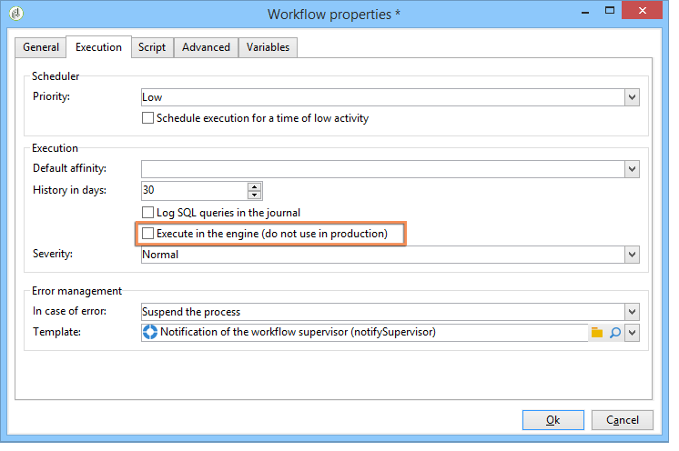
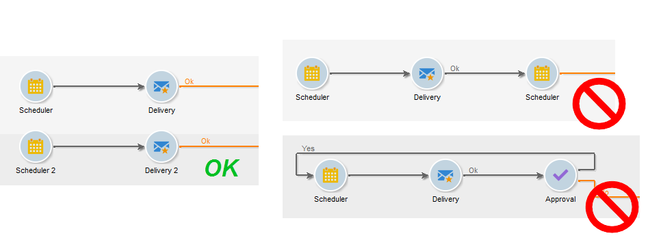
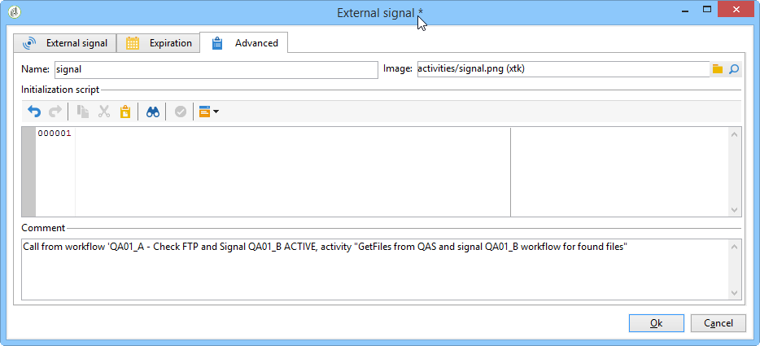

# Práticas recomendadas de fluxos de trabalho{#workflow-best-practices}

## Execução e desempenho {#execution-and-performance}

As diretrizes gerais sobre a otimização do desempenho do Campaign estão listadas abaixo, incluindo as práticas recomendadas para aplicar aos fluxos de trabalho.

As diretrizes para solução de problemas relacionados à execução de fluxos de trabalho também estão disponíveis no [Guia de produção do Campaign Classic v7](../../production/using/workflow-execution.md).

### Logs {#logs}

O método **[!UICONTROL logInfo()]** do JavaScript é uma ótima solução para depurar um fluxo de trabalho. É útil, mas deve ser usado com cuidado, especialmente para atividades executadas com frequência: pode sobrecarregar os logs e aumentar significativamente o tamanho da tabela de log. Mas, também pode ser preciso de mais do que **[!UICONTROL logInfo()]**.

Duas soluções adicionais estão disponíveis para ajudar:

* **Manter o resultado de populações provisórias entre duas execuções**

  Essa opção mantém tabelas temporárias entre duas execuções de um fluxo de trabalho. Está disponível na guia **[!UICONTROL General]** das propriedades do fluxo de trabalho e pode ser usado para desenvolvimento e testes para monitorar dados e verificar resultados. Você pode usar essa opção em ambientes de desenvolvimento, mas nunca usá-la em ambientes de produção. Manter tabelas temporárias pode resultar no aumento significativo do tamanho de banco de dados e, por fim, atingir o limite de tamanho. Além disso, o backup ficará lento.

  Somente as tabelas de trabalho da última execução do fluxo de trabalho são mantidas. As tabelas de trabalho das execuções anteriores são removidas pelo fluxo de trabalho **[!UICONTROL cleanup]**, executado diariamente.

  >[!CAUTION]
  >
  >Essa opção nunca deve ser marcada em um fluxo de trabalho de produção. Essa opção é usada para analisar os resultados e é projetada apenas para fins de teste e, portanto, deve ser usada apenas em ambientes de desenvolvimento ou de preparo.

* **Logs de queries SQL no journal**

  Disponível na guia **[!UICONTROL Execution]** das propriedades do fluxo de trabalho, essa opção registrará todos as consultas SQL geradas pela ferramenta a partir das diferentes atividades. É uma boa forma de ver o que está realmente sendo executado pela plataforma. No entanto, essa opção só deve ser usada temporariamente durante o desenvolvimento e não ativada durante a produção.

Elimine os registros quando eles não forem mais necessários. O histórico do fluxo de trabalho não é eliminado automaticamente: todas as mensagens são mantidas por padrão. Para limpar o histórico, acesse o menu **[!UICONTROL File > Actions]** ou clique no botão Ações localizado na barra de ferramentas acima da lista. Selecione Limpar histórico.
Para saber como eliminar seus registros, consulte esta [documentação](starting-a-workflow.md).

### Planejamento de fluxo de trabalho {#workflow-planning}

* Tente manter um nível estável de atividade ao longo do dia e evitar picos para prevenir a sobrecarga da instância. Para fazer isso, distribua os horários de início do fluxo de trabalho uniformemente ao longo do dia.
* Agende a carga de dados durante a noite para reduzir o a contenção de recurso.
* Fluxos de trabalho longos podem ter impacto no servidor e nos recursos do banco de dados. Divida os fluxos de trabalho mais longos para reduzir o tempo de processamento.
* Para reduzir os tempos de execução gerais, substitua atividades demoradas por atividades simplificadas e mais rápidas.
* Evite executar mais de 20 fluxos de trabalho simultaneamente. Quando muitos fluxos de trabalho são executados ao mesmo tempo, o sistema pode ficar sem recursos e se tornar instável. Para obter mais informações sobre por que o fluxo de trabalho pode não estar sendo iniciado, consulte este [artigo](https://helpx.adobe.com/ie/campaign/kb/workflows-not-starting-in-a-campaign-technical-workflows.html).

### Opção de Executar no mecanismo {#execute-in-the-engine-option}

Na janela **[!UICONTROL Workflow properties]**, nunca marque a opção **[!UICONTROL Execute in the engine]**. Quando essa opção está habilitada, o fluxo de trabalho tem prioridade e todos os outros fluxos de trabalho são interrompidos pelo mecanismo do fluxo de trabalho até que este seja concluído.

## Propriedades do fluxo de trabalho {#workflow-properties}

### Pastas de fluxo de trabalho {#workflow-folders}

A Adobe recomenda criar seus fluxos de trabalho em uma pasta dedicada.

Se o fluxo de trabalho afetar toda a plataforma (processos de limpeza, por exemplo), é possível considerar adicionar uma subpasta à pasta interna **[!UICONTROL Technical Workflows]**.

### Nomeação do fluxo de trabalho {#workflow-naming}

Como facilita a localização e a solução de problemas se não estiverem executando da forma esperada, a Adobe recomenda que os fluxos de trabalho tenham nomes e rótulos adequados: preencha o campo de descrição do fluxo de trabalho para resumir o processo para que o operador possa entender facilmente.

Se o fluxo de trabalho fizer parte de um processo envolvendo vários fluxos de trabalho, você pode ser explícito ao inserir um rótulo. Usar números é uma ótima maneira de organizar os fluxos de trabalho (por Rótulo).

Por exemplo:

* 001 – Importar – Importação de destinatárioes
* 002 – Importar – Importação de vendas
* 003 – Importar – Importação de detalhes de vendas
* 010 – Exportar – Exportação de logs de entregas
* 011 – Exportar – Exportação de logs de rastreamento

### Severidade do fluxo de trabalho {#workflow-severity}

É possível configurar a severidade nas propriedades do fluxo de trabalho, na guia **[!UICONTROL Execution]**:

* Normal
* Produção
* Crítico

Fornecer essas informações ao criar um fluxo de trabalho ajudará a entender a severidade do processo configurado.

Essa opção tem impacto funcional somente nos fluxos de trabalho da campanha.

Fluxos de trabalho da campanha (fluxos de trabalho criados como parte de uma campanha/operação) com uma severidade mais alta são executados com prioridade caso a campanha tenha muitos processos executados simultaneamente. Por padrão, apenas dez processos podem ser executados simultaneamente em uma campanha, de acordo com a opção NmsOperation_LimitConcurrency. Por exemplo, se uma campanha contêm 25 fluxos de trabalho, os fluxos de trabalho com uma severidade mais alta serão executados no primeiro pool de dez processos.

### Monitoramento do fluxo de trabalho {#workflow-monitoring}

Todos os fluxos de trabalho agendados que estão sendo executados em ambientes de produção devem ser monitorados para que um alerta seja enviado em caso de erro.

Nas propriedades do fluxo de trabalho, selecione um grupo supervisor, seja o grupo **[!UICONTROL Workflow supervisors]** padrão ou um grupo personalizado. Certifique-se de que pelo menos um operador participe desse grupo, com um email definido.

Antes de começar a construir um fluxo de trabalho, lembre-se de definir supervisores de fluxo de trabalho. Eles serão notificados por email em caso de erro. Para obter mais informações, consulte [Gerenciando erros](monitoring-workflow-execution.md#managing-errors).

Verifique regularmente a guia **[!UICONTROL Monitoring]** para visualizar o status geral dos fluxos de trabalho ativos. Para obter mais informações, consulte [Supervisão de instância](monitoring-workflow-execution.md#instance-supervision).

O Workflow HeatMap permite aos administradores da plataforma Adobe Campaign monitorarem a carga na instância e planejarem os fluxos de trabalho correspondentes. Para obter mais informações, consulte [Monitoramento de fluxo de trabalho](heatmap.md).

## Uso das atividades {#using-activities}

>[!CAUTION]
>
>É possível copiar e colar atividades dentro de um mesmo fluxo de trabalho. No entanto, não recomendamos atividades de copiar e colar em fluxos de trabalho diferentes. Algumas configurações anexadas a atividades como Entrega e Scheduler podem gerar conflitos e erros ao executar o fluxo de trabalho de destino. Em vez disso, recomendamos usar **Duplicate** nos fluxos de trabalho. Para obter mais informações, consulte [Duplicação de fluxos de trabalho](building-a-workflow.md#duplicating-workflows).

### Nome da atividade {#name-of-the-activity}

Ao desenvolver seu fluxo de trabalho, todas as atividades terão um nome, como todos os objetos do Adobe Campaign. Embora o nome seja gerado pela ferramenta, recomendamos que você renomeie com um nome explícito ao configurá-lo. O risco de fazer isso depois é que pode interromper o fluxo de trabalho com atividades usando o nome de outra atividade anterior. Portanto, seria um trabalho difícil atualizar os nomes depois.

O nome da atividade pode ser encontrado na guia **[!UICONTROL Advanced]**. Não use nomes como **[!UICONTROL query]**, **[!UICONTROL query1]**, **[!UICONTROL query11]**, mas sim nomes explícitos como **[!UICONTROL querySubscribedRecipients]**. Esse nome aparecerá no diário e, se aplicável, nos logs SQL, e isso ajudará a depurar o fluxo de trabalho ao configurá-lo.

### Primeira e última atividades {#first-and-last-activities}

* Sempre inicie o fluxo de trabalho com uma atividade **[!UICONTROL Start]** ou atividade **[!UICONTROL Scheduler]** . Quando pertinente, também é possível usar uma atividade **[!UICONTROL External signal]**.
* Ao criar o fluxo de trabalho, use apenas uma atividade **[!UICONTROL Scheduler]** por ramificação. Se a mesma ramificação de um fluxo de trabalho tiver vários schedulers (vinculados uns aos outros), o número de tarefas a serem executadas será multiplicado exponencialmente, o que irá sobrecarregar consideravelmente o banco de dados. Essa regra também se aplica a todas as atividades com uma guia **[!UICONTROL Scheduling & History]**. Saiba mais em [Agendamento](scheduler.md).

  

* Use atividades **[!UICONTROL End]** para cada fluxo de trabalho. Isso permite que o Adobe Campaign libere espaço temporário usado para cálculos dentro de fluxos de trabalho. Para obter mais informações, consulte [início e fim](start-and-end.md).

### Javascript em uma atividade {#javascript-within-an-activity}

Você pode adicionar JavaScript ao inicializar uma atividade do fluxo de trabalho. Isso pode ser feito na guia **[!UICONTROL Advanced]** da atividade.

Para facilitar a identificação do fluxo de trabalho, recomendamos usar traços duplos no início e no fim do rótulo da atividade da seguinte maneira: -- Meu rótulo --.

### Sinal {#signal}

Na maior parte do tempo, você não saberá de onde o sinal é chamado. Para evitar esse problema, use o campo **[!UICONTROL Comment]** dentro da guia **[!UICONTROL Advanced]** da atividade do sinal para documentar a origem esperada de um sinal para essa atividade.

## Atualização de fluxo de trabalho {#workflow-update}

Um fluxo de trabalho de produção não deve ser atualizado diretamente. A menos que o processo consista na criação de uma campanha com modelos de fluxos de trabalho, os processos devem ser testados primeiro em um ambiente de desenvolvimento. Após essa validação, o fluxo de trabalho pode ser implantado e iniciado na produção.

Realize todos os testes em ambientes de desenvolvimento ou de preparo, não em ambientes de produção. O desempenho não pode ser assegurado em tais casos.

Os fluxos de trabalho arquivados podem ser mantidos em plataformas de desenvolvimento ou teste, em uma pasta Arquivada, mas o ambiente de produção deve permanecer o mais limpo possível. Os fluxos de trabalho antigos devem ser removidos do ambiente de produção se estiverem inativos.
